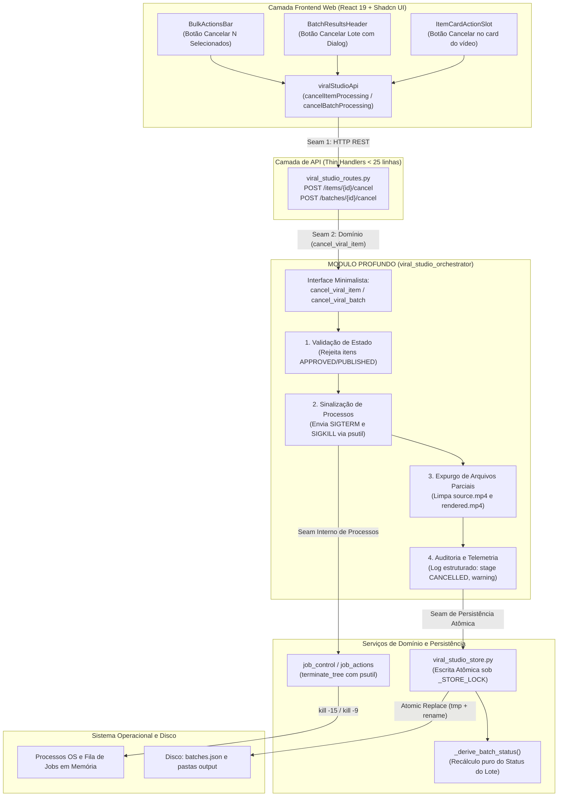
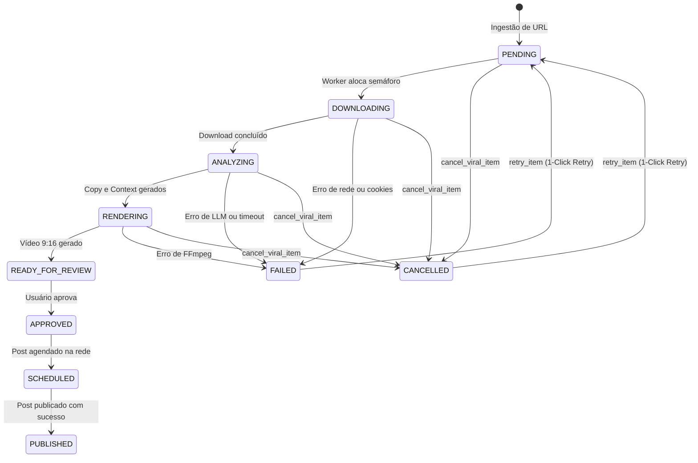
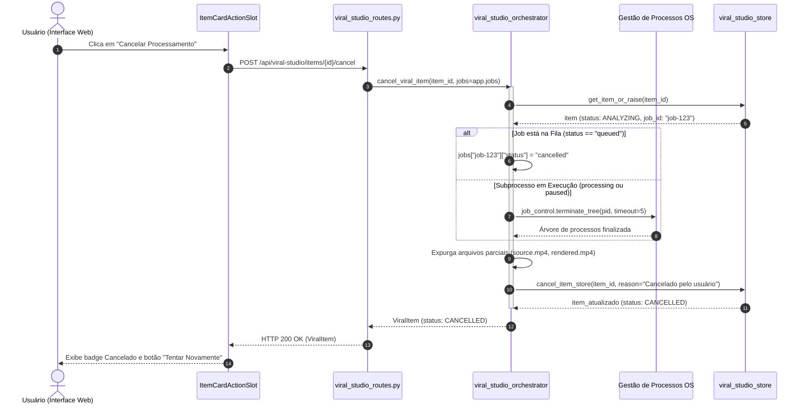

# Arquitetura e Implementação: Cancelamento de Processamento no Viral Content Studio

Este documento descreve a arquitetura, o design de código e os detalhes de implementação da funcionalidade de **Cancelamento de Processamento de Lotes e Vídeos Individuais** no **Viral Content Studio** do ClippyMe / ViralForge.

A implementação foi estruturada com base nos princípios de **Codebase Design** ([SKILL.md](file:///home/luis/.gemini/config/skills/codebase-design/SKILL.md)):
- **Módulo Profundo (Deep Module)**: Interface pública mínima e expressiva com alta alavancagem de comportamento interno (encapsula validação de transição, gestão de processos do SO, expurgo de arquivos parciais, persistência atômica e auditoria).
- **Seams Limpos (Clean Seams)**: Fronteiras desacopladas entre camada HTTP (thin handlers), domínio (`viral_studio_orchestrator`), controle de processos (`job_control`) e persistência durável (`viral_studio_store`).
- **Alavancagem & Localidade**: A complexidade do ciclo de vida de cancelamento e limpeza de recursos é concentrada em um único lugar no domínio.
- **Superfície de Teste Unificada**: Callers de produção e testes automatizados cruzam exatamente o mesmo seam sem vazar detalhes operacionais.

---

## 1. Visão Geral e Motivação

### 1.1. O Problema Resolvido
No processamento de lotes de vídeos curtos verticais (Instagram Reels, TikTok, YouTube Shorts), um lote pode conter dezenas de itens em diferentes estágios computacionais:
1. **Ingestão e Download (`PENDING`, `DOWNLOADING`)**
2. **Análise Multissinal por IA (`ANALYZING`)**
3. **Composição e Renderização Audiovisual com FFmpeg (`RENDERING`)**

Antes desta implementação, o sistema não oferecia mecanismos para interromper um processamento em andamento. Se um download travasse por instabilidade externa, se uma chave de LLM expirasse ou se o usuário detectasse que inseriu URLs erradas, o lote ficava permanentemente preso em estado ativo (ex: `1 Em Processamento / 75%`), monopolizando semáforos de concorrência e poluindo os KPIs do dashboard.

### 1.2. A Solução
Foi implementado um subsistema completo de cancelamento com:
- **Cancelamento granular por item**: Aborta o vídeo selecionado e libera seus recursos.
- **Cancelamento em lote**: Cancela concorrentemente todos os vídeos em processamento ativo do lote.
- **Cancelamento em massa (Bulk Actions)**: Permite selecionar múltiplos vídeos em execução e cancelá-los de uma só vez.
- **Reversibilidade imediata (1-Click Retry)**: Itens no estado `CANCELLED` podem ser re-enfileirados a qualquer momento com um clique, transicionando de volta para `PENDING`.
- **Prevenção de Jobs Órfãos e Arquivos Parciais**: Finalização segura da árvore de processos via `psutil` (`SIGTERM` + `SIGKILL` timeout) e expurgo automático de arquivos inacabados em disco.

---

## 2. Diagramas de Arquitetura (Codebase Design)

### 2.1. Mapa de Camadas, Módulo Profundo e Seams



---

### 2.2. Máquina de Estados e Ciclo de Vida do Vídeo

O estado `CANCELLED` foi formalizado como estado terminal abortado pelo usuário, mantendo total reversibilidade através do endpoint `retry`:



---

### 2.3. Diagrama de Sequência de Execução



---

## 3. Especificação das Camadas de Implementação

### 3.1. Persistência e Domínio Puro (`src/clippyme/domain/viral_studio_store.py`)

#### `_derive_batch_status(items: List[Dict[str, Any]]) -> str`
Função pura (sem I/O, deterministicamente testável), responsável por recalcular o status consolidado de um lote:
- Se qualquer item estiver em processamento ativo (`PENDING`, `DOWNLOADING`, `ANALYZING`, `RENDERING`), o lote permanece `PENDING`.
- Se algum item estiver pronto (`READY_FOR_REVIEW`, `APPROVED`, `SCHEDULED`, `PUBLISHED`), o lote consolida como `READY_FOR_REVIEW`.
- Se todos os itens foram cancelados (`all(s == 'CANCELLED')`), o lote assume `CANCELLED`.
- Se todos falharam ou há mistura de falha com cancelado sem nenhum concluído, o lote assume `FAILED`.

#### `cancel_item_store(item_id: str, reason: str = "Cancelado pelo usuário") -> Dict[str, Any]`
Executa a transição atômica de dados sob lock de concorrência (`_STORE_LOCK`):
- **Idempotência**: Se o item já estiver `CANCELLED`, retorna o registro existente sem erro.
- **Proteção de Invariantes**: Se o item estiver em estado terminal aprovado ou publicado (`APPROVED`, `SCHEDULED`, `PUBLISHED`), lança `ValidationError` impedindo cancelamento indevido.
- **Limpeza de Ponteiros**: Limpa `job_id`, limpa `error`, remove ponteiros de arquivos parciais de vídeo incompletos.
- **Auditoria Estruturada**: Insere um evento de log com `stage="CANCELLED"`, `level="warning"`, `message=reason` e timestamp ISO.
- **Escrita Segura**: Persiste no arquivo `batches.json` via substituição atômica (`tempfile` + `os.replace`).

---

### 3.2. Módulo Profundo de Orquestração (`src/clippyme/domain/viral_studio_orchestrator.py`)

#### `cancel_viral_item(item_id: str, *, jobs: Optional[dict] = None) -> Dict[str, Any]`
Constitui a interface primária do Módulo Profundo. Encapsula toda a complexidade operacional:
1. Recupera o item ou lança `NotFoundError`.
2. Valida se o status é passível de cancelamento (`PENDING`, `DOWNLOADING`, `ANALYZING`, `RENDERING`, `CANCELLED`).
3. Se houver `job_id` ativo no mapa global de jobs da aplicação:
   - Se na fila (`queued`): marca o status do job como `"cancelled"`.
   - Se em execução (`processing` ou `paused`): resolve o PID e executa `job_control.terminate_tree(pid, timeout=5.0)` via `psutil`, garantindo o encerramento gracioso (`SIGTERM`) com fallback forçado (`SIGKILL`).
4. Remove do disco arquivos de vídeo parciais ou corrompidos associados ao item (`source.mp4`, `rendered.mp4`).
5. Chama `cancel_item_store` para consolidar o estado e o status recalculado do lote.

#### `cancel_viral_batch(batch_id: str, *, jobs: Optional[dict] = None) -> Dict[str, Any]`
Identifica todos os itens ativos do lote e dispara `cancel_viral_item` concorrentemente via `asyncio.gather`, retornando o payload consolidado do lote.

---

### 3.3. Resiliência do Job Runner (`src/clippyme/domain/job_runner.py`)

No loop de execução em background de jobs do SO, foi introduzida uma salvaguarda para evitar sobrescrita de estado:
```python
# Evita sobrescrever itens intencionalmente cancelados pelo usuário
if job_record.get("status") == "cancelled":
    logger.info("Job %s foi cancelado externamente; preservando estado CANCELLED.", job_id)
    return
```
Isso impede que a finalização forçada do processo retorne código de erro (ex.: código 15 / SIGTERM) e altere erroneamente o item para `FAILED`.

---

### 3.4. Camada de Endpoints REST (`src/clippyme/api/viral_studio_routes.py`)

Os manipuladores HTTP seguem o padrão *Thin Handlers* (< 25 linhas), delegando 100% da lógica para o domínio:

```python
@router.post("/items/{id}/cancel", response_model=ViralItem)
async def cancel_item_endpoint(id: str):
    """Cancel an in-progress viral item processing and terminate its subprocess."""
    from clippyme.api import app as app_module
    return await viral_studio_orchestrator.cancel_viral_item(id, jobs=app_module.jobs)


@router.post("/batches/{id}/cancel", response_model=BatchResponse)
async def cancel_batch_endpoint(id: str):
    """Cancel all active processing items in a batch."""
    from clippyme.api import app as app_module
    return await viral_studio_orchestrator.cancel_viral_batch(id, jobs=app_module.jobs)
```

---

### 3.5. Camada Frontend Web (`web/src/features/viral-studio/`)

1. **Cliente de API ([`viral-studio.api.ts`](file:///home/luis/repositories/viralforge/web/src/features/viral-studio/services/viral-studio.api.ts))**:
   - `cancelItemProcessing(itemId: string): Promise<ViralItem>`
   - `cancelBatchProcessing(batchId: string): Promise<BatchResponse>`

2. **Hooks TanStack Query ([`use-item-actions.ts`](file:///home/luis/repositories/viralforge/web/src/features/viral-studio/hooks/use-item-actions.ts))**:
   - `useCancelItem(batchId?: string)`: Dispara mutação otimista e invalida caches de lote e listagem de lotes.
   - `useCancelBatch(batchId: string)`: Notifica via `toast` de sucesso/erro.
   - `useBulkItemActions`: Fornece `bulkCancel(itemIds: string[])` para operações em lote com `toast.promise`.

3. **Componentes de Interface**:
   - [`item-card-action-slot.tsx`](file:///home/luis/repositories/viralforge/web/src/features/viral-studio/components/item-card-action-slot.tsx):
     - Para itens em processamento (`isBusy`): exibe botão Shadcn com ícone `X` e tooltip *"Cancelar processamento"*.
     - Para itens cancelados (`CANCELLED`): exibe botão *"Tentar Novamente"* (`RefreshCw`), permitindo retentativa com 1 clique reaproveitando o slot fixo `h-8`.
   - [`video-preview-card.tsx`](file:///home/luis/repositories/viralforge/web/src/features/viral-studio/components/video-preview-card.tsx):
     - Overlay visual com badge neutro, ícone de alerta e mensagem explicativa de cancelamento.
   - [`batch-results-header.tsx`](file:///home/luis/repositories/viralforge/web/src/features/viral-studio/components/batch-results-header.tsx):
     - Botão *"Cancelar Lote"* disponível quando `processingCount > 0` com diálogo de confirmação.
   - [`bulk-actions-bar.tsx`](file:///home/luis/repositories/viralforge/web/src/features/viral-studio/components/bulk-actions-bar.tsx):
     - Botão *"Cancelar (N)"* para cancelamento de múltiplos vídeos selecionados.

---

## 4. Contrato da API REST

### 4.1. Cancelar Item Individual
- **Método**: `POST`
- **Rota**: `/api/viral-studio/items/{id}/cancel`
- **Autenticação**: Bearer token (se configurado)
- **Resposta Sucesso (`200 OK`)**:
  ```json
  {
    "id": "45819ce9",
    "batch_id": "3a8bdb4b",
    "status": "CANCELLED",
    "source_url": "https://www.instagram.com/reel/...",
    "logs": [
      {
        "timestamp": "2026-09-28T22:00:00Z",
        "stage": "CANCELLED",
        "level": "warning",
        "message": "Cancelado pelo usuário"
      }
    ]
  }
  ```
- **Erros Possíveis**:
  - `404 Not Found`: Item com o ID especificado não existe.
  - `400 Bad Request`: Item já foi aprovado ou publicado (`APPROVED`, `PUBLISHED`), impedindo cancelamento indevido.

### 4.2. Cancelar Lote Inteiro
- **Método**: `POST`
- **Rota**: `/api/viral-studio/batches/{id}/cancel`
- **Resposta Sucesso (`200 OK`)**: Objeto `BatchResponse` atualizado contendo os itens cancelados e o novo status consolidado do lote.

---

## 5. Garantia de Qualidade e Matriz de Testes

A implementação conta com cobertura automatizada ponta a ponta:

| Camada | Arquivo de Teste | Cenários Cobertos |
|---|---|---|
| **Backend API & Store** | `tests/api/test_viral_studio_api.py` | Cancelamento de item em `ANALYZING`, idempotência, encerramento de subprocesso mockado, retentativa via `retry_item`, recálculo de status de lote, cancelamento de lote concorrente. |
| **Backend Pure Function** | `tests/api/test_viral_studio_api.py` | Cobertura completa de todas as permutações de `_derive_batch_status` (todos cancelados, mistura com prontos, mistura com falhas). |
| **Frontend API** | `web/src/features/viral-studio/services/viral-studio.api.test.ts` | Chamadas HTTP para `cancelItemProcessing` e `cancelBatchProcessing`. |
| **Frontend Hooks** | `web/src/features/viral-studio/hooks/use-item-actions.test.tsx` | Invalidação de queries e disparo de mutações `useCancelItem` e `useCancelBatch`. |
| **Frontend Componentes** | `web/src/features/viral-studio/components/batch-results-header.test.tsx`<br>`web/src/features/viral-studio/components/bulk-actions-bar.test.tsx` | Renderização condicional do botão de cancelamento e disparo de confirmação. |

### Comandos de Verificação
```bash
# Validação da suite backend
./scripts/verify.sh --backend

# Validação da suite web (Linter Shadcn, TypeScript, ESLint, Vitest, Vite Build)
./scripts/verify.sh --web
```
