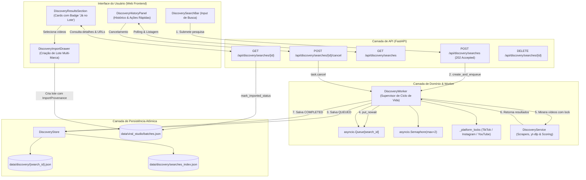
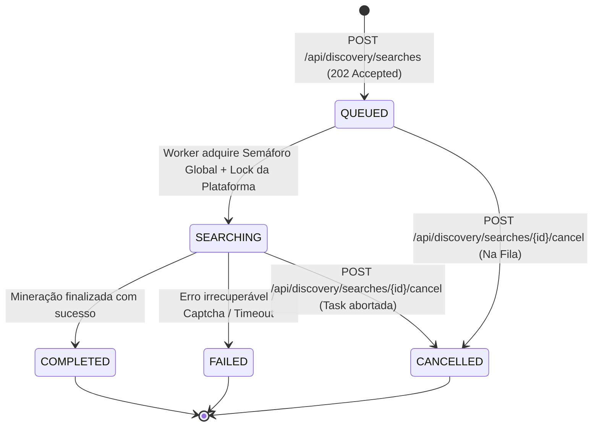

# Especificação Técnica — Descoberta Assíncrona, Worker Dedicado e Persistência de Buscas

> **Documento de Engenharia & Arquitetura de Produto**  
> **Módulo:** Viral Studio / Descoberta Multiplataforma & Mineração de Tendências  
> **Status:** Implementado e Operacional  
> **ADR de Referência:** [`docs/adr/0004-asynchronous-discovery-mining-and-search-persistence.md`](adr/0004-asynchronous-discovery-mining-and-search-persistence.md)  
> **Glossário do Domínio:** [`CONTEXT.md`](../CONTEXT.md)  

---

## 1. Contexto, Motivação e Problema

O módulo de Descoberta Multiplataforma do ViralForge permite minerar vídeos virais por palavra-chave e hashtag no TikTok, Instagram Reels e YouTube Shorts, calculando automaticamente pontuações de engajamento e *Viral Score* para gerar lotes de produção.

No entanto, a arquitetura original apresentava três gargalos operacionais críticos:

1. **Chamadas Síncronas Bloqueantes e Risco de Timeout:**
   - A extração remota de metadados, navegação headless e paginação via `yt-dlp` ou Playwright leva de 15 a 60 segundos por pesquisa. Em conexões lentas ou queries volumosas, a requisição HTTP estourava o timeout do cliente ou travava a navegação da aplicação web.
2. **Perda de Sessão e Descarte Prematuro dos Resultados:**
   - Como os resultados ficavam apenas no estado transitório do componente frontend (ou em cache em memória), qualquer recarregamento de página (`F5`), navegação para outra aba do sistema ou fechamento do navegador descartava os vídeos minerados, forçando o usuário a reexecutar a raspagem do zero.
3. **Ausência de Concorrência Controlada e Risco de IP Ban / Captchas:**
   - Múltiplas buscas disparadas em paralelo podiam sobrecarregar o IP do servidor contra as redes sociais, resultando em bloqueios por taxa de requisições (HTTP 429), desafios de captcha ou invalidação de cookies autenticados.
4. **Falta de Controle de Cancelamento em Voo:**
   - Se o usuário digitasse uma palavra-chave errada ou decidisse interromper uma busca longa, não havia como abortar o processo em execução no servidor.

---

## 2. Objetivos da Funcionalidade

- **Desacoplamento Assíncrono com Resposta Imediata:** A criação da pesquisa responde em milissegundos com status `HTTP 202 Accepted` e identificador único (`search_id`), transferindo o trabalho pesado para segundo plano.
- **Worker Dedicado Supervisionado (`DiscoveryWorker`):** Processamento em fila contínua acoplado ao ciclo de vida (`lifespan`) do FastAPI, com recuperação automática de estado em caso de reinicialização.
- **Controle de Concorrência em Dois Níveis:**
  1. *Semáforo Global:* Limita a concorrência total a `MAX_CONCURRENT_DISCOVERY = 2`.
  2. *Locks Isolados por Plataforma:* Garante no máximo 1 extração ativa por rede social (TikTok, Instagram, YouTube) simultaneamente, prevenindo bloqueios por padrão de robô.
- **Cancelamento Imediato em Voo:** Capacidade de cancelar buscas pendentes ou ativas com abortamento da `asyncio.Task`, interrupção de subprocessos e devolução instantânea do slot no semáforo.
- **Persistência Atômica e Histórico Permanente:** Armazenamento crash-safe de cada busca (`data/discovery/{id}.json`) com índice leve (`searches_index.json`) para carregar o histórico de prospecções passadas sem overhead de rede.
- **Rastreamento de Proveniência & Deduplicação Visual:** Vinculação da busca aos vídeos minerados (`ImportProvenance`) e verificação cruzada com os lotes existentes, exibindo um badge semântico nos vídeos que já foram importados (`Já no Lote #X`).

---

## 3. Arquitetura da Solução



---

## 4. Ciclo de Vida da Busca (`DiscoverySearch`)



### Transições de Estado:
1. **`QUEUED`:** A pesquisa foi salva em disco e aguarda disponibilidade de slot na fila.
2. **`SEARCHING`:** O worker adquiriu o semáforo geral e o lock exclusivo da plataforma, iniciando a raspagem dos vídeos.
3. **`COMPLETED`:** Os vídeos foram minerados, o *Viral Score* foi calculado, e o resultado foi gravado atomicamente no disco e no índice.
4. **`FAILED`:** Ocorreu uma exceção não-tratada, bloqueio de rede ou erro do provedor. A mensagem de erro é persistida em `error_message` para auditoria.
5. **`CANCELLED`:** O usuário acionou o cancelamento. A tarefa é abortada imediatamente e o semáforo é liberado para a próxima requisição da fila.

---

## 5. Especificação dos Contratos de API

### 5.1. `POST /api/discovery/searches`
Inicia uma busca assíncrona com enfileiramento imediato.
- **Status:** `HTTP 202 Accepted`
- **Request Body (`DiscoveryFilter`):**
  ```json
  {
    "query": "achadinhos shopee",
    "platform": "tiktok",
    "limit": 20,
    "min_views": 10000,
    "max_age_days": 30,
    "sort_by": "virality_score"
  }
  ```
- **Response Body (`DiscoverySearchSummary`):**
  ```json
  {
    "id": "550e8400-e29b-41d4-a716-446655440000",
    "platform": "tiktok",
    "query": "achadinhos shopee",
    "status": "QUEUED",
    "total_found": 0,
    "created_at": "2026-09-24T17:00:00.000Z",
    "completed_at": null,
    "error_message": null
  }
  ```

---

### 5.2. `POST /api/discovery/searches/{search_id}/cancel`
Cancela imediatamente uma busca em andamento ou na fila.
- **Status:** `HTTP 200 OK`
- **Response Body (`DiscoverySearchSummary`):**
  ```json
  {
    "id": "550e8400-e29b-41d4-a716-446655440000",
    "platform": "tiktok",
    "query": "achadinhos shopee",
    "status": "CANCELLED",
    "total_found": 0,
    "created_at": "2026-09-24T17:00:00.000Z",
    "completed_at": "2026-09-24T17:00:05.120Z",
    "error_message": null
  }
  ```

---

### 5.3. `GET /api/discovery/searches`
Retorna a lista cronológica de buscas salvas (índice leve, sem payload pesado de itens).
- **Status:** `HTTP 200 OK`
- **Response Body:** Array de `DiscoverySearchSummary` ordenados por `created_at` decrescente.

---

### 5.4. `GET /api/discovery/searches/{search_id}`
Retorna a entidade completa com a coleção classificada de vídeos e flags de importação.
- **Status:** `HTTP 200 OK`
- **Response Body (`DiscoverySearch`):**
  ```json
  {
    "id": "550e8400-e29b-41d4-a716-446655440000",
    "platform": "tiktok",
    "query": "achadinhos shopee",
    "status": "COMPLETED",
    "total_found": 15,
    "duration_seconds": 18.42,
    "created_at": "2026-09-24T17:00:00.000Z",
    "completed_at": "2026-09-24T17:00:18.420Z",
    "error_message": null,
    "items": [
      {
        "id": "tiktok_7392819283",
        "platform": "tiktok",
        "url": "https://www.tiktok.com/@achadostops/video/7392819283",
        "title": "Esse gadget vai salvar sua cozinha!",
        "author_name": "Achados Tops",
        "author_handle": "@achadostops",
        "view_count": 850000,
        "like_count": 62000,
        "comment_count": 1420,
        "virality_score": 92.4,
        "engagement_rate": 7.46,
        "already_imported": true,
        "imported_batch_id": "batch-8812"
      }
    ]
  }
  ```

---

### 5.5. `DELETE /api/discovery/searches/{search_id}`
Remove o arquivo da busca em disco e limpa o registro no índice.
- **Status:** `HTTP 200 OK`
- **Response Body:** `{ "success": true }`

---

## 6. Persistência, Concorrência e Resiliência Técnica

### 6.1. Garantia de Escrita Atômica e Crash-Safety (`DiscoveryStore`)
- As buscas individuais são salvas no diretório `data/discovery/{id}.json`.
- Cada escrita utiliza arquivos temporários irmãos (`tempfile.mkstemp(prefix=".disc-", dir=...)`) seguidos de `os.replace()`, com `os.fsync()` e permissões estritas `0o600` (arquivos) e `0o700` (diretórios).
- Um índice leve em memória e sincronizado em disco (`data/discovery/searches_index.json`) permite listagens e filtragens imediatas sem necessitar ler e desserializar múltiplos arquivos JSON grandes.
- Protegido por uma trava reentrante global de thread (`threading.RLock`).

### 6.2. Concorrência e Prevenção de Bloqueios de IP (`DiscoveryWorker`)
- **Semáforo Global:** Limita a 2 tarefas simultâneas no processo uvicorn.
- **Locks por Plataforma:** Dicionário de locks assíncronos (`_platform_locks: Dict[PlatformType, asyncio.Lock]`). Se duas pesquisas para o TikTok forem submetidas consecutivamente, a segunda aguarda a liberação da primeira, eliminando requisições paralelas simultâneas ao mesmo provedor social.
- **Cancelamento Seguro:** O cancelamento invoca `task.cancel()` na `asyncio.Task` ativa mapeada em `self._active_tasks`. O bloco `finally` garante que o semáforo seja liberado imediatamente, permitindo que a próxima busca da fila inicie sem atrasos.
- **Recuperação de Inicialização (`recover_on_startup`):** Ao iniciar o servidor FastAPI, qualquer pesquisa deixada em `QUEUED` ou `SEARCHING` (devido a queda de energia ou reinicialização do container) é recuperada e marcada como `FAILED` com nota explicativa em `error_message`, prevenindo buscas travadas em loop infinito.

---

## 7. Interface do Usuário (Frontend Web)

### 7.1. Componente `DiscoveryHistoryPanel`
- Localizado na visualização `/discovery`, exibe o histórico cronológico de buscas recentes.
- Indicadores visuais semânticos com badges Shadcn:
  - `Minerando...` (Badge âmbar pulsante com spinner animado).
  - `Na Fila` (Badge secundário neutro).
  - `Concluído ({N})` (Badge verde esmeralda com contagem de vídeos).
  - `Cancelada` (Badge muted).
  - `Falha` (Badge destrutivo com tooltip de erro).
- Botão rápido de cancelamento (`X`) para pesquisas ativas e exclusão da lixeira para buscas arquivadas.

### 7.2. Polling Reativo e Desativação Inteligente
- O hook `useDiscoverySearchDetail(activeSearchId)` monitora a pesquisa selecionada via TanStack Query.
- Se o status for `QUEUED` ou `SEARCHING`, o hook ativa o polling automático com intervalo de **1.500 ms**.
- No instante em que o status transita para `COMPLETED`, `FAILED` ou `CANCELLED`, o polling é automaticamente desligado para economizar recursos de rede.

### 7.3. Deduplicação Visual no Card de Vídeo (`DiscoveryVideoCard`)
- Vídeos que já constam em lotes criados no Viral Studio recebem uma sobreposição com o badge:
  `✓ Já no Lote #{batch_id}`
- Isso impede que o criador de conteúdo minere e importe acidentalmente o mesmo vídeo repetidas vezes para diferentes marcas.

### 7.4. Integração com Lote e Proveniência (`DiscoveryImportDrawer`)
- Ao selecionar múltiplos vídeos da busca minerada e abrir o drawer de importação, cada item empacota o DTO `ImportProvenance`:
  ```typescript
  provenance: {
    search_id: activeSearch.id,
    platform: item.platform,
    query: activeSearch.query,
    discovered_item_id: item.id,
    virality_score: item.virality_score
  }
  ```
- O lote resultante é criado com distribuição multi-marca (`BrandPool`) e template visual unificado, mantendo a rastreabilidade completa de ponta a ponta.
