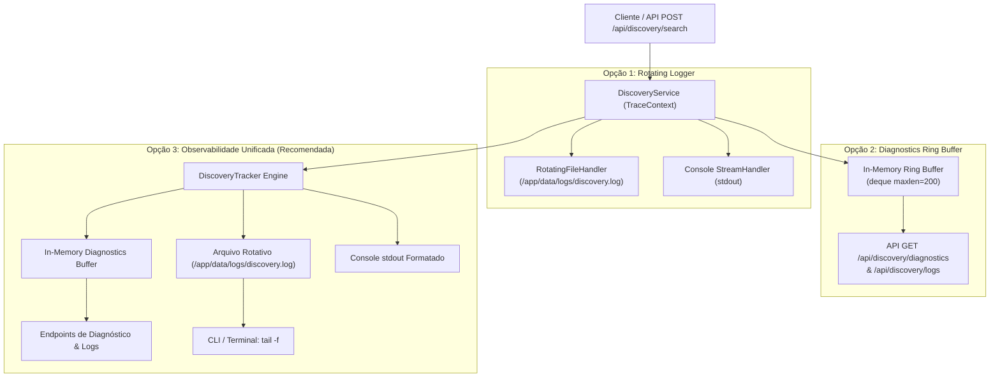

# Pesquisa de Observabilidade, Tracing e Logging para o Fluxo de Discovery

**Documento:** `docs/discovery-observability-and-logging-research.md`  
**Data:** 2026-09-24  
**Status:** Proposta Aprovada / Especificação Técnica  
**Módulos Impactados:**
- `src/clippyme/api/discovery_routes.py`
- `src/clippyme/domain/discovery/service.py`
- `src/clippyme/domain/discovery/providers/tiktok_playwright.py`
- `src/clippyme/domain/discovery/providers/tiktok_provider.py`
- `src/clippyme/domain/discovery/providers/instagram_provider.py`
- `src/clippyme/domain/discovery/providers/youtube_provider.py`
- `src/clippyme/domain/discovery/diagnostics.py` (Novo)

---

## 1. Motivação e Diagnóstico do Estado Atual

O fluxo de **Discovery** do ClippyMe é responsável por buscar, extrair, pontuar e filtrar vídeos virais em plataformas sociais (TikTok, Instagram Reels e YouTube Shorts). No caso específico do TikTok, o fluxo utiliza um navegador headless Chromium via **Playwright** (`TikTokPlaywrightWorker`), que executa as seguintes etapas complexas:
1. Inicialização do Chromium com argumentos anti-detecção.
2. Expansão de queries baseadas no limite solicitado (ex: `limite > 20` ou `> 50` gera variações automáticas de palavras-chave).
3. Criação de contextos isolados com injeção de cookies Netscape (`parse_netscape_cookies`).
4. Interceptação assíncrona de eventos de rede (`page.on("response")`) para capturar requisições `/api/search/item/full/` ou `/api/search/general/full/`.
5. Tratamento de modais flutuantes, overlays do TikTok e cliques no botão de "Tentar novamente" (*Retry*).
6. Rolagem progressiva (*mouse wheel* e *PageDown*) com pausas controladas.
7. Fallback de extração via DOM caso nenhuma resposta de API seja interceptada.
8. Fallback secundário para extração de tag via `yt-dlp` em thread pool se o Playwright falhar ou retornar vazio.

### Gaps Identificados na Arquitetura Atual
- **Logs em Nível DEBUG não exibidos:** Chamadas críticas como interceptação de payloads JSON, timeout de navegação e falhas no fallback DOM estão registradas como `logger.debug()`. Como a aplicação inicia com `logging.basicConfig(level=logging.INFO)`, esses eventos são completamente ignorados.
- **Poluição do `stdout` Geral:** Os logs de descoberta são misturados com requisições HTTP do Uvicorn, prints de download do yt-dlp e mensagens do pipeline de corte.
- **Falta de Correlação por Sessão (`trace_id`):** Quando múltiplas buscas ou variações de termos rodam de forma concorrente, é impossível rastrear qual log pertence a qual busca.
- **Impossibilidade de Diagnóstico Rápido:** Um desenvolvedor ou operador acessando o container via SSH/terminal não possui um arquivo dedicado para inspecionar com `tail -f`.

---

## 2. Requisitos Operacionais & Arquiteturais

1. **Inspeção no Container:** O operador deve ser capaz de executar comandos padrão como `tail -f /app/data/logs/discovery.log` ou `grep` dentro do container sem necessidade de instalar ferramentas externas.
2. **Acesso no Host:** Como o volume `./data` já está mapeado para `/app/data` no `docker-compose.yml`, o arquivo de log deve refletir imediatamente em `./data/logs/discovery.log` no host, respeitando as permissões `0o600` e o UID do usuário (`appuser`).
3. **Log Rotation Seguro:** Rotação automática de arquivos para evitar estouro de disco (ex: 5 arquivos de no máximo 10 MB cada).
4. **Tracing Granular por Sessão:** Cada requisição de busca deve gerar um `trace_id` único (ex: `disc-e3f4a1`), registrado em todos os sub-eventos.
5. **Telemetria de Eventos em Tempo Real:** Captura de métricas operacionais por busca:
   - Duração total e por query secundária.
   - Contagem de itens encontrados vs descartados por filtros (views, idade, duração).
   - Ocorrência de cache hit ou miss.
   - Status do navegador Chromium (lançamento, interceptação, fechamento).
   - Acionamento de fallbacks (DOM ou yt-dlp).

---

## 3. Avaliação Comparativa de Opções Arquiteturais



### Quadro Comparativo

| Critério | Opção 1: Dedicated File Logger | Opção 2: In-Memory Ring Buffer + API | Opção 3: Observabilidade Híbrida (Recomendada) |
| :--- | :--- | :--- | :--- |
| **Facilidade de Inspeção no Terminal** | ⭐⭐⭐⭐⭐ Direto via `tail -f` | ⭐⭐ Requer `curl` e `jq` | ⭐⭐⭐⭐⭐ Direto via `tail -f` ou CLI |
| **Integração com Docker Volumes** | ⭐⭐⭐⭐⭐ Persistido em `/app/data/logs/` | ❌ Volátil em memória | ⭐⭐⭐⭐⭐ Persistido em `/app/data/logs/` |
| **Consumo pelo Frontend / UI** | ⭐ Requer leitura indireta | ⭐⭐⭐⭐⭐ JSON nativo via API | ⭐⭐⭐⭐⭐ JSON nativo via API |
| **Histórico e Métricas Estruturadas** | ⭐⭐ Apenas texto não estruturado | ⭐⭐⭐⭐ Estruturado em memória | ⭐⭐⭐⭐⭐ Logs em arquivo + métricas na API |
| **Rastreamento de Tracing (`trace_id`)** | ⭐⭐⭐ Apenas nos prefixos | ⭐⭐⭐⭐ Agrupado por sessão | ⭐⭐⭐⭐⭐ Totalmente correlacionado |
| **Sobrecarga de I/O** | Mínima (buffer do SO) | Quase nula (RAM) | Mínima e controlada (async + bounded) |

---

## 4. Arquitetura Detalhada da Solução Recomendada (Opção 3)

A solução recomendada adota a **Arquitetura Híbrida**, estruturada em quatro pilares principais alinhados aos padrões do repositório (*Ports & Adapters*, gravações atômicas e código testável isolado de I/O).

### Pilar 1: Configuração do Logger Dedicado e Rotação de Arquivos

Criar um módulo de logging autônomo em `src/clippyme/domain/discovery/logger.py` que configura o logger hierárquico `clippyme.discovery`.

* **Caminho do Arquivo:** `/app/data/logs/discovery.log` (ou `data/logs/discovery.log` no host).
* **Política de Rotação:** `RotatingFileHandler` com `maxBytes = 10 * 1024 * 1024` (10 MB) e `backupCount = 5`.
* **Formato de Saída no Arquivo:**
  ```text
  %(asctime)s [%(levelname)s] [trace=%(trace_id)s] [%(platform)s] %(name)s: %(message)s
  ```
* **Formato de Saída no Console:**
  ```text
  %(asctime)s [%(levelname)s] [DISCOVERY:%(trace_id)s] %(message)s
  ```

### Pilar 2: `DiscoveryTraceContext` e Contexto de Execução

Utilizar um objeto de contexto imutável ou `contextvars.ContextVar` para transportar o `trace_id` e métricas entre corrotinas assíncronas sem poluir assinaturas de métodos com parâmetros adicionais.

```python
from contextvars import ContextVar
import uuid

current_trace_id: ContextVar[str] = ContextVar("current_trace_id", default="disc-global")

def new_trace_id() -> str:
    tid = f"disc-{uuid.uuid4().hex[:8]}"
    current_trace_id.set(tid)
    return tid
```

### Pilar 3: `DiscoveryTracker` (Event Journal & Bounded Ring Buffer)

Implementado em `src/clippyme/domain/discovery/diagnostics.py`. Mantém um buffer circular em memória com capacidade limitada (ex: 100 sessões recentes) protegido por `threading.Lock`.

#### Estrutura de Dados de uma Sessão (`DiscoverySession`):
```json
{
  "trace_id": "disc-7a3b19e2",
  "started_at": "2026-09-24T16:10:00.123Z",
  "completed_at": "2026-09-24T16:10:04.560Z",
  "duration_ms": 4437,
  "platform": "tiktok",
  "query": "shopee achadinhos",
  "requested_limit": 20,
  "cache_hit": false,
  "status": "COMPLETED",
  "items_found": 20,
  "queries_executed": [
    {"query": "shopee achadinhos", "duration_ms": 2840, "items_intercepted": 12},
    {"query": "achadinhos virais", "duration_ms": 1420, "items_intercepted": 8}
  ],
  "milestones": [
    {"stage": "CACHE_MISS", "time_offset_ms": 12, "details": {"key": "b4f2c..."}},
    {"stage": "BROWSER_LAUNCHED", "time_offset_ms": 820, "details": {"chrome_path": "/usr/bin/google-chrome"}},
    {"stage": "RESPONSE_INTERCEPTED", "time_offset_ms": 2340, "details": {"url": "https://www.tiktok.com/api/search/item/full/", "items": 12}},
    {"stage": "FILTERING", "time_offset_ms": 4410, "details": {"total": 20, "discarded_views": 0, "discarded_age": 0}}
  ],
  "errors": []
}
```

### Pilar 4: Endpoints de Diagnóstico e Logs na API

Adicionados ao `src/clippyme/api/discovery_routes.py`:

1. **`GET /api/discovery/diagnostics`**
   - Retorna visão geral de saúde do Discovery: total de buscas, taxa de sucesso, cache hit ratio, latência média e resumo das últimas 20 sessões.
2. **`GET /api/discovery/diagnostics/{trace_id}`**
   - Retorna os eventos detalhados e linha do tempo de uma sessão específica.
3. **`GET /api/discovery/logs?limit=100&tail=true`**
   - Retorna as últimas linhas do arquivo `/app/data/logs/discovery.log` diretamente via HTTP para facilitar debug remoto.

---

## 5. Pontos de Instrumentação no Código

### 5.1 No `DiscoveryService` (`src/clippyme/domain/discovery/service.py`)
- **Início da Busca:** Registra `SESSION_START` com `trace_id`, `platform`, `query`, filtros.
- **Cache Check:** Registra `CACHE_HIT` (com tempo e itens reutilizados) ou `CACHE_MISS`.
- **Pós-Filtros:** Registra contagem de itens descartados por `min_views`, `max_age_days` e `duration`.
- **Término:** Registra `SESSION_COMPLETE` com duração total em ms e quantidade de itens retornados.

### 5.2 No `TikTokPlaywrightWorker` (`src/clippyme/domain/discovery/providers/tiktok_playwright.py`)
- **Lançamento do Browser:** Log de tempo gasto no `p.chromium.launch()`.
- **Criação de Contexto & Cookies:** Registra quantidade de cookies Netscape válidos injetados.
- **Interceptação de Respostas (`handle_response`):**
  - Log sempre que um endpoint `/api/search/item/full/` for interceptado.
  - Log do tamanho do payload recebido e número de vídeos deserializados.
- **Interações de UI:**
  - Registro quando o botão de retry (`Tente novamente`) for detectado e clicado.
  - Registro de remoção de modais/portais via JS.
  - Registro de scroll executado com número acumulado de itens.
- **DOM Fallback:** Se zero itens forem interceptados pela rede, registra explicitamente o início e resultado da extração do DOM.

### 5.3 No `TikTokProvider` (`src/clippyme/domain/discovery/providers/tiktok_provider.py`)
- Registro de transição quando o Playwright falhar ou retornar vazio e acionar o fallback para `yt-dlp` (`_fallback_tag_search`).

---

## 6. Runbook Operacional: Como Inspecionar os Logs

### A. Diretamente no Host (Sem entrar no container)
Como `./data` está montado no host:
```bash
# Acompanhar logs em tempo real
tail -f data/logs/discovery.log

# Filtrar apenas erros ou avisos
grep -E "WARNING|ERROR" data/logs/discovery.log

# Filtrar eventos de uma sessão específica pelo trace_id
grep "disc-7a3b19e2" data/logs/discovery.log
```

### B. Dentro do Container Docker (Terminal / Docker Exec)
```bash
# Acompanhar logs de discovery dentro do container
docker exec -it clippyme-backend tail -f /app/data/logs/discovery.log

# Verificar as últimas 200 linhas formatadas
docker exec -it clippyme-backend tail -n 200 /app/data/logs/discovery.log

# Acompanhar logs do container docker filtrando por discovery
docker logs -f clippyme-backend | grep -i "DISCOVERY"
```

### C. Via API HTTP (curl / DevTools / Postman / Celular)
```bash
# Consultar métricas e histórico de sessões
curl -s http://localhost:8000/api/discovery/diagnostics | jq .

# Inspecionar detalhes de uma busca específica
curl -s http://localhost:8000/api/discovery/diagnostics/disc-7a3b19e2 | jq .

# Obter as últimas 50 linhas de log geradas
curl -s "http://localhost:8000/api/discovery/logs?limit=50"
```

---

## 7. Segurança, Permissões e Desempenho

1. **Permissões de Arquivo:** O diretório `/app/data/logs` é criado com permissões seguras. Graças ao `docker-entrypoint.sh`, o UID do `appuser` coincide com o UID do usuário host, garantindo que o arquivo pertença ao usuário e não gere erros de permissão (`PermissionDenied`).
2. **Sanitização de Dados Sensíveis:**
   - Nunca logar valores de cookies de autenticação (`sessionid`, tokens de autenticação ou chaves secretas).
   - Logar apenas nomes de cookies encontrados ou contagem de cookies.
3. **Desempenho Assíncrono:**
   - O `RotatingFileHandler` do Python opera de forma extremamente veloz no buffer de SO para volumes locais.
   - O `DiscoveryTracker` em memória opera com estruturas O(1) (`deque(maxlen=200)`), garantindo zero impacto no loop assíncrono do FastAPI.

---

## 8. Plano de Implementação Passo a Passo

1. **Passo 1 (Logging e Tracing):** Criar `src/clippyme/domain/discovery/logger.py` e `tracing.py` configurando o handler rotativo em `data/logs/discovery.log`.
2. **Passo 2 (Diagnósticos em Memória):** Implementar `src/clippyme/domain/discovery/diagnostics.py` com a classe `DiscoveryTracker`.
3. **Passo 3 (Instrumentação de Provedores e Workers):**
   - Atualizar `TikTokPlaywrightWorker` para emitir logs informativos claros e registrar marcos no `DiscoveryTracker`.
   - Atualizar `DiscoveryService` para abrir e fechar a sessão de rastreamento.
4. **Passo 4 (Endpoints na API):** Adicionar rotas `/api/discovery/diagnostics` e `/api/discovery/logs` em `discovery_routes.py`.
5. **Passo 5 (Testes Unitários):** Criar testes em `tests/unit/test_discovery_diagnostics.py` validando retenção de buffer, rotação de logs e geração de trace IDs sem quebrar isolamento de host.
