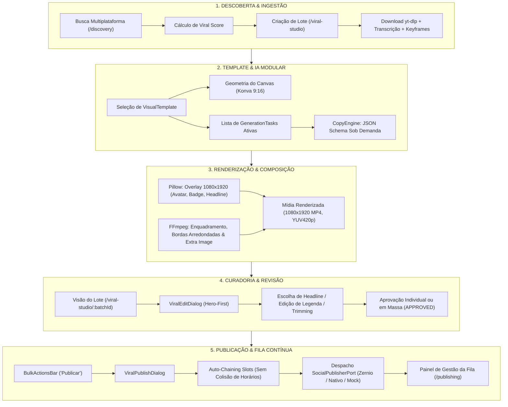
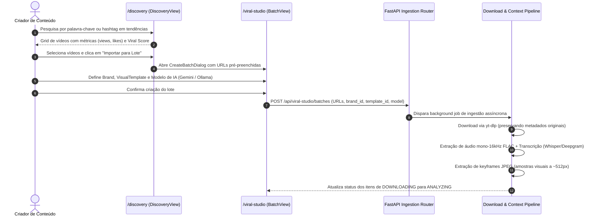
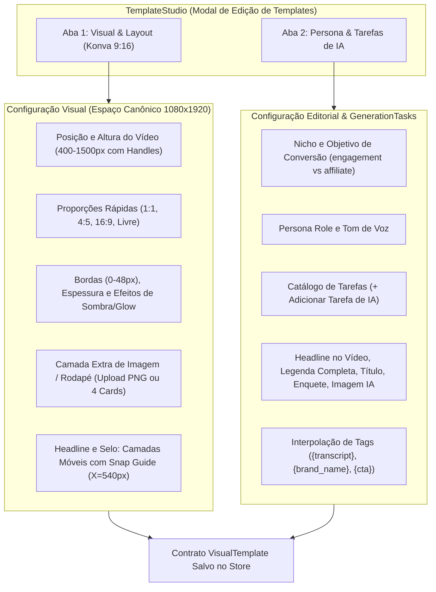
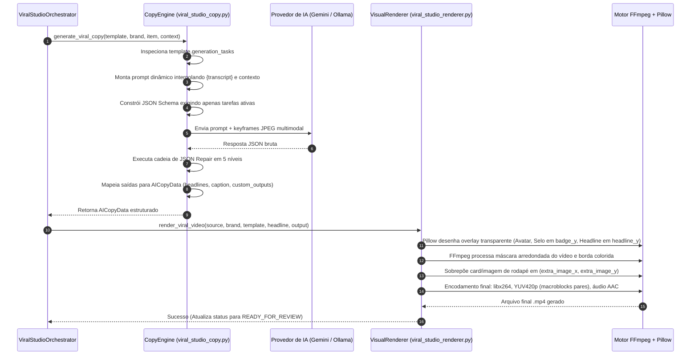
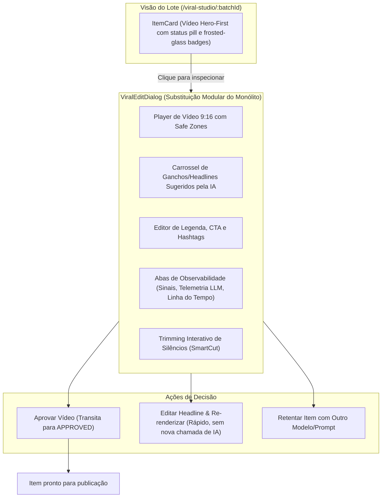
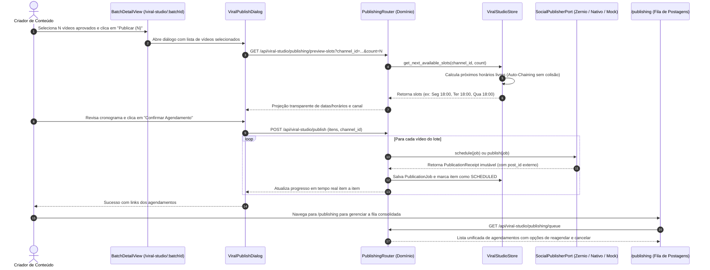

# Mapa de Fluxos de Ponta a Ponta — ViralForge

> **Documento de Arquitetura Unificada de Fluxos e Jornadas do Usuário**  
> **Fontes & Referências:**  
> - [`docs/plano-migracao-frontend.md`](plano-migracao-frontend.md) (Arquitetura React 19 + TanStack Router + Shadcn)  
> - [`docs/publicacao-e-fila-continua.md`](publicacao-e-fila-continua.md) (Fila Contínua & Ports and Adapters)  
> - [`docs/viral-studio-template-architecture.md`](viral-studio-template-architecture.md) (Templates Desacoplados, Konva & GenerationTasks)  
> - [`docs/adr/0001-ports-and-adapters-publishing.md`](adr/0001-ports-and-adapters-publishing.md)  
> - [`docs/adr/0002-decoupled-templates-personas-konva.md`](adr/0002-decoupled-templates-personas-konva.md)  
> - [`CONTEXT.md`](../CONTEXT.md) (Vocabulário Ubíquo de Domínio)  
> **Status:** Aprovado  
> **Data:** Setembro de 2026  

---

## 1. Visão Holística do Sistema: O Ciclo de Vida do Conteúdo

O **ViralForge** é uma plataforma automatizada de ponta a ponta para produção e distribuição de vídeos curtos verticais (9:16). O fluxo operacional une inteligência multimodal de IA, composição gráfica precisa (Pillow + FFmpeg), curadoria visual humana e agendamento contínuo em redes sociais (TikTok, Instagram Reels e YouTube Shorts).



---

## 2. Detalhamento dos 5 Grandes Fluxos de Ponta a Ponta

---

### FLUXO 1: Descoberta de Tendências & Ingestão de Lotes

**Objetivo:** Capturar mídias de alto potencial viral das redes ou permitir uploads locais, gerando um `ViralBatch` com contexto auditável.



* **Protótipos & Telas Relacionadas:**
  - `web/src/features/discovery/views/discovery-view.tsx`
  - `web/src/features/viral-studio/components/create-batch-dialog.tsx`
* **Invariantes do Fluxo:**
  - Modelos locais (Ollama / LM Studio) utilizam transcrição Whisper em CPU para evitar esgotamento de VRAM da GPU.
  - As URLs recebem validação estrita anti-SSRF antes do disparo do yt-dlp.

---

### FLUXO 2: Design de Templates & Contrato de IA (`TemplateStudio`)

**Objetivo:** Permitir ao criador configurar visualmente o layout 9:16 (vídeo, molduras, rodapé) e definir exatamente o que a IA deve gerar através de tarefas modulares (`GenerationTask`).



* **Protótipos de Validação:**
  - **Mecânica Visual:** [`docs/prototypes/viral-studio-template-simulation.html`](prototypes/viral-studio-template-simulation.html)
  - **Tarefas Modulares de IA:** [`docs/prototypes/dynamic-generation-tasks-simulation.html`](prototypes/dynamic-generation-tasks-simulation.html)
* **Invariantes do Fluxo:**
  - Se a tarefa `canvas_headline` for desativada, o vídeo entra no modo limpo e a IA não gasta tokens gerando manchetes.
  - Se `conversion_goal == "engagement"`, códigos de afiliados e links de bio são terminantemente proibidos no prompt.

---

### FLUXO 3: Execução de IA & Composição de Mídia (`CopyEngine` + `Renderer`)

**Objetivo:** Transformar a transcrição e os keyframes do vídeo em conteúdo de alta conversão e renderizar o arquivo final 1080×1920 com paridade matemática.



* **Costuras do Backend:**
  - `clippyme.domain.viral_studio_copy.generate_viral_copy`
  - `clippyme.domain.viral_studio_renderer.render_viral_video`
* **Invariantes do Fluxo:**
  - Todas as coordenadas de corte e escala geradas no FFmpeg passam pela correção par mandatória: `coord - (coord % 2)`.
  - Falhas de execução da IA ou do subprocesso FFmpeg transitam o item para `FAILED` com telemetria detalhada de erro, evitando itens congelados.

---

### FLUXO 4: Curadoria, Edição de Gancho & Revisão (`ViralEditDialog`)

**Objetivo:** Permitir ao criador inspecionar o vídeo final, selecionar entre as 5 manchetes geradas pela IA, ajustar a legenda e aprovar o item.



* **Diretrizes de Interface:**
  - **Vídeo como Hero:** Mídia sempre visível e sem sobrecarga de cabeçalhos duplos.
  - **Alinhamento Anti-Gap:** Grades de itens alinhadas ao topo (`items-start`), com botões e badges de ação ocupando slots simétricos de altura fixa (`h-8`).
* **Invariantes do Fluxo:**
  - Re-renderizar o vídeo para trocar de headline ou alterar o template não baixa o vídeo original novamente nem gasta créditos com a IA.

---

### FLUXO 5: Agendamento Inteligente com Fila Contínua & Publicação

**Objetivo:** Publicar vídeos aprovados nas redes sociais de forma contínua, sem colisões de horários e com desacoplamento de fornecedores externos.



* **Arquitetura de Portas e Adaptadores:**
  - **Porta:** `SocialPublisherPort` (definida no domínio).
  - **Adaptadores:** `ZernioPublisherAdapter` (oficial), `InternalPublisherAdapter` (futuro nativo), `MockPublisherAdapter` (testes offline).
* **Invariantes do Fluxo:**
  - Se um lote de 3 vídeos for agendado hoje (Seg, Ter, Qua às 18:00), o próximo lote para a mesma conta continuará automaticamente na Quinta às 18:00 (*Zero colisão*).
  - Em caso de esgotamento de quota ou HTTP 429 no provedor, o sistema reporta o erro transparente por item e oferece canal de fallback.

---

## 3. Matriz de Telas & Rotas do Novo Frontend (`web/src/routes/`)

A navegação entre os fluxos é unificada e tipada com **TanStack Router**:

| Rota | View / Feature | Papel no Fluxo | Ações Principais |
| :--- | :--- | :--- | :--- |
| **`/discovery`** | `DiscoveryView` | Fluxo 1: Descoberta de tendências | Busca por palavras/tags, filtro por rede, importar para lote. |
| **`/viral-studio`** | `ViralStudioView` | Fluxo 1 & 4: Gestão de lotes | Criar lote, visualizar cards de lotes com métricas agregadas. |
| **`/viral-studio/:batchId`** | `BatchDetailView` | Fluxo 4: Curadoria do lote | Grid hero-first de vídeos, filtro por status, seleção múltipla, abrir editor, botão "Publicar (N)". |
| **Modal / Dialog** | `ViralEditDialog` | Fluxo 4: Edição fina do item | Seleção de ganchos de IA, edição de cópia, trimming SmartCut, observabilidade de tokens. |
| **Modal / Dialog** | `TemplateStudio` | Fluxo 2: Estúdio de Templates | Canvas Konva 9:16 interativo, ajuste de altura e bordas, catálogo de tarefas de IA. |
| **Modal / Dialog** | `ViralPublishDialog`| Fluxo 5: Agendamento | Seletor de canal social, projeção de slots contínuos, disparo em tempo real. |
| **`/publishing`** | `PublishingQueueView`| Fluxo 5: Central da Fila | Histórico e calendário de agendamentos, filtros por canal, reagendamento e cancelamento. |
| **`/settings`** | `SettingsView` | Suporte Global | Configuração de chaves de IA (Gemini), provedores locais (Ollama), cookies e telemetria. |

---

## 4. Tabela de Estados do Vídeo (`ViralItem.status`)

Cada vídeo no sistema transita por uma máquina de estados estrita:

```
[DOWNLOADING] ──► [ANALYZING] ──► [READY_FOR_REVIEW] ──► [APPROVED] ──► [SCHEDULED] ──► [PUBLISHED]
       │                 │                  ▲                  │
       ▼                 ▼                  │                  ▼
    [FAILED]          [FAILED]         [Re-render]          [FAILED]
```

1. **`DOWNLOADING`**: yt-dlp realizando o download da mídia original em disco e salvando metadados.
2. **`ANALYZING`**: Transcrição de áudio, extração de keyframes, chamada ao `CopyEngine` e renderização preliminar no `VisualRenderer`.
3. **`READY_FOR_REVIEW`**: Vídeo renderizado com a headline inicial da IA, aguardando curadoria humana.
4. **`APPROVED`**: Vídeo revisado e aprovado pelo criador; habilitado para compor lotes de publicação.
5. **`SCHEDULED`**: Post agendado com data e hora reservada no algoritmo de fila contínua e registrado no provedor (`PublicationReceipt` emitido).
6. **`PUBLISHED`**: Post publicado com sucesso na plataforma social de destino.
7. **`FAILED`**: Falha com erro detalhado gravado na telemetria, habilitado para reprocessamento via `RetryItemDialog`.

---

## 5. Invariantes de Negócio & Qualidade de Código

1. **Invariante de Isolamento do Domínio:** Nenhuma classe de interface ou rota HTTP comunica diretamente com o SDK do Zernio ou APIs de redes sociais. Toda a publicação passa pelo `PublishingRouter` e pela porta `SocialPublisherPort`.
2. **Invariante de Pureza de Testes:** As regras de cálculo de slots de agendamento (`get_next_available_slots`) e a montagem de prompts (`build_viral_copy_prompt`) são puras e 100% testáveis no host via Vitest e Pytest sem acesso à internet.
3. **Invariante de Fidelidade Visual 1:1:** O que o criador vê no canvas 9:16 do `TemplateStudio` (coordenadas, moldura, escala, textos) é matematicamente equivalente à matriz de pixels processada pelo Pillow e FFmpeg no vídeo exportado.
4. **Invariante de Conformidade de Tema:** Todos os novos componentes de interface utilizam rigorosamente o catálogo Shadcn UI com variáveis semânticas do tema TweakCN (`tokens.css` + `app.css`). Proibido estilos inline ad-hoc com cores fora da paleta do projeto.

---

## 6. Fases de Execução e Roadmap de Implementação de Ponta a Ponta

Para materializar todos os fluxos com estabilidade, manutenibilidade e cobertura rigorosa de testes, a esteira de desenvolvimento é dividida em **Fases Sequenciais Coesas**, com distinção formal entre **V1 (Fechamento do Fluxo Essencial)** e **V2 (Evoluções Posteriores)**:


---

### ✅ Fases Concluídas (Fundação Sólida)

* **Fase 0 — Setup & Design System:** Vite 8, React 19, TypeScript estrito, Tailwind v4 e os 43 componentes do Shadcn UI integrados ao tema Dark Editorial Flat / TweakCN (`tokens.css` + `app.css`).
* **Fase 1 — Shell da Aplicação & Infraestrutura de Testes:** TanStack Router (`_app.tsx`), `AppSidebar`, `TopNav`, pirâmide de testes com Vitest, MSW v2 e Playwright (>90% de cobertura).
* **Fase 2 — Viral Studio Core (Ingestão de Lotes & Marcas):** Endpoints e hooks para `/batches`, `/items`, `CreateBatchDialog`, grid de lotes e persistência atômica com retrocompatibilidade garantida.
* **Fase 3 — Viral Editor Widescreen:** Desacoplamento do monólito em página dedicada (`/viral-studio/$id/items/$itemId`), hub de observabilidade em 3 abas, galeria de keyframes e seletor de ganchos da IA.

---

### 🎯 Fase 4: Publicação Inteligente & Fila Contínua (Zernio) [FASE ATUAL / EM EXECUÇÃO — FECHA V1]
> **Objetivo da Fase:** Fechar o fluxo do Viral Studio 100% de ponta a ponta na V1, conectando os vídeos aprovados à publicação imediata e agendamento em fila contínua sem colisões.  
> **Especificação Detalhada:** [`docs/publicacao-e-fila-continua.md`](publicacao-e-fila-continua.md)  
> **ADR de Decisão:** [`docs/adr/0001-ports-and-adapters-publishing.md`](adr/0001-ports-and-adapters-publishing.md)  
> **Metodologia:** `/codebase-design` (Módulos Profundos, Costuras e Dois Adaptadores)

* **Subfase 4.1: Arquitetura Hexagonal & Costura no Domínio (`SocialPublisherPort`)**
  - [ ] Implementar a porta abstrata `SocialPublisherPort` em `clippyme.domain.social_publisher_port`:
    - `publish(job: PublicationJob) -> PublicationReceipt`
    - `schedule(job: PublicationJob) -> PublicationReceipt`
    - `cancel(external_id: str) -> bool`
    - `get_status(external_id: str) -> PublicationReceipt`
  - [ ] Implementar a **Regra dos Dois Adaptadores (*Two Adapters Rule*)**:
    1. `ZernioPublisherAdapter`: adaptador de produção integrando `ZernioClient`, upload pré-assinado via streaming, conversão de payloads (TikTok, Instagram, YouTube) e tratamento de erros 429 com backoff.
    2. `MockPublisherAdapter`: adaptador determinístico em memória para testes offline e execução sem chave configurada.

* **Subfase 4.2: Motor Algorítmico de Fila Contínua (*Auto-Chaining Queue Engine*)**
  - [ ] Implementar a função pura `get_next_available_slots(account_id, count, preferred_time="18:00")` em `viral_studio_store.py`:
    - Consultar slots ocupados (`status == "SCHEDULED"`) para a conta social indicada.
    - Projetar slots futuros consecutivamente a partir do último horário ocupado sem colisão (ex: Seg 18:00, Ter 18:00; próximo lote começa na Qua 18:00).
    - Tratar viradas de mês, anos bissextos e preferências de dias da semana.
  - [ ] Implementar `cancel_item_schedule(item_id)` no store para cancelar o agendamento no provedor e retornar o item com segurança para `APPROVED`.

* **Subfase 4.3: Roteador e Endpoints da API Backend (`viral_studio_routes.py`)**
  - [ ] `GET /api/viral-studio/publishing/preview-slots?channel_id=...&count=N`: prévia em tempo real das datas/horários calculados antes da confirmação do usuário.
  - [ ] `POST /api/viral-studio/publish`: disparo transacional do lote para publicação ou agendamento via `SocialPublisherPort`.
  - [ ] `POST /api/viral-studio/publishing/{item_id}/cancel`: cancelamento no provedor externo e reversão do status para `APPROVED`.

* **Subfase 4.4: Interface do Usuário no Frontend (React 19 + Shadcn UI)**
  - [ ] Modal de Disparo `ViralPublishDialog.tsx`:
    - Seletor visual de contas conectadas (TikTok, Instagram, YouTube).
    - Modos: "Publicar Agora" (imediato) ou "Fila Inteligente Contínua" (1 post/dia às 18:00 sem colisão).
    - Tabela de projeção com preview transparente das datas e horários calculados para cada vídeo selecionado.
    - Painel em tempo real de disparo item a item com feedback de sucesso/falha e links gerados.
  - [ ] Pontos de Disparo no Lote e Editor:
    - `BulkActionsBar` (`batch-results-view.tsx`): botão "Publicar ({approvedCount})" ativado ao selecionar itens aprovados.
    - `ItemCard`: botão rápido de publicação individual para itens aprovados.
    - `ViralEditorBottomBar`: botão "Publicar Vídeo" para itens já aprovados.
  - [ ] Visualização de Status & Cancelamento no Lote:
    - Status pill `Agendado`: exibe *"Agendado para DD/MM às HH:MM"* com botão rápido para *"Cancelar Agendamento"*.
    - Status pill `Publicado`: exibe *"Publicado"* com link direto para o post.
    - `BatchFilterToolbar`: nova aba "Agendados / Publicados".

* **Subfase 4.5: Verificação e Testes de Host**
  - [ ] Testes unitários do backend (Pytest): `test_publishing_ports.py`, `test_auto_chaining.py` e `test_viral_studio_orchestrator.py`.
  - [ ] Testes de componentes no frontend (Vitest): `viral-publish-dialog.test.tsx`, `bulk-actions-bar.test.tsx` e `item-card.test.tsx`.

---

### ⏳ Fase 5: Estúdio de Templates Universais & IA Modular (Konva 9:16) [V2 — POSTERGADO]
> **Especificação Detalhada:** [`docs/viral-studio-template-architecture.md`](viral-studio-template-architecture.md)  
> **ADR de Decisão:** [`docs/adr/0002-decoupled-templates-personas-konva.md`](adr/0002-decoupled-templates-personas-konva.md)  
> **Protótipos Validados:** [`docs/prototypes/viral-studio-template-simulation.html`](prototypes/viral-studio-template-simulation.html) e [`docs/prototypes/dynamic-generation-tasks-simulation.html`](prototypes/dynamic-generation-tasks-simulation.html)

* **Backend (Schemas, Store, CopyEngine & Renderer):**
  - [ ] Implementar `GenerationTask` e atualizar `VisualTemplate` com 35+ campos (geometria 1080x1920, altura 400-1500px, bordas, rodapé e lista de `generation_tasks`).
  - [ ] Atualizar `AICopyData` com `custom_outputs: Dict[str, Any]` preservando retrocompatibilidade total.
  - [ ] Inicializar os 4 templates de fábrica universais no `viral_studio_store.py` (`curiosities-viral`, `classic-affiliate`, `quick-facts-news`, `tech-review`).
  - [ ] Refatorar `viral_studio_copy.py` (`CopyEngine`): montagem dinâmica de prompt por tarefas ativas, JSON Schema dinâmico sob demanda e desativação de manchetes em templates de vídeo limpo (*Clean Video Mode*).
  - [ ] Refatorar `viral_studio_renderer.py`: desenhar selo em `badge_y`, headline em `headline_y`, máscara de cantos arredondados (`video_radius`), moldura colorida e sobreposição do card/imagem extra de rodapé.
* **Frontend (TemplateStudio Workstation com `react-konva`):**
  - [ ] Criar o modal `TemplateEditorModal.tsx` dual-pane integrado aos componentes Shadcn e `react-konva`.
  - [ ] Implementar o canvas 1080×1920 com manipulação livre de camadas, alças verticais de altura do vídeo e guia magnética central (*Snap Guide*).
  - [ ] Implementar a aba "Persona & Tarefas de IA" com catálogo de blocos (+ Adicionar Tarefa de IA) e inserção de tags dinâmicas.

---

### ⏳ Fase 6: Central Dedicada de Fila e Calendário (`/publishing`) [V2 — POSTERGADO]
- [ ] Nova rota TanStack Router `_app/publishing.tsx` com link no menu `AppSidebar`.
- [ ] Painel gerencial com abas de status (Agendados, Publicados, Falhas) e filtros por canal/rede social.
- [ ] Visão em calendário mensal/semanal cross-batch com suporte a drag-and-drop para reagendamento manual.
- [ ] Endpoint `PATCH /api/viral-studio/publishing/{item_id}/reschedule`.

---

### ⏳ Fase 7: Descoberta Multiplataforma de Tendências (`/discovery`) [V2 — POSTERGADO]
- [ ] Endpoints `/api/discovery/search` e `/api/discovery/trending` (TikTok, Instagram Reels, YouTube Shorts).
- [ ] Cálculo algorítmico do **Viral Score**.
- [ ] Interface `DiscoveryView` com busca, filtros de engajamento e ação "Importar Selecionados para Lote".

---

### ⏳ Fase 8: Pipeline Tradicional de Cortes & Configurações Globais [V2 — POSTERGADO]
- [ ] Submissão de vídeos longos do YouTube para cortes automáticos 9:16 (`/clips`).
- [ ] Central de configurações `/settings` (gestão segura de API keys, IA local Ollama, cookies e telemetria de GPU).

---

### ⏳ Fase 9: Homologação Final, E2E & Substituição no Docker [V2 — POSTERGADO]
- [ ] Execução completa da suíte de testes automatizados (Pytest + Vitest).
- [ ] Testes E2E Playwright cobrindo a jornada completa: $\text{Lote} \longrightarrow \text{Editor} \longrightarrow \text{Aprovação} \longrightarrow \text{Publicação}$.
- [ ] Atualização do `Dockerfile` e `docker-compose.yml` para o build de produção do novo `web/`.
- [ ] Descomissionamento definitivo e arquivamento do diretório legado `dashboard/`.


