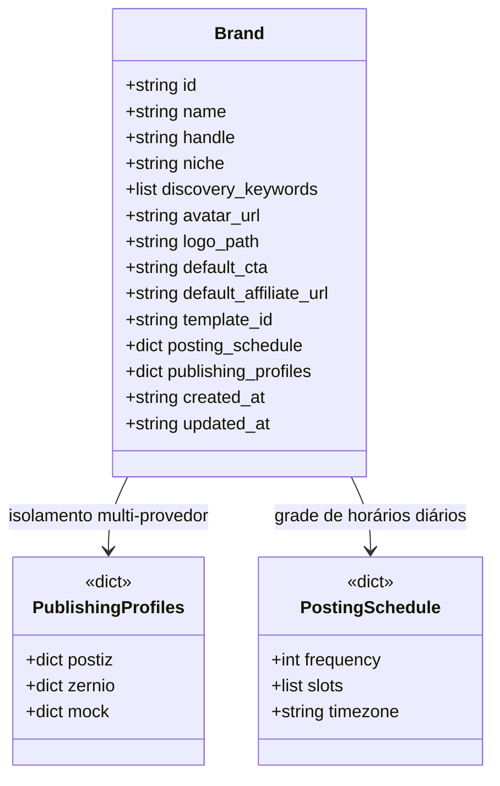
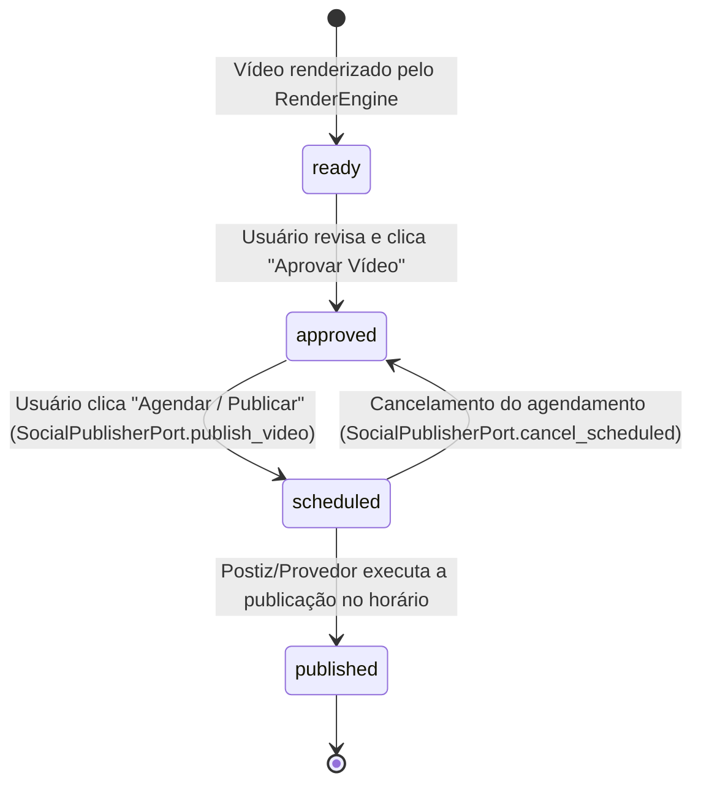

# Especificação Técnica: Workspace da Gestão de Marcas (Brand Management)

> **Status**: Concluído e Validado (2026-09-27)  
> **Protótipo Interativo**: [`docs/prototypes/gestao-marcas-workspace.html`](prototypes/gestao-marcas-workspace.html)  
> **Documentos Relacionados**: [`docs/integracao-publicacao-postiz.md`](integracao-publicacao-postiz.md), [`docs/adr/0001-ports-and-adapters-publishing.md`](adr/0001-ports-and-adapters-publishing.md), [`CONTEXT.md`](../CONTEXT.md)

---

## 1. Visão Geral e Princípios Arquiteturais

A Gestão de Marcas no ViralForge evolui de um simples formulário cadastral de metadados para um **Workspace Operacional Soberano da Marca** (`/viral-studio/brands/:brandId`).

### Diretrizes Fundamentais:
1. **Ports & Adapters (Hexagonal) Puro**: O domínio de marcas pertence exclusivamente ao ViralForge. Motores de publicação como **Postiz**, **Zernio** ou **Mock** são meros adaptadores periféricos (`SocialPublisherAdapter`) que implementam a porta `SocialPublisherPort`.
2. **Zero Acoplamento a Conceitos Proprietários**: O modelo central da entidade `Brand` e a interface do frontend não usam terminologias específicas de um provedor (ex: grupos, customers, internal IDs). Todas as referências a provedores externos são isoladas no dicionário agnóstico `publishing_profiles: Dict[str, Any]`.
3. **Sem Duplicação de Banco de Dados**: A verdade editorial dos vídeos permanece nos arquivos `batches.json`; os metadados da marca residem em `brands.json`; a fila e a execução do agendamento são consultadas on-demand através da porta do provedor ativo.
4. **Transferência Exclusiva 1:1 de Canais**: Um canal social pertence a exatamente uma marca por vez em todo o sistema. Ao vincular o canal à Marca B, o ViralForge remove automaticamente a vinculação prévia na Marca A, prevenindo colisões ou duplicações.

---

## 2. Modelo de Domínio (`/domain-modeling`)

### 2.1 Entidade `Brand` (Core Domain)

A entidade `Brand` modela a identidade, diretrizes editoriais e os vínculos de publicação da marca.



#### Estrutura de `posting_schedule` e Metadados Editoriais:
O campo `posting_schedule` armazena a grade editorial diária da marca, e os campos `niche` e `discovery_keywords` contextualizam a mineração inteligente no Discovery:
```json
{
  "id": "achadinhos-da-ju",
  "name": "Achadinhos da Ju",
  "handle": "@achadinhosdaju",
  "niche": "Achadinhos & Utilidades Domésticas",
  "discovery_keywords": ["achadinhos shopee", "produtos úteis tiktok", "unboxing utilidades"],
  "template_id": "classic-affiliate",
  "posting_schedule": {
    "frequency": 3,
    "slots": ["10:00", "15:00", "20:00"],
    "timezone": "America/Sao_Paulo"
  }
}
```

O campo `publishing_profiles` armazena de forma agnóstica o identificador de workspace da marca em cada provedor:
```json
{
  "postiz": {
    "customer_id": "cust_postiz_ju_101",
    "linked_at": "2026-09-26T17:30:00Z"
  },
  "zernio": {
    "profile_id": "z_ws_ju_001",
    "linked_at": "2026-09-26T17:30:00Z"
  },
  "mock": {
    "workspace_id": "mock_ws_default"
  }
}
```

### 2.2 Ciclo de Vida Editorial do Vídeo e Transições de Estado

Cada vídeo produzido no ViralForge (`ViralItem` em `batches.json`) tem vínculo obrigatório com uma `brand_id`. 



#### Invariante Crítica de Cancelamento:
Quando um agendamento é cancelado pelo usuário na aba de agendamentos:
1. O provedor de publicação deleta o post agendado (`SocialPublisherPort.cancel_scheduled(post_id)`).
2. O item correspondente em `batches.json` **reverte imediatamente seu status para `approved`**, permitindo que o usuário o re-agende em outro horário ou canal com um clique.
3. Um evento de auditoria é registrado no histórico `item.publication_records`:
   ```json
   {
     "action": "cancelled",
     "post_id": "post_pst_901",
     "cancelled_at": "2026-09-26T17:40:00Z",
     "reason": "user_cancelled"
   }
   ```

---

## 3. A Porta `SocialPublisherPort` (`/codebase-design`)

Para suportar a gestão completa de marcas sem vazamento de detalhes de infraestrutura, a interface abstrata `SocialPublisherPort` define contratos coesos com comportamento padrão (retrocompatível com adapters existentes):

```python
# src/clippyme/domain/social_publisher_port.py

from abc import ABC, abstractmethod
from dataclasses import dataclass, field
from datetime import datetime
from typing import Any, Dict, List, Optional

@dataclass(frozen=True)
class SocialChannel:
    """Representação agnóstica de um canal social conectado."""
    id: str
    platform: str  # 'instagram', 'tiktok', 'youtube', 'threads', 'facebook'
    name: str
    connected: bool = True
    handle: Optional[str] = None
    avatar_url: Optional[str] = None
    provider: str = "postiz"
    group_id: Optional[str] = None
    group_name: Optional[str] = None
    bound_to_brand_id: Optional[str] = None
    bound_to_brand_name: Optional[str] = None
    metadata: Dict[str, Any] = field(default_factory=dict)

@dataclass
class WorkspaceSummary:
    """Espaço de trabalho, cliente ou grupo no provedor de publicação."""
    id: str
    name: str
    provider: str

@dataclass
class ScheduledPost:
    """Post agendado ou publicado sob custódia do provedor."""
    post_id: str
    brand_id: str
    item_id: Optional[str]
    title: str
    scheduled_time: str
    status: str  # 'scheduled', 'published', 'failed'
    channels: List[str]
    thumbnail_url: Optional[str] = None
    external_url: Optional[str] = None
    metrics: Dict[str, Any] = field(default_factory=dict)

class SocialPublisherPort(ABC):
    """Porta canônica para provedores de publicação social."""

    # --- Contas e Canais ---
    async def list_accounts(self, brand_id: Optional[str] = None) -> List[SocialChannel]:
        """Extrai as contas/canais sociais conectados para uma marca específica."""
        return []

    async def get_connect_channel_url(self, brand_id: str, platform: Optional[str] = None) -> Optional[str]:
        """Retorna URL para o usuário autenticar nova rede social no provedor."""
        return None

    # --- Workspaces e Onboarding ---
    async def list_workspaces(self) -> List[WorkspaceSummary]:
        """Lista workspaces/grupos disponíveis no provedor para associação."""
        return []

    async def ensure_brand_workspace(self, brand_id: str, brand_name: str) -> str:
        """Provisiona ou garante a existência de um workspace para a marca no provedor."""
        return f"auto_{brand_id}"

    # --- Grade de Horários e Descoberta de Slots ---
    async def update_schedule_slots(self, brand_id: str, slots: List[str], timezone: str) -> bool:
        """Sincroniza grade de horários diários com o provedor (ex: Postiz POST /integrations/:id/time)."""
        return True

    async def find_next_slot(self, brand_id: str) -> Optional[datetime]:
        """Descobre o próximo horário livre recomendado para publicação da marca (ex: Postiz GET /find-slot)."""
        return None

    @abstractmethod
    async def publish(self, job: PublicationJob) -> PublicationReceipt:
        """Publica um vídeo imediatamente nos canais especificados."""
        ...

    @abstractmethod
    async def schedule(self, job: PublicationJob) -> PublicationReceipt:
        """Agenda um vídeo para data/hora futura no provedor."""
        ...

    async def cancel(self, external_id: str) -> bool:
        """Cancela e remove uma publicação agendada no provedor."""
        return False

    async def list_scheduled(
        self,
        brand_id: str,
        start_date: Optional[datetime] = None,
        end_date: Optional[datetime] = None,
    ) -> List[ScheduledPost]:
        """Lista os posts agendados e publicados sob custódia do provedor."""
        return []

    async def get_metrics(self, post_id: str) -> Dict[str, Any]:
        """Retorna métricas consolidadas (views, likes, comments) de um post."""
        return {}
```

---

## 4. Endpoints da API do ViralForge (`viral_studio_routes.py`)

A API expõe rotas especializadas para o Workspace da Marca, delegando as operações para o `SocialPublisherPort` ativo:

| Método | Endpoint | Descrição |
|---|---|---|
| `GET` | `/api/viral-studio/brands/{brand_id}/workspace` | Retorna metadados da marca, resumo do motor ativo e contadores. |
| `GET` | `/api/viral-studio/brands/{brand_id}/channels` | Chama `port.list_accounts(brand_id)` e retorna as redes sociais conectadas com vínculo e grupos. |
| `PUT` | `/api/viral-studio/brands/{brand_id}/channels` | Vincula canais à marca com **Transferência Exclusiva Automática 1:1** e provisionamento no provedor. |
| `POST` | `/api/viral-studio/brands/{brand_id}/channels/connect-url` | Retorna o link de conexão externa retornado por `port.get_connect_channel_url`. |
| `GET` | `/api/viral-studio/brands/{brand_id}/videos` | Filtra vídeos de `batches.json` onde `item.brand_id == brand_id`. Suporta `?status=approved`. |
| `POST` | `/api/viral-studio/brands/{brand_id}/publish` | Dispara agendamento: `item_id`, `channels`, opcional `schedule_time` (ou usa `port.find_next_slot`). |
| `POST` | `/api/viral-studio/brands/{brand_id}/auto-schedule` | Auto-agenda vídeo aprovado em 1 clique no próximo horário vago (`port.find_next_slot`). |
| `POST` | `/api/viral-studio/brands/{brand_id}/schedule-slots` | Atualiza a grade de horários diários da marca e sincroniza com o motor (`port.update_schedule_slots`). |
| `GET` | `/api/viral-studio/brands/{brand_id}/scheduled` | Chama `port.list_scheduled(brand_id)` para exibir a timeline. |
| `DELETE` | `/api/viral-studio/brands/{brand_id}/scheduled/{post_id}` | Chama `port.cancel_scheduled(post_id)` e **reverte o vídeo local para `approved`**. |
| `GET` | `/api/viral-studio/publishing/workspaces` | Chama `port.list_workspaces()` para permitir seleção de workspace no formulário da marca. |

---

## 5. Especificação de Interface Frontend (TanStack Router & Shadcn)

O ecossistema de Gestão de Marcas é composto por **duas telas integradas e complementares**, mantendo a coerência visual com o restante do ViralForge (Tailwind v4, tokens OKLCH, Dark Theme e componentes Shadcn UI):

```
web/src/routes/_app/viral-studio/
├── brands/
│   ├── index.tsx              # Tela 1: Catálogo Global de Marcas (brands-view.tsx)
│   └── $brandId.tsx           # Tela 2: Workspace da Marca Selecionada (workspace de 4 abas)
```

---

### 5.1 Tela 1: Catálogo Global de Marcas (`/viral-studio/brands` — `brands-view.tsx`)

A tela de listagem centraliza a visão panorâmica de todas as marcas cadastradas, permitindo buscar, filtrar por provedor ativo, auditar métricas operacionais e navegar diretamente para o workspace de cada marca.

```
┌────────────────────────────────────────────────────────────────────────────────────────┐
│  Top Bar: ViralForge Studio | Visualização: [📋 Ver Todas as Marcas v]                 │
├────────────────────────────────────────────────────────────────────────────────────────┤
│  CABEÇALHO DA LISTAGEM                                                                 │
│  [🔖] Perfis de Marca                                                [+ Nova Marca]   │
│       Gerencie marcas comerciais, canais conectados e esteiras de publicação.          │
├────────────────────────────────────────────────────────────────────────────────────────┤
│  [🔍 Buscar por nome, @handle ou nicho...]   [Motor: Todos v]   [3 marcas cadastradas]  │
├────────────────────────────────────────────────────────────────────────────────────────┤
│  GRID DE CARDS DE MARCA (3 colunas responsivo)                                         │
│                                                                                        │
│  ┌─────────────────────────┐  ┌─────────────────────────┐  ┌─────────────────────────┐ │
│  │ [Avatar] Achadinhos     │  │ [Avatar] Cortes Tech    │  │ [Avatar] Gourmet Exp    │ │
│  │ @achadinhosdaju         │  │ @cortestech             │  │ @gourmetexpress         │ │
│  │ Nicho: Achadinhos & Ut. │  │ Nicho: IA & Gadgets     │  │ Nicho: Culinária & Air. │ │
│  │ Motor: Postiz           │  │ Motor: Postiz           │  │ Motor: Postiz           │ │
│  │ ─────────────────────── │  │ ─────────────────────── │  │ ─────────────────────── │ │
│  │ 3 canais | 4 vídeos     │  │ 2 canais | 2 vídeos     │  │ 2 canais | 2 vídeos     │ │
│  │ Grade: 3 envios/dia     │  │ Grade: 2 envios/dia     │  │ Grade: 3 envios/dia     │ │
│  │ CTA: "Link na bio! 🛍️" │  │ CTA: "Siga p/ novidades"│  │ CTA: "E-book de 50 rec" │ │
│  │ ─────────────────────── │  │ ─────────────────────── │  │ ─────────────────────── │ │
│  │ [ Acessar Workspace → ] │  │ [ Acessar Workspace → ] │  │ [ Acessar Workspace → ] │ │
│  │ [ Discovery ]           │  │ [ Discovery ]           │  │ [ Discovery ]           │ │
│  └─────────────────────────┘  └─────────────────────────┘  └─────────────────────────┘ │
└────────────────────────────────────────────────────────────────────────────────────────┘
```

#### Especificação do Componente `BrandCard` Enriquecido (`brand-card.tsx`):
1. **Cabeçalho**:
   - Avatar da marca com indicador de status online e fallback de iniciais.
   - Nome comercial em destaque e `@handle` estilizado em fonte mono.
   - Badge do nicho editorial (`brand.niche`).
   - Badge do motor de publicação ativo (`Motor: Postiz` / `Zernio` / `Mock`).
2. **Resumo Operacional**:
   - Três métricas essenciais em pílulas:
     - **Canais Conectados**: Contagem de redes sociais ativas da marca.
     - **Acervo de Vídeos**: Total de criativos renderizados/aprovados em `batches.json`.
     - **Grade de Envios**: Frequência de postagens diárias e slots configurados.
3. **Diretrizes Editoriais**:
   - Snippet do **CTA Padrão** truncado em 1 linha.
   - Identificador do **Template Visual Padrão** (`classic-affiliate`, `modern-minimal`, etc.).
   - Chips das palavras-chave de mineração do Discovery (`#achadinhos`, `#shopee`).
4. **Ações**:
   - **Botão Primário**: **"Acessar Workspace →"** (ação principal com destaque total em roxo `bg-vf-primary`, navegando direto para `/viral-studio/brands/$brandId`).
   - **Ação Secundária**: Botão "Discovery" (atalho rápido para a ferramenta de Descoberta contextualizado no nicho da marca).
   - **Regra Arquitetural de Edição**: **A edição de dados da marca NÃO acontece na listagem.** O modal na listagem global é exclusivamente para cadastrar uma `+ Nova Marca`. Toda e qualquer alteração de nome, handle, nicho, template, CTA, links, canais ou grade de publicação é feita **exclusivamente dentro do Workspace da Marca** (`Aba 4: Configurações`), mantendo a listagem 100% enxuta, focada em visão macro e sem sobreposição de fluxos.

---

### 5.2 Tela 2: Workspace Dedicado da Marca (`/viral-studio/brands/$brandId` — `$brandId.tsx`)

Ao acessar a marca, o operador entra em seu ambiente de trabalho soberano com 4 abas especializadas:

```
┌────────────────────────────────────────────────────────────────────────────────────────┐
│  Top Bar: ViralForge Studio / Perfis de Marca / [Achadinhos da Ju]                     │
├────────────────────────────────────────────────────────────────────────────────────────┤
│  HERO DA MARCA                                                                         │
│  [← Voltar] [Avatar 80x80]  Achadinhos da Ju (@achadinhosdaju)                        │
│                             Template: classic-affiliate | Nicho: Achadinhos            │
│                             Motor Ativo: Postiz                                        │
│                             [Configurações da Marca] [Novo Lote de Vídeos v]           │
├───────────────────┬──────────────────────────┬───────────────────┬─────────────────────┤
│ 1. Canais Sociais │ 2. Vídeos da Marca       │ 3. Agenda & Fila  │ 4. Configurações     │
│    (Operacional)  │    (batches.json)        │    (Porta/Fila)   │    (Motor & Grade)  │
├───────────────────┴──────────────────────────┴───────────────────┴─────────────────────┤
│ CONTEÚDO DA ABA ATIVA                                                                  │
└────────────────────────────────────────────────────────────────────────────────────────┘
```

#### Botão de Voltar e Breadcrumbs:
- O botão `←` no cabeçalho do Workspace retorna instantaneamente para a listagem global (`/viral-studio/brands`).
- O breadcrumb no TopNav exibe o link clicável `Perfis de Marca`, permitindo retorno em 1 toque.
- O seletor de marcas no TopNav inclui a opção `📋 Ver Todas as Marcas` para transição rápida entre a visão macro e a visão individual.

---

### 5.3 As 4 Abas do Workspace da Marca

#### Aba 1: Canais Sociais (100% Limpa e Focada no Usuário)
- **Grid de Canais Conectados**: Cards com avatar da rede, handle, badge de status (`Conectado`, `Expirado`).
- **Botão "Conectar Nova Rede"**: Abre modal para vincular novos canais sociais.
- **Botão "Sincronizar"**: Revalida o status das conexões via `port.list_accounts(brand_id)`.
- **Zero Detalhes Técnicos**: A tela não exibe endpoints, tokens, portas do container ou IDs internos.

#### Aba 2: Vídeos da Marca
- **Filtros por Estado Editorial**: `Todos`, `Prontos para Revisão`, `Aprovados`, `Agendados`, `Publicados`.
- **Barra de Ferramentas**: Botão de ação rápida **"⚡ Auto-Agendar Próximo Slot"** para despachar o próximo vídeo aprovado em 1 clique.
- **Card do Vídeo**: Proporção 9:16 com thumbnail, título, gancho e badge colorido de estado.
- **Botões Contextuais**:
  - `ready` -> Botão verde **"Aprovar Vídeo"** (transiciona para `approved`).
  - `approved` -> Ação dupla:
    - Botão verde primário: **"⚡ Auto-Agendar no Próximo Slot"** (1 clique: consulta `find_next_slot` e agenda instantaneamente).
    - Botão secundário: **"Personalizar Horário..."** (abre Quick Publish Modal para ajustar canais ou selecionar horário específico).
  - `scheduled` -> Botão roxo **"Ver na Fila"** (alterna para Aba 3).
  - `published` -> Botão cinza **"Ver Post nas Redes"**.
- **Quick Publish Modal**:
  - Pré-seleciona todos os canais ativos da marca com opção de desmarcar individualmente.
  - Oferece opção de **"Próximo Slot Livre"** (calculado via `find_next_slot`) ou **"Publicar Agora"**.

#### Aba 3: Agenda & Fila
- **Linha do Tempo**: Lista cronológica de agendamentos contendo thumbnail, horário previsto, canais de destino e status.
- **Indicador do Próximo Slot**: Badge no cabeçalho exibindo em tempo real a próxima janela disponível (ex: `Hoje às 18:00` ou `Amanhã às 10:00`).
- **Ação "Cancelar Agendamento"**:
  - Modal de confirmação: *"Tem certeza que deseja cancelar? O vídeo retornará ao status 'Aprovado' para que você possa reagendá-lo quando desejar."*
  - Ao confirmar, dispara `DELETE /api/viral-studio/brands/{brand_id}/scheduled/{post_id}`.
  - O post desaparece da lista e o card na Aba 2 volta a exibir o botão "Auto-Agendar / Personalizar".
- **Visualização de Métricas**: Para posts com status `published`, exibe visualizações e curtidas obtidas via `port.get_metrics`.

#### Aba 4: Configurações da Marca & Motor de Publicação (Local Exclusivo de Edição da Marca)
Esta aba centraliza a edição de todos os parâmetros cadastrais e operacionais da marca:
- **Card 1: Motor & Adaptador de Publicação**:
  - Select para alternar o motor desta marca (`Postiz (Docker Self-Hosted)`, `Zernio (Cloud Provider)`, `Mock Offline`).
  - Associação de Workspace / Grupo do provedor via `port.list_workspaces()` ou provisionamento automático.
  - Endpoint Base, Orquestrador de Fila e status de conectividade com botão de **"Testar Conexão com o Motor"**.
- **Card 2: Grade de Publicação Automática (Posting Schedule)**:
  - Seletor de Frequência Pré-definida (`1x`, `2x`, `3x`, `4x` ao dia) ou horários customizados.
  - Fuso Horário da Marca (ex: `America/Sao_Paulo`).
  - Lista dinâmica de slots de postagem com inputs de horário (`Slot 1: 10:00`, `Slot 2: 15:00`, `Slot 3: 20:00`).
  - Sincronização direta com `postingTimes` no Postiz (`POST /integrations/:id/time`) convertendo horários em minutos desde a meia-noite (`[600, 900, 1200]`).
- **Card 3: Identidade Visual & Diretrizes**:
  - Edição de Nome da Marca, Handle `@`, Nicho Editorial (`niche`), Palavras-chave de Mineração (`discovery_keywords`), Template Visual Padrão, CTA de Conversão e Link de Afiliado.
  - Salva em `brands.json` com isolamento agnóstico em `brand.publishing_profiles`.

---

## 6. Sinergia com a Ferramenta de Descoberta (Discovery) e Ingestão de Lotes

Para garantir que o fluxo entre mineração de conteúdo, processamento no Viral Forge e gestão na Marca seja contínuo e sem atrito, aplicamos as seguintes regras:

### 6.1 Menu "Novo Lote de Vídeos" no Cabeçalho da Marca
O botão principal do workspace oferece duas opções ao criador:
1. **"Minerar no Discovery"**:
   - Navega para `/discovery?brand_id={brandId}`.
   - O Discovery lê o `brandId` da query string e exibe no topo os **chips de busca rápida** baseados em `brand.discovery_keywords` (ex: `[achadinhos shopee]`, `[produtos úteis]`).
   - Clicar em um chip dispara a mineração instantaneamente com 1 toque.
2. **"Inserir Links Manuais"**:
   - Abre um modal Shadcn enxuto diretamente no Workspace da Marca.
   - O criador cola links diretos (Instagram, TikTok, YouTube Shorts), já com a marca e seu template padrão pré-fixados.
   - Ao submeter, dispara `POST /batches` e os novos vídeos entram imediatamente na Aba 2 em estado `Renderizando...`.

### 6.2 Herança de Template Visual no `DiscoveryImportDrawer`
Ao selecionar vídeos minerados no Discovery e abrir o drawer de importação:
- **Mono-Marca (1 Marca selecionada)**: O drawer pré-seleciona automaticamente o `template_id` padrão da marca (`brand.template_id`).
- **Multi-Marca (`BrandPool` com 2+ Marcas)**: O criador pode optar por definir 1 template visual unificado para o lote ou manter o template padrão individual de cada marca (suportado nativamente via `item.template_id` no orquestrador).

### 6.3 Navegação e Feedback Pós-Importação
- Se o usuário iniciou a mineração a partir de uma Marca: após clicar em "Importar Lote", ele é redirecionado de volta para o Workspace daquela Marca (`/viral-studio/brands/{brandId}`) com notificação Toast.
- Na **Aba 2 (Vídeos da Marca)**, os itens em processamento são renderizados com badge roxo `Renderizando...` e indicador de carregamento ativo até transicionarem automaticamente para `Pronto p/ Revisão` (`READY_FOR_REVIEW`).

---

## 7. Plano de Implementação

| Fase | Entrega | Arquivos Envolvidos |
|---|---|---|
| **Fase 1: Domínio & Port** | Adicionar métodos `list_workspaces`, `ensure_brand_workspace`, `cancel_scheduled`, `list_scheduled`, `get_connect_channel_url`, `update_schedule_slots` e `find_next_slot` com defaults em `SocialPublisherPort`. Adicionar `niche` e `discovery_keywords` em `Brand`. | `src/clippyme/domain/social_publisher_port.py`, `src/clippyme/domain/viral_studio_store.py` |
| **Fase 2: Postiz Adapter** | Implementar `PostizClient` e os métodos da porta em `PostizPublisherAdapter` (suportando `/integrations/:id/time` e `/find-slot/:id`). | `src/clippyme/integrations/postiz_client.py`, `src/clippyme/domain/postiz_publisher_adapter.py` |
| **Fase 3: Endpoints API** | Implementar rotas `/api/viral-studio/brands/{brand_id}/...` incluindo `/auto-schedule` e `/schedule-slots`. | `src/clippyme/api/viral_studio_routes.py` |
| **Fase 4: Frontend Workspace** | Criar rota `$brandId.tsx`, header da marca com menu Novo Lote (Discovery vs Manual), 4 abas e modais de agendamento e lote manual em React/Shadcn. | `web/src/routes/_app/viral-studio/brands/$brandId.tsx`, `web/src/features/viral-studio/views/` |
| **Fase 5: Integração Discovery** | Conectar parâmetro `?brand_id=` no Discovery, renderizar chips de `discovery_keywords` e pré-selecionar a marca e template no drawer de importação. | `web/src/features/discovery/views/discovery-view.tsx`, `web/src/features/discovery/components/discovery-import-drawer.tsx` |
| **Fase 6: Testes Host** | Testes unitários do adapter Postiz, teste das transições de estado do vídeo, teste de agendamento contínuo e cancelamento. | `tests/test_postiz_publisher_adapter.py`, `tests/test_brand_workspace_routes.py` |
