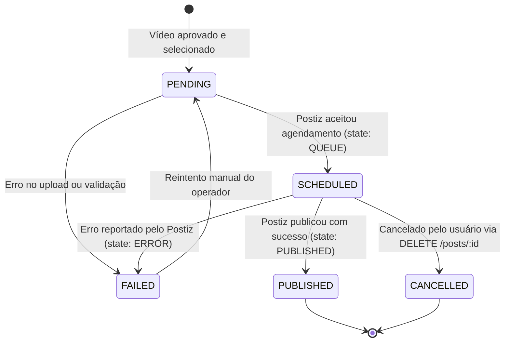

# Documentação Arquitetural e Funcional: Integração ViralForge ↔ Postiz

**Status:** Concluído e Validado (2026-09-27).  
**Metodologias aplicadas:**  
- `/ponytail` (simplicidade radical, zero duplicação de dados, sem abstrações especulativas).  
- `/domain-modeling` (vocabulário canônico estrito, invariantes de isolamento multimarca).  
- `/codebase-design` (módulos profundos, costuras com Ports & Adapters, testabilidade de host isolada).  

---

## 1. Visão Geral e Objetivos

O ViralForge é uma plataforma de estúdio autohospedada que ingere vídeos longos ou referências de tendências, extrai inteligência multimodal, gera roteiros e legendas dinâmicas, renderiza criativos verticais 9:16 de alta conversão e distribui o conteúdo final para múltiplos perfis sociais pertencentes a até 50 marcas distintas.

O **Postiz** (`ghcr.io/gitroomhq/postiz-app`) é um motor de agendamento e publicação social de código aberto, autohospedado em Docker com PostgreSQL 17, Redis 7.2 e um cluster **Temporal** (`temporal:7233`).

**Objetivo da Integração:**  
Delegar ao Postiz a responsabilidade integral pela autenticação OAuth com as redes sociais, gerenciamento de tokens, orquestração durável de filas, retries automáticos com backoff e disparo de posts para Instagram, TikTok, YouTube Shorts, Facebook, Threads, etc. O ViralForge mantém foco no pipeline criativo/editorial e na gestão de marcas, interagindo com o Postiz por meio de uma costura desacoplada (`SocialPublisherPort`).

---

## 2. Matriz de Responsabilidades (Divisão de Fronteiras)

Após a rodada de alinhamento `/grill-me`, as responsabilidades entre os sistemas ficaram estritamente delimitadas para evitar redundâncias ("reinvenção da roda"):

| Responsabilidade | Sistema Executor | Mecanismo e Descrição |
|---|---|---|
| **Criação & Edição Criativa** | **ViralForge** | Download, IA multimodal, copy, renderização 9:16, aprovação do operador e persistência editorial em `batches.json`. |
| **Autenticação OAuth Social** | **Postiz** | O operador conecta contas (Instagram, TikTok, YouTube) na interface do Postiz. O Postiz renova tokens e trata autenticação expirada. |
| **Agrupamento por Marca** | **Postiz + ViralForge** | Cada `Brand` no ViralForge mapeia para um `Customer` (Group) no Postiz. Contas sociais conectadas naquele grupo pertencem àquela marca. |
| **Transferência de Mídia (Vídeo)** | **ViralForge ➔ Postiz** | Stream multipart HTTP (`POST /public/v1/upload`) do MP4 gerado. 100% local via rede Docker (`host.docker.internal:4007`), sem URLs públicas ou buckets S3. |
| **Sugestão de Horários (Slots)** | **Postiz (com override ViralForge)** | Postiz calcula o próximo horário livre via `GET /public/v1/find-slot/:id` com base nos horários configurados. O operador pode aceitar ou customizar. |
| **Orquestração de Fila & Retries** | **Postiz (Temporal)** | O cluster Temporal gerencia a durabilidade da fila, retries automáticos contra rate limits e disparo exato no segundo programado. |
| **Armazenamento de Agendamentos** | **Postiz (PostgreSQL)** | O Postiz é a fonte canônica dos posts agendados (`GET /public/v1/posts?customer={id}`). O ViralForge **não duplica** esses dados em banco SQLite. |
| **Sincronização de Status** | **100% Sob Demanda** | Sem background workers ou crons no ViralForge. Status atualizado ao abrir a tela da Marca ou detalhe do vídeo via API do Postiz. |
| **Cancelamento de Agendamento** | **Postiz (via API)** | Ao cancelar no ViralForge, aciona `DELETE /public/v1/posts/:id` no Postiz, que cancela a workflow no Temporal e marca o item local como cancelado. |
| **Métricas e Analytics** | **Postiz (On-Demand)** | Ao visualizar métricas de um post publicado, consulta `GET /public/v1/analytics/post/:postId` no Postiz em tempo real. |

---

## 3. Modelo de Domínio (/domain-modeling)

### 3.1 Vocabulário Canônico e Mapeamento 1:1

```
ViralForge                                       Postiz
┌───────────────────────┐                        ┌───────────────────────┐
│        Brand          │ ◄────────────────────► │   Customer (Group)    │
│  (vale-o-clique)      │                        │  (id, name)           │
└──────────┬────────────┘                        └──────────┬────────────┘
           │ 1                                              │ 1
           │ possui                                         │ possui
           ▼ N                                              ▼ N
┌───────────────────────┐                        ┌───────────────────────┐
│     SocialChannel     │ ◄────────────────────► │      Integration      │
│  (@valeoclick_br)     │                        │  (Instagram, TikTok)  │
└───────────────────────┘                        └───────────────────────┘
           ▲                                                ▲
           │ 1                                              │ 1
           │ recebe                                         │ recebe
           │ N                                              │ N
┌───────────────────────┐                        ┌───────────────────────┐
│    PublicationJob     │ ◄────────────────────► │         Post          │
│  (Item X -> Canal Y)  │                        │  (state: QUEUE)       │
└───────────────────────┘                        └───────────────────────┘
```

* **`Brand` (Marca):** Entidade comercial no ViralForge. É dona dos vídeos e modelos visuais. Mapeia para um `Customer` no Postiz.
* **`SocialChannel` (Canal Social):** Perfil de rede social conectado (Instagram, TikTok, YouTube). Mapeia para uma `Integration` vinculada ao grupo da marca no Postiz.
* **`ViralItem`:** Criativo em vídeo aprovado pelo operador no ViralForge, contendo caminho do MP4 (`rendered_path`), título (`selected_headline`) e legenda (`caption`).
* **`PublicationJob`:** Unidade atômica que expressa o agendamento de 1 `ViralItem` em 1 `SocialChannel` específico.
* **`PublicationReceipt`:** Recibo imutável devolvido pela porta de publicação, contendo `post_id` externo, data programada, estado e URLs públicas.

### 3.2 Invariantes de Domínio e Regras de Negócio

1. **Isolamento Multimarca Absoluto:** Um `ViralItem` com `brand_id = "marca-a"` jamais pode ser despachado para uma `Integration` da `"marca-b"`. O validador de domínio confere a correspondência antes de qualquer chamada externa.
2. **Independência de Filas por Canal (`ADR 0005`):** Canais diferentes não compartilham slots. Se o Instagram da marca já esgotou a cota do dia, o TikTok da marca pode receber o post normalmente no seu próximo horário livre.
3. **Idempotência de Envio:** O par `(item_id, channel_id)` possui chave estável baseada em hash. O sistema bloqueia reenvios acidentais se já existir post em estado `scheduled` ou `published`.
4. **Isolamento de Falha:** A falha de postagem em uma rede social (ex: TikTok 429) não cancela nem afeta os envios bem-sucedidos em outras redes (Instagram, YouTube).

### 3.3 Ciclo de Vida do Job (4 Estados Limpos)



---

## 4. Arquitetura de Software e Design de Código (/codebase-design)

### 4.1 Visão Geral dos Módulos e Costuras

```
┌────────────────────────────────────────────────────────────────────────┐
│                        FastAPI Layer (api/)                            │
│  viral_studio_routes.py / brand_routes.py                              │
│  - GET  /api/viral-studio/brands/{id}/channels                         │
│  - POST /api/viral-studio/publications/schedule                        │
│  - POST /api/viral-studio/publications/{id}/cancel                     │
│  - GET  /api/viral-studio/brands/{id}/schedule                         │
└──────────────────────────────────┬─────────────────────────────────────┘
                                   │
                                   ▼
┌────────────────────────────────────────────────────────────────────────┐
│                 PublicationService (Deep Domain Module)                │
│  src/clippyme/domain/publication_service.py                            │
│  - schedule_items(brand_id, item_ids, channels, mode)                  │
│  - preview_slots(brand_id, channel_ids)                                │
│  - cancel_job(item_id, external_post_id)                               │
│  - list_brand_schedule(brand_id, start_date, end_date)                 │
└──────────────────┬───────────────────────────────┬─────────────────────┘
                   │                               │
                   ▼ (Seam: Porta Abstrata)        ▼ (Persistência Editorial)
┌─────────────────────────────────────┐   ┌──────────────────────────────┐
│        SocialPublisherPort          │   │         batches.json         │
│  src/clippyme/domain/               │   │ item.publication_records     │
│    social_publisher_port.py         │   │ (recibo leve por item)       │
│  - schedule(job) -> Receipt         │   └──────────────────────────────┘
│  - publish(job)  -> Receipt         │
│  - cancel(external_id)              │
│  - get_status(external_id)          │
│  - list_accounts(brand_id)          │
│  - find_next_slot(channel_id)       │
│  - list_scheduled(customer_id)      │
│  - get_metrics(post_id)             │
└──────────────────┬──────────────────┘
                   │
         ┌─────────┴─────────┐
         ▼                   ▼
┌─────────────────┐ ┌────────────────────────────────────────────────────┐
│  MockPublisher  │ │ PostizPublisherAdapter (Deep Adapter)              │
│     Adapter     │ │ src/clippyme/domain/postiz_publisher_adapter.py    │
│  (Host Tests)   │ │                                                    │
│  Em memória,    │ │ - Conecta em host.docker.internal:4007             │
│  0 dependências │ │ - Stream multipart para /public/v1/upload          │
│  de rede/Docker │ │ - Agendamento via /public/v1/posts                 │
│                 │ │ - Busca de slot via /public/v1/find-slot/:id       │
│                 │ │ - Tradução de erros e mapeamento de estados        │
└─────────────────┘ └────────────────────────────────────────────────────┘
```

### 4.2 A Costura: `SocialPublisherPort`

Localizado em [`src/clippyme/domain/social_publisher_port.py`](../src/clippyme/domain/social_publisher_port.py).  
A porta expõe uma interface pequena e estável que esconde toda a complexidade do Postiz:

```python
class SocialPublisherPort(ABC):
    """Porta abstrata do domínio para qualquer provedor de distribuição social."""

    @abstractmethod
    async def schedule(self, job: PublicationJob) -> PublicationReceipt:
        """Faz streaming do vídeo e cria post agendado no provedor."""
        ...

    @abstractmethod
    async def publish(self, job: PublicationJob) -> PublicationReceipt:
        """Faz streaming do vídeo e cria post com disparo imediato."""
        ...

    @abstractmethod
    async def cancel(self, external_id: str) -> bool:
        """Cancela post agendado no provedor."""
        ...

    @abstractmethod
    async def get_status(self, external_id: str) -> PublicationReceipt:
        """Consulta estado atual, erro e releaseURL no provedor."""
        ...

    async def list_accounts(self, brand_id: Optional[str] = None) -> List[SocialChannel]:
        """Lista os canais/integrações sociais disponíveis (opcionalmente filtrados por brand_id)."""
        return []

    async def find_next_slot(self, channel_id: str) -> Optional[datetime]:
        """Consulta o próximo horário livre no provedor (se suportado). Retorna None para fallback local."""
        return None

    async def list_scheduled(
        self, customer_id: str, start_date: str, end_date: str
    ) -> List[Dict[str, Any]]:
        """Consulta o calendário de posts no provedor (se suportado)."""
        return []

    async def get_metrics(self, external_id: str) -> Dict[str, Any]:
        """Consulta estatísticas de engajamento do post no provedor (se suportado)."""
        return {}
```

### 4.3 O Adaptador: `PostizPublisherAdapter`

Localizado em `src/clippyme/domain/postiz_publisher_adapter.py`.  
É um **Deep Module**: esconde o cliente HTTP, autenticação por API Key, streaming multipart em chunks de 64KB, construção de DTOs do Postiz (`CreatePostDto`), e tratamento de exceções com fallback.

```python
class PostizPublisherAdapter(SocialPublisherPort):
    def __init__(self, base_url: str, api_key: str):
        self.base_url = base_url.rstrip("/")
        self.api_key = api_key
        self.client = httpx.AsyncClient(
            base_url=self.base_url,
            headers={"Authorization": api_key},
            timeout=120.0
        )
```

#### Operações de Upload e Agendamento:
1. **Upload de Mídia:**
   O adapter abre o arquivo `job.effective_media_path` e realiza streaming para `POST /public/v1/upload`.  
   O Postiz salva o arquivo em seu volume local e responde `{ "id": "media_uuid", "path": "uploads/..." }`.
2. **Criação do Post:**
   Dispara `POST /public/v1/posts` com o payload:
   ```json
   {
     "type": "schedule",
     "date": "2026-09-27T18:00:00.000Z",
     "shortLink": false,
     "tags": [],
     "posts": [
       {
         "integration": { "id": "postiz_integration_id" },
         "value": [
           {
             "content": "Título / Legenda do ViralForge",
             "image": [
               {
                 "id": "media_uuid",
                 "path": "uploads/..."
               }
             ]
           }
         ],
         "settings": {
           "post_type": "post"
         }
       }
     ]
   }
   ```
   *Nota de Resposta:* O Postiz pode responder tanto com um objeto `{"postId": "..."}` quanto com um array de itens criados `[{"postId": "..."}]`. O cliente trata ambas as estruturas transparentemente.
3. **Mapeamento de Status:**
   * `QUEUE` no Postiz ➔ `status: "scheduled"` no ViralForge.
   * `PUBLISHED` no Postiz ➔ `status: "published"`, captura `releaseURL` e `releaseId`.
   * `ERROR` no Postiz ➔ `status: "failed"`, captura `error`.

### 4.4 Persistência Editorial em `batches.json` (Sem Banco SQLite Extra)

Em estrita consonância com a regra de simplificação `/ponytail` validada no alinhamento:
* **Zero tabelas SQLite novas:** Não criamos nenhum arquivo `.sqlite3` adicional nem gerenciamos migrações.
* **Histórico de Execução no Item:** O ViralForge já possui `item.publication_records` gravado atomicamente com `_STORE_LOCK` em `batches.json`. Cada agendamento adiciona um registro leve:
  ```json
  {
    "key": "sha256_hash",
    "channel_id": "postiz_integration_id",
    "platform": "instagram",
    "post_id": "postiz_post_id",
    "scheduled_for": "2026-09-27T18:00:00Z",
    "status": "scheduled",
    "updated_at": "2026-09-26T20:00:00Z"
  }
  ```
* **Consulta da Grade da Marca:** Quando o operador abre a tela da Marca ("Agenda da Marca"):
  1. Para listar os **vídeos gerados** dessa marca: `viral_studio_store.get_items_by_brand(brand_id)` filtra os itens em memória em `< 1ms`.
  2. Para listar o **calendário de agendamentos reais**: chama `SocialPublisherPort.list_scheduled(brand.postiz_customer_id, start_date, end_date)`. O Postiz consulta seu PostgreSQL e retorna a lista com status atualizado.

---

## 5. Garantia de Compatibilidade com Outros Provedores (Zernio, Mock, Futuros)

A integração do Postiz foi rigorosamente desenhada para **não quebrar** a interoperabilidade com o **Zernio**, o **Mock** ou futuros adaptadores nativos:

### 5.1. Resolução Dinâmica de Provedores (`get_social_publisher`)
A fábrica de instâncias preserva suporte total à alternância de provedores via configuração (`PUBLISHING_PROVIDER` em `data/config.json` ou variável de ambiente):
```python
def get_social_publisher(provider: Optional[str] = None) -> SocialPublisherPort:
    # 1. Mock para testes ou modo offline
    if use_mock:
        return MockPublisherAdapter()
    
    # 2. Postiz como provedor primário multimarca
    if provider == "postiz" or (configured_provider == "postiz") or (has_postiz_key and not configured_provider):
        return PostizPublisherAdapter(base_url=postiz_url, api_key=postiz_key)

    # 3. Zernio como provedor legado/alternativo
    if provider == "zernio" or (configured_provider == "zernio") or (has_zernio_key and not configured_provider):
        return ZernioPublisherAdapter(api_key=zernio_key)

    # 4. Fallback seguro para Mock
    return MockPublisherAdapter()
```
Se um operador desejar continuar publicando via Zernio, basta selecionar `PUBLISHING_PROVIDER=zernio` nas Configurações.

### 5.2. Degradação Graciosa de Métodos Estendidos
Os novos métodos adicionados à porta (`find_next_slot`, `list_scheduled`, `get_metrics`) **não são abstratos** e possuem retorno padrão seguro (`None`, `[]`, `{}`):
* **Fallback de Slots:** Se o provedor ativo retornar `None` em `find_next_slot` (caso do Zernio e Mock), o serviço de publicação automaticamente utiliza o algoritmo local `viral_studio_store.get_next_available_slots()`. A fila contínua segue funcionando sem interrupção.
* **Fallback de Calendário:** Se o provedor não suportar `list_scheduled`, a tela da marca exibe os itens com status baseado nos registros locais `publication_records`.
* **Fallback de Métricas:** Se o provedor não expor analytics, a consulta retorna vazio graciosamente sem lançar exceções.

### 5.3. Universalidade dos DTOs (`PublicationJob` e `PublicationReceipt`)
* O campo `account_id` no `PublicationJob` é agnóstico: representa o `integration_id` no Postiz, o `account_id` no Zernio ou o `mock_id` no Mock.
* O `PublicationReceipt` padroniza o resultado (`scheduled`, `published`, `failed`, `cancelled`), mantendo o comportamento idêntico para o orquestrador e para o frontend.

---

## 6. Comunicação de Infraestrutura e Redes Docker

No arquivo [`docker-compose.yml`](../docker-compose.yml), o container `clippyme-backend` já possui a diretiva `host.docker.internal:host-gateway`:

```yaml
services:
  backend:
    container_name: clippyme-backend
    extra_hosts:
      - "host.docker.internal:host-gateway"
```

O Postiz está mapeado na porta `4007` do host (`0.0.0.0:4007->5000/tcp`).  
Portanto, a comunicação entre o backend do ViralForge e o Postiz funciona imediatamente com:
* **`POSTIZ_BASE_URL`**: `http://host.docker.internal:4007`
* **`POSTIZ_API_KEY`**: Chave de API gerada no painel de administração do Postiz.

---

## 7. Fluxos Operacionais de Ponta a Ponta

### Fluxo 1: Vinculação de Canais da Marca
1. O operador cadastra os perfis sociais no painel do Postiz e organiza por grupo/customer correspondente à Marca.
2. Na tela de Configurações da Marca no ViralForge, o frontend consulta `GET /api/viral-studio/brands/{id}/channels`.
3. O backend consulta o Postiz via `list_accounts(brand.postiz_customer_id)` e exibe os canais ativos (foto, @handle, ícone da plataforma).
4. O ViralForge salva no `brands.json` o mapeamento: `publishing_profiles[platform] = { account_id: postiz_integration_id, handle, name, avatar_url }`.

### Fluxo 2: Publicação em Lote / Agendamento Automático
1. O operador seleciona itens aprovados (`status == "APPROVED"`) no Viral Studio e abre o diálogo de publicação.
2. O operador escolhe publicar "Agora" ou "Agendar na Fila".
3. Se "Agendar na Fila":
   * Para cada canal da marca, o ViralForge consulta `find_next_slot(channel_id)` no Postiz para sugerir a próxima vaga.
   * O operador pode aceitar ou ajustar a data/hora.
4. Ao confirmar:
   * O backend valida que cada item pertence à marca dos canais solicitados.
   * Dispara o stream multipart do vídeo para o Postiz (`/public/v1/upload`).
   * Dispara o `POST /public/v1/posts` com data agendada.
   * O Postiz entrega a execução para o Temporal e retorna `post.id`.
   * O ViralForge grava o recibo em `item.publication_records` com `status: "scheduled"`.

### Fluxo 3: Cancelamento de Post Agendado
1. Na tela da Marca ou no modal do vídeo, o operador visualiza um post com `status: "scheduled"` e clica em "Cancelar Agendamento".
2. O ViralForge chama `POST /api/viral-studio/publications/{post_id}/cancel`.
3. O adapter chama `DELETE /public/v1/posts/{post_id}` no Postiz.
4. O Postiz remove a tarefa do Temporal e deleta o post.
5. O ViralForge atualiza o `item.publication_records` localmente para `status: "cancelled"`.

### Fluxo 4: Sincronização On-Demand de Status e Métricas
1. Quando o operador abre os detalhes do vídeo publicado no ViralForge:
2. O frontend chama `GET /api/viral-studio/publications/{post_id}/metrics`.
3. O adapter consulta `GET /public/v1/analytics/post/{post_id}` no Postiz.
4. Retorna visualizações, curtidas, comentários e o link público (`releaseURL`) em tempo real.

---

## 8. Roteiro de Implementação e Verificação

### Fase 1: Cliente e Adaptador Postiz (Backend)
* [ ] Implementar cliente HTTP `PostizClient` em `src/clippyme/integrations/postiz_client.py`.
* [ ] Implementar `PostizPublisherAdapter` em `src/clippyme/domain/postiz_publisher_adapter.py`.
* [ ] Atualizar factory `get_social_publisher()` em `src/clippyme/domain/social_publisher_port.py` para suportar `provider="postiz"`.
* [ ] Adicionar variáveis `POSTIZ_BASE_URL` e `POSTIZ_API_KEY` em `.env.example` e `config_store.py`.
* [ ] Criar suite de testes de host `tests/test_postiz_publisher_adapter.py` com mocks de resposta para validação rápida no CI sem dependência de rede.

### Fase 2: Serviço de Publicação e Rotas FastAPI
* [ ] Criar `src/clippyme/domain/publication_service.py` orquestrando validação multimarca, upload e agendamento.
* [ ] Atualizar rotas em `src/clippyme/api/viral_studio_routes.py` para expor:
  * `POST /api/viral-studio/publications/schedule`
  * `POST /api/viral-studio/publications/{id}/cancel`
  * `GET  /api/viral-studio/brands/{id}/schedule`
  * `GET  /api/viral-studio/publications/{id}/metrics`

### Fase 3: Conexão Frontend (Web)
* [ ] Atualizar tela de Gestão da Marca no frontend para listar canais do Postiz e exibir a grade de posts agendados.
* [ ] Atualizar o diálogo de publicação `viral-publish-dialog.tsx` para permitir escolher data sugerida pelo Postiz ou envio imediato.
* [ ] Exibir link direto para a publicação (`releaseURL`) nos cards de vídeos aprovados e publicados.

---

## 9. Verificação e Testes

```bash
# 1. Executar testes de unidade do adaptador Postiz (rápidos, isolados)
uv run --extra host-tests --with pytest pytest tests/test_postiz_publisher_adapter.py -v

# 2. Executar validação de qualidade (Ruff + linter)
./scripts/verify.sh --backend

# 3. Teste manual de ponta a ponta
# - Iniciar Postiz em /home/luis/repositories/postiz-docker-compose
# - Iniciar ViralForge backend e frontend
# - Conectar uma conta de teste no Postiz
# - Agendar um vídeo gerado no ViralForge e confirmar recebimento na fila do Temporal (http://localhost:8080)
```

---

## 10. Infraestrutura de Domínio Público e Túneis (Cloudflare Tunnel)

Para viabilizar a comunicação com provedores sociais externos (OAuth da Meta/Instagram/Facebook/TikTok e Webhooks) sem restrições de tráfego, a infraestrutura pública do ambiente utiliza **Cloudflare Tunnel (`cloudflared`)** com um domínio próprio configurado via `.env` (`CLOUDFLARE_DOMAIN` e `POSTIZ_PUBLIC_URL`), substituindo permanentemente túneis com limite rígido de banda (como o plano gratuito do ngrok de 1 GB/mês).

### 10.1 Mapeamento de Subdomínios e Portas

| Serviço | Subdomínio Modelo | Porta Local | Finalidade |
|---|---|---|---|
| **Postiz** | `https://postiz.<seu-dominio.online>` | `4007` | Interface web do Postiz, OAuth callback e Webhooks da Meta |
| **ViralForge API** | `https://api.<seu-dominio.online>` | `8000` | Backend FastAPI, webhooks e documentação Swagger (`/docs`) |
| **ViralForge Studio** | `https://studio.<seu-dominio.online>` | `5176` | Frontend Vite Dashboard |

### 10.2 Configuração dos Túneis

* **Configuração local:** `~/.cloudflared/config.yml` mapeia o túnel nomeado `viralforge` com regras de *ingress* para cada subdomínio com protocolo HTTP/2.
* **Execução em segundo plano:** Gerenciado pelo serviço de usuário do systemd (`~/.config/systemd/user/cloudflared.service`), ativo 24/7 e sobrevivendo a reinicializações.
* **Script de controle:** `./scripts/start_tunnels.sh {status|start|stop|restart}`.

