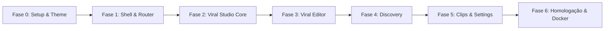

# Plano de Migração e Arquitetura do Frontend — ViralForge

> **Documento de Especificação Técnica e Diretrizes Arquiteturais**  
> **Status:** Aprovado para execução faseada  
> **Referência Arquitetural:** [`/home/luis/repositories/engancha-web`](file:///home/luis/repositories/engancha-web)  
> **Tema Visual Shadcn:** [TweakCN Theme](https://tweakcn.com/r/themes/cmlva2weo000104jr85nt08re)

---

## 1. Contexto e Motivação

O frontend atual (`dashboard/`) foi concebido inicialmente como um fork do ClippyMe, acumulando dívida técnica severa que impede a escalabilidade do **ViralForge**:

1. **Monólitos de Código:** Arquivos centrais como `viralStudio.jsx` (+1.300 linhas) e `ViralEditModal.jsx` (+1.000 linhas) misturam layout, chamadas de rede, regras de negócio e manipulação de estado em um único bloco.
2. **Ausência de TypeScript:** O uso de JavaScript puro gera erros silenciosos em tempo de execução ao manipular os complexos contratos de dados do backend (transcrições, telemetria de LLM, ganchos, métricas de engajamento).
3. **Gerenciamento de Estado Frágil:** Sincronização manual via `useEffect`, `setInterval` e chaves soltas de `localStorage` sem cache centralizado.
4. **Camada Legada:** A pasta provisória `dashboard/src/redesign/` gerou duplicações com `src/lib/` e `src/hooks/`.

### Objetivo da Migração
Construir um novo frontend moderno, performático, fortemente tipado e escalável em uma pasta isolada (ex.: `web/`), mantendo o `dashboard/` legado operacional até a substituição definitiva.

---

## 2. Stack Tecnológica Oficial

A stack adota exatamente os padrões consolidados no projeto de referência `engancha-web`:

| Camada | Tecnologia | Versão / Padrão |
|---|---|---|
| **Runtime & Bundler** | React + Vite | React 19, Vite 8, TypeScript estrito |
| **Estilização** | Tailwind CSS v4 + tw-animate-css | CSS-first (`@import 'tailwindcss';`) |
| **Componentes UI** | Shadcn UI (New York style) + Radix UI | Catálogo completo sob `@/components/ui` |
| **Tema** | TweakCN | `pnpm dlx shadcn@latest add https://tweakcn.com/r/themes/cmlva2weo000104jr85nt08re` |
| **Roteamento** | TanStack Router | File-based routing com parâmetros e buscas tipadas |
| **Data Fetching** | TanStack Query (React Query) | v5 com cache, refetch reativo e polling inteligente |
| **Tabelas** | TanStack Table | v8 para listagens complexas com paginação e filtros |
| **Estado Transitório** | Zustand | v5 para stores leves (ex.: player ativo, rascunho de edições) |
| **Formulários & Schemas**| React Hook Form + Zod | Validação automática refletindo os modelos Pydantic do backend |
| **Notificações** | Sonner | Toasts modernos acessíveis e tematizados |
| **Ícones** | Lucide React | Consistência visual em todo o app |
| **Testes** | Vitest + React Testing Library | Cobertura unitária e de integração de componentes |

---

## 3. Diretrizes e Regras Arquiteturais Inegociáveis

### 3.1. Convenção Estrita de Features (Padrão `engancha-web`)
Cada funcionalidade do sistema é encapsulada em um módulo autônomo dentro de `src/features/<feature>/`:

```text
src/features/<feature>/
├── views/       # Composição da página/fluxo da feature. NÃO faz fetch, NÃO conhece apiFetch.
├── components/  # Componentes de apresentação locais. Recebem dados e callbacks via props.
├── hooks/       # TanStack Query (useQuery, useMutation), polling e orquestração de estado.
├── services/    # Chamadas HTTP (Axios), definição de queryKeys e helpers de invalidação.
└── data/        # Schemas Zod, tipos TypeScript inferidos e constantes sem efeitos colaterais.
```

#### Regras Obrigatórias de Dependência entre Camadas:
- **Rotas (`src/routes/`)** importam **exclusivamente** a `view` pública da feature. Jamais montam layout ou chamam serviços.
- **`views/`** compõe os `components/` e invoca os `hooks/`. Ela não conhece detalhes de transporte HTTP.
- **`components/`** são puramente apresentacionais ou locais. Nunca importam serviços de API diretamente.
- **`hooks/`** concentram a adaptação de dados. Toda `mutation` deve invalidar as `queryKeys` correspondentes declaradas em seu `services/`.
- **`services/`** é o **único** ponto de contato com o cliente HTTP (`api-client.ts`). Nenhuma outra camada deve fazer requisições diretas.
- **`data/`** não possui efeitos colaterais: abriga schemas Zod, tipos derivados (`z.infer`), mapeamentos e opções estáticas.

---

### 3.2. Regra Irrevogável: Shadcn-First

> **Mandato:** Todo elemento de interface deve utilizar obrigatoriamente um componente do **shadcn/ui** (`src/components/ui/`). O desenvolvimento de componentes customizados só é tolerado quando for tecnicamente impossível expressar a funcionalidade com os primitivos existentes.

#### Mapeamento de Primitivos Mandatórios:
- **Botões:** `Button` (variantes `default`, `secondary`, `destructive`, `ghost`, `outline`).
- **Formulários:** `Form`, `FormField`, `FormItem`, `FormLabel`, `FormControl`, `FormMessage`.
- **Entradas:** `Input`, `Textarea`, `Select`, `RadioGroup`, `Checkbox`, `Switch`.
- **Diálogos:** `Dialog`, `AlertDialog`, `Sheet` (drawers laterais para painéis de edição/filtro).
- **Navegação & Contexto:** `DropdownMenu`, `Popover`, `Tabs`, `Tooltip`.
- **Status & Indicadores:** `Badge`, `Progress`, `Skeleton` (para estados de carregamento).
- **Containers:** `Card`, `CardHeader`, `CardTitle`, `CardDescription`, `CardContent`, `CardFooter`.
- **Feedback:** `Sonner` estilizado conforme o tema TweakCN.

#### Protocolo para Componentes Customizados (Exceções):
Aplica-se unicamente a elementos sem equivalente no shadcn, como:
- Player de vídeo vertical 9:16 com grid de guias seguras (safe zones).
- Linha do tempo interativa de trimming/corte com waveform de áudio.

**Regras para componentes customizados:**
1. **Composição interna com Shadcn:** Controles do player (play/pause, volume, timeline) **devem** ser compostos por `Button`, `Slider` e `Switch` do shadcn.
2. **Uso estrito de tokens do tema:** Proibido o uso de cores hexadecimais hardcoded. Usar sempre classes semânticas do tema (`bg-card`, `border-border`, `text-card-foreground`, `ring-ring`).
3. **Localização:** Componentes compartilhados globais ficam em `src/components/shared/`; componentes específicos de uma tela ficam em `features/<feature>/components/`.

---

## 4. Estrutura Completa de Diretórios Proposta

```text
web/
├── src/
│   ├── api/
│   │   ├── client.ts                 # Instância tipada do Axios com baseURL (/api) e interceptors
│   │   └── handle-api-error.ts       # Tratamento centralizado de erros do FastAPI e emissão de toasts
│   │
│   ├── components/
│   │   ├── ui/                       # Catálogo oficial do Shadcn UI gerado via CLI
│   │   └── shared/                   # Componentes compartilhados (AppSidebar, TopNav, SafeZoneOverlay)
│   │
│   ├── features/
│   │   ├── viral-studio/             # ⭐ MÓDULO CENTRAL DO VIRALFORGE
│   │   │   ├── views/
│   │   │   │   ├── viral-studio-view.tsx    # Dashboard principal de lotes e estatísticas
│   │   │   │   └── batch-detail-view.tsx    # Visão detalhada de um lote (grid de vídeos/itens)
│   │   │   ├── components/
│   │   │   │   ├── batch-card.tsx
│   │   │   │   ├── batch-status-badge.tsx
│   │   │   │   ├── create-batch-dialog.tsx  # Modal com upload de cookies e entrada de URLs
│   │   │   │   ├── item-card.tsx            # Card de vídeo com preview, status e badges
│   │   │   │   ├── item-telemetry-badge.tsx # Indicadores de modelo de IA, tokens e duração
│   │   │   │   └── retry-item-dialog.tsx    # Diálogo para reprocessamento com outro prompt/modelo
│   │   │   ├── hooks/
│   │   │   │   ├── use-batches.ts           # Query de listagem de lotes
│   │   │   │   ├── use-batch-detail.ts      # Query detalhada com refetchInterval inteligente
│   │   │   │   ├── use-create-batch.ts      # Mutation de ingestão de lote
│   │   │   │   └── use-retry-item.ts        # Mutation para retentar job de item falhado
│   │   │   ├── services/
│   │   │   │   ├── viral-studio.api.ts      # Endpoints: /api/viral-studio/batches, /items, /retry
│   │   │   │   └── viral-studio.keys.ts     # Query keys: ['batches'], ['batch', id]
│   │   │   └── data/
│   │   │       ├── batch.schema.ts          # Schemas Zod de validação
│   │   │       └── batch.types.ts           # Tipos TypeScript inferidos
│   │   │
│   │   ├── viral-editor/             # ✂️ EDITOR DE CONTEÚDO E GANCHO VIRAL
│   │   │   ├── views/
│   │   │   │   └── viral-edit-dialog.tsx    # Modal orquestrador da edição (substitui o arquivo de 1000 linhas)
│   │   │   ├── components/
│   │   │   │   ├── video-preview.tsx        # Player 9:16 com botões shadcn
│   │   │   │   ├── hook-selector.tsx        # Carrossel/lista dos ganchos sugeridos pela IA
│   │   │   │   ├── copy-editor-form.tsx     # Edição de legenda, CTA e link de afiliado
│   │   │   │   ├── subtitle-styler.tsx      # Configuração visual de legendas dinâmicas
│   │   │   │   └── audio-mixer.tsx          # Controle de volume original vs música de fundo
│   │   │   ├── hooks/
│   │   │   │   ├── use-item-editor.ts       # Controle de formulário com RHF + Zod
│   │   │   │   └── use-render-item.ts       # Mutation para gerar novo vídeo renderizado
│   │   │   ├── services/
│   │   │   │   └── viral-editor.api.ts      # Endpoints de preview e renderização
│   │   │   └── data/
│   │   │       └── editor.schema.ts
│   │   │
│   │   ├── discovery/                # 🔎 DESCOBERTA MULTIPLATAFORMA DE TENDÊNCIAS
│   │   │   ├── views/
│   │   │   │   └── discovery-view.tsx       # Exploração por palavra-chave e tendências
│   │   │   ├── components/
│   │   │   │   ├── discovery-search-bar.tsx
│   │   │   │   ├── platform-filter-tabs.tsx # Tabs shadcn: Todos, TikTok, Instagram, YouTube
│   │   │   │   ├── trend-video-grid.tsx
│   │   │   │   ├── trend-card.tsx           # Métricas de engajamento e cálculo de viral score
│   │   │   │   └── import-to-batch-modal.tsx# Ação para transformar vídeos descobertos em lote
│   │   │   ├── hooks/
│   │   │   │   ├── use-discovery-search.ts
│   │   │   │   └── use-import-trends.ts
│   │   │   ├── services/
│   │   │   │   └── discovery.api.ts         # Endpoint /api/discovery/search
│   │   │   └── data/
│   │   │       └── discovery.types.ts
│   │   │
│   │   ├── pipeline-clips/           # 📼 PIPELINE TRADICIONAL DE CORTES (LEGADO REFATORADO)
│   │   │   ├── views/
│   │   │   │   ├── create-clip-view.tsx     # Submissão de link longo (YouTube/upload)
│   │   │   │   └── clip-history-view.tsx    # Histórico de jobs legados
│   │   │   ├── components/
│   │   │   │   ├── source-input-form.tsx
│   │   │   │   ├── clip-recipe-card.tsx
│   │   │   │   └── clip-results-grid.tsx
│   │   │   ├── hooks/
│   │   │   │   └── use-clip-jobs.ts
│   │   │   └── services/
│   │   │       └── clip-jobs.api.ts
│   │   │
│   │   └── settings/                 # ⚙️ CONFIGURAÇÕES DO SISTEMA E IA
│   │       ├── views/
│   │       │   └── settings-view.tsx
│   │       ├── components/
│   │       │   ├── api-keys-card.tsx        # Chaves Gemini, Deepgram, ElevenLabs
│   │       │   ├── ai-models-card.tsx       # Seletor de modelos locais (Ollama) e cloud
│   │       │   ├── cookies-manager-card.tsx # Upload de cookies por plataforma
│   │       │   └── hardware-status-card.tsx # Telemetria de GPU (CUDA/ROCm) vs CPU
│   │       ├── hooks/
│   │       │   ├── use-settings.ts
│   │       │   └── use-update-settings.ts
│   │       └── services/
│   │           └── settings.api.ts          # Endpoints /api/config
│   │
│   ├── routes/                       # TanStack Router (File-based routing)
│   │   ├── __root.tsx                # Shell raiz: ThemeProvider, QueryClientProvider, Toaster
│   │   ├── _app.tsx                  # Layout padrão com Sidebar e TopNav
│   │   ├── _app/
│   │   │   ├── viral-studio/
│   │   │   │   ├── index.tsx         # Rota /viral-studio
│   │   │   │   └── $batchId.tsx      # Rota /viral-studio/:batchId
│   │   │   ├── discovery.tsx         # Rota /discovery
│   │   │   ├── clips.tsx             # Rota /clips
│   │   │   └── settings.tsx          # Rota /settings
│   │   └── index.tsx                 # Redireciona para /viral-studio
│   │
│   ├── stores/                       # Zustand Stores
│   │   ├── app-store.ts              # Preferências de interface e sidebar colapsada
│   │   └── player-store.ts           # Vídeo atualmente em reprodução ativa
│   │
│   └── styles/
│       ├── index.css                 # Importação do Tailwind v4 e resets
│       └── theme.css                 # Tokens CSS do tema TweakCN
```

---

## 5. Fases de Execução da Migração



### Fase 0: Inicialização do Projeto & Design System
1. Inicializar o projeto `web/` com Vite 8, React 19 e TypeScript (`vite.config.ts`, `tsconfig.json`).
2. Configurar o Tailwind CSS v4 (`@import 'tailwindcss';` e `@import 'tw-animate-css';`).
3. Instalar o tema do TweakCN via CLI do Shadcn:
   ```bash
   pnpm dlx shadcn@latest add https://tweakcn.com/r/themes/cmlva2weo000104jr85nt08re
   ```
4. Configurar os componentes base do Shadcn (`Button`, `Card`, `Dialog`, `Input`, `Badge`, `Sonner`, etc.).
5. Configurar `api-client.ts` com Axios e `query-client.ts` com TanStack Query v5.

### Fase 1: Shell da Aplicação & Roteamento
1. Configurar o TanStack Router com árvore de rotas automatizada (`routeTree.gen.ts`).
2. Implementar o `_app.tsx` com a `AppSidebar` e `TopNav` (exibindo marca ViralForge e avatar `VF`).
3. Adicionar o `Toaster` do Sonner no `__root.tsx`.

### Fase 2: Viral Studio Core (Lotes e Itens)
1. Criar `features/viral-studio/services/` com endpoints `/api/viral-studio/batches` e schemas Zod em `data/`.
2. Criar `hooks/use-batches.ts` e `hooks/use-batch-detail.ts` com polling automático quando houver jobs em processamento.
3. Criar a tela principal `ViralStudioView`:
   - Listagem de lotes em cards responsivos com badges de status.
   - Diálogo de criação de lote (`CreateBatchDialog`) com suporte a URLs e upload opcional de cookies.
4. Criar a tela `BatchDetailView`:
   - Grid de itens do lote com telemetria (modelo de IA, tokens, status de renderização).
   - Ações de retentativa (`RetryItemDialog`) com personalização de modelo/prompt.

### Fase 3: Viral Editor (Decomposição do Modal Monolítico)
1. Decompor o arquivo legado de 1.000 linhas (`ViralEditModal.jsx`) em componentes atômicos:
   - `video-preview.tsx` (player com aspect ratio 9:16).
   - `hook-selector.tsx` (cards de seleção de ganchos virais).
   - `copy-editor-form.tsx` (campos de texto para título, descrição, CTA e link de afiliado com validação Zod).
   - `subtitle-styler.tsx` (seletor de estilo de legenda).
2. Implementar `use-item-editor.ts` usando React Hook Form para edição fluida sem re-renders desnecessários.
3. Conectar a mutação de renderização com feedback em tempo real via Sonner.

### Fase 4: Descoberta Multiplataforma de Vídeos
1. Implementar `features/discovery/` com integração ao endpoint `/api/discovery/search`.
2. Criar barra de busca unificada por hashtag/palavra-chave e filtros por plataforma (TikTok, Instagram, YouTube).
3. Implementar card de tendências com métricas de engajamento e botão de importação direta para lote do Viral Studio.

### Fase 5: Pipeline Tradicional de Cortes & Configurações
1. Migrar a submissão de vídeos longos para corte (`features/pipeline-clips/`).
2. Implementar a tela de configurações (`features/settings/`):
   - Gerenciamento de chaves de API com mascaramento seguro.
   - Seleção de modelo local Ollama / Cloud Gemini.
   - Upload de cookies de autenticação por plataforma.

### Fase 6: Homologação, Testes & Substituição no Docker
1. Validar a suíte de testes unitários com Vitest para todas as features.
2. Atualizar o `docker-compose.yml` e o `Dockerfile` para apontar o build do frontend para a nova pasta `web/`.
3. Validar a execução completa do container em ambiente de desenvolvimento e produção.
4. Descomissionar e arquivar o diretório legado `dashboard/`.

---

## 6. Critérios de Aceite & Checklist de Conclusão

- [ ] **Zero linhas de CSS global ad-hoc:** Estilização 100% via Tailwind v4 e variáveis semânticas do tema TweakCN.
- [ ] **100% Shadcn-First:** Nenhum botão, input, modal ou badge criado manualmente fora do catálogo Shadcn.
- [ ] **Zero `any` em TypeScript:** Todos os payloads de API e estados locais estritamente tipados via schemas Zod.
- [ ] **Nenhum arquivo com mais de 300 linhas:** Decomposição estrita de views e subcomponentes.
- [ ] **Cache Reativo:** Transições de tela instantâneas com TanStack Query sem refetches redundantes ou telas brancas.
- [ ] **Paridade Funcional Completa:** 100% das funcionalidades do Viral Studio, Discovery e Configurações operando sem regressões.
