# Plano de Migração e Arquitetura do Frontend — ViralForge

> **Documento de Especificação Técnica e Diretrizes Arquiteturais**  
> **Status:** Aprovado para execução faseada  
> **Referência Arquitetural:** [`/home/luis/repositories/engancha-web`](file:///home/luis/repositories/engancha-web)  
> **Tema Visual Shadcn:** [TweakCN Theme](https://tweakcn.com/r/themes/cmlva2weo000104jr85nt08re)

---

## 1. Contexto e Motivação

O frontend atual (`dashboard/`) foi concebido inicialmente como um fork do ClippyMe, acumulando dívida técnica severa que impede a escalabilidade do **ViralForge**:

1. **Monólitos de Código:** Arquivos centrais como `viralStudio.jsx` (+1.300 linhas) e `ViralEditModal.jsx` (+1.000 linhas) misturam layout, chamadas de rede, regras de negócio e manipulação de estado em um único bloco.
2. **Ausência de TypeScript:** O uso de JavaScript puro gera erros silenciosos em tempo de execução ao manipular os complexos contratos de dados do backend (transcrições, telemetria de LLM, ganchos, métricas de engajamento).
3. **Gerenciamento de Estado Frágil:** Sincronização manual via `useEffect`, `setInterval` e chaves soltas de `localStorage` sem cache centralizado.
4. **Camada Legada:** A pasta provisória `dashboard/src/redesign/` gerou duplicações com `src/lib/` e `src/hooks/`.

### Objetivo da Migração
Construir um novo frontend moderno, performático, fortemente tipado e escalável em uma pasta isolada (ex.: `web/`), mantendo o `dashboard/` legado operacional até a substituição definitiva.

---

## 2. Stack Tecnológica Oficial

A stack adota exatamente os padrões consolidados no projeto de referência `engancha-web`:

| Camada | Tecnologia | Versão / Padrão |
|---|---|---|
| **Runtime & Bundler** | React + Vite | React 19, Vite 8, TypeScript estrito |
| **Estilização** | Tailwind CSS v4 + tw-animate-css | CSS-first (`@import 'tailwindcss';`) |
| **Componentes UI** | Shadcn UI (New York style) + Radix UI | Catálogo completo sob `@/components/ui` |
| **Tema** | TweakCN | `pnpm dlx shadcn@latest add https://tweakcn.com/r/themes/cmlva2weo000104jr85nt08re` |
| **Roteamento** | TanStack Router | File-based routing com parâmetros e buscas tipadas |
| **Data Fetching** | TanStack Query (React Query) | v5 com cache, refetch reativo e polling inteligente |
| **Tabelas** | TanStack Table | v8 para listagens complexas com paginação e filtros |
| **Estado Transitório** | Zustand | v5 para stores leves (ex.: player ativo, rascunho de edições) |
| **Formulários & Schemas**| React Hook Form + Zod | Validação automática refletindo os modelos Pydantic do backend |
| **Notificações** | Sonner | Toasts modernos acessíveis e tematizados |
| **Ícones** | Lucide React | Consistência visual em todo o app |
| **Testes** | Vitest + React Testing Library | Cobertura unitária e de integração de componentes |

---

## 3. Diretrizes e Regras Arquiteturais Inegociáveis

### 3.1. Convenção Estrita de Features (Padrão `engancha-web`)
Cada funcionalidade do sistema é encapsulada em um módulo autônomo dentro de `src/features/<feature>/`:

```text
src/features/<feature>/
├── views/       # Composição da página/fluxo da feature. NÃO faz fetch, NÃO conhece apiFetch.
├── components/  # Componentes de apresentação locais. Recebem dados e callbacks via props.
├── hooks/       # TanStack Query (useQuery, useMutation), polling e orquestração de estado.
├── services/    # Chamadas HTTP (Axios), definição de queryKeys e helpers de invalidação.
└── data/        # Schemas Zod, tipos TypeScript inferidos e constantes sem efeitos colaterais.
```

#### Regras Obrigatórias de Dependência entre Camadas:
- **Rotas (`src/routes/`)** importam **exclusivamente** a `view` pública da feature. Jamais montam layout ou chamam serviços.
- **`views/`** compõe os `components/` e invoca os `hooks/`. Ela não conhece detalhes de transporte HTTP.
- **`components/`** são puramente apresentacionais ou locais. Nunca importam serviços de API diretamente.
- **`hooks/`** concentram a adaptação de dados. Toda `mutation` deve invalidar as `queryKeys` correspondentes declaradas em seu `services/`.
- **`services/`** é o **único** ponto de contato com o cliente HTTP (`api-client.ts`). Nenhuma outra camada deve fazer requisições diretas.
- **`data/`** não possui efeitos colaterais: abriga schemas Zod, tipos derivados (`z.infer`), mapeamentos e opções estáticas.

---

### 3.2. Regra Irrevogável: Shadcn-First

> **Mandato:** Todo elemento de interface deve utilizar obrigatoriamente um componente do **shadcn/ui** (`src/components/ui/`). O desenvolvimento de componentes customizados só é tolerado quando for tecnicamente impossível expressar a funcionalidade com os primitivos existentes.

#### Mapeamento de Primitivos Mandatórios:
- **Botões:** `Button` (variantes `default`, `secondary`, `destructive`, `ghost`, `outline`).
- **Formulários:** `Form`, `FormField`, `FormItem`, `FormLabel`, `FormControl`, `FormMessage`.
- **Entradas:** `Input`, `Textarea`, `Select`, `RadioGroup`, `Checkbox`, `Switch`.
- **Diálogos:** `Dialog`, `AlertDialog`, `Sheet` (drawers laterais para painéis de edição/filtro).
- **Navegação & Contexto:** `DropdownMenu`, `Popover`, `Tabs`, `Tooltip`.
- **Status & Indicadores:** `Badge`, `Progress`, `Skeleton` (para estados de carregamento).
- **Containers:** `Card`, `CardHeader`, `CardTitle`, `CardDescription`, `CardContent`, `CardFooter`.
- **Feedback:** `Sonner` estilizado conforme o tema TweakCN.

#### Protocolo para Componentes Customizados (Exceções):
Aplica-se unicamente a elementos sem equivalente no shadcn, como:
- Player de vídeo vertical 9:16 com grid de guias seguras (safe zones).
- Linha do tempo interativa de trimming/corte com waveform de áudio.

**Regras para componentes customizados:**
1. **Composição interna com Shadcn:** Controles do player (play/pause, volume, timeline) **devem** ser compostos por `Button`, `Slider` e `Switch` do shadcn.
2. **Uso estrito de tokens do tema:** Proibido o uso de cores hexadecimais hardcoded. Usar sempre classes semânticas do tema (`bg-card`, `border-border`, `text-card-foreground`, `ring-ring`).
3. **Localização:** Componentes compartilhados globais ficam em `src/components/shared/`; componentes específicos de uma tela ficam em `features/<feature>/components/`.

---

## 4. Estrutura Completa de Diretórios Proposta

```text
web/
├── src/
│   ├── api/
│   │   ├── client.ts                 # Instância tipada do Axios com baseURL (/api) e interceptors
│   │   └── handle-api-error.ts       # Tratamento centralizado de erros do FastAPI e emissão de toasts
│   │
│   ├── components/
│   │   ├── ui/                       # Catálogo oficial do Shadcn UI gerado via CLI
│   │   └── shared/                   # Componentes compartilhados (AppSidebar, TopNav, SafeZoneOverlay)
│   │
│   ├── features/
│   │   ├── viral-studio/             # ⭐ MÓDULO CENTRAL DO VIRALFORGE
│   │   │   ├── views/
│   │   │   │   ├── viral-studio-view.tsx    # Dashboard principal de lotes e estatísticas
│   │   │   │   └── batch-detail-view.tsx    # Visão detalhada de um lote (grid de vídeos/itens)
│   │   │   ├── components/
│   │   │   │   ├── batch-card.tsx
│   │   │   │   ├── batch-status-badge.tsx
│   │   │   │   ├── create-batch-dialog.tsx  # Modal com upload de cookies e entrada de URLs
│   │   │   │   ├── item-card.tsx            # Card de vídeo com preview, status e badges
│   │   │   │   ├── item-telemetry-badge.tsx # Indicadores de modelo de IA, tokens e duração
│   │   │   │   └── retry-item-dialog.tsx    # Diálogo para reprocessamento com outro prompt/modelo
│   │   │   ├── hooks/
│   │   │   │   ├── use-batches.ts           # Query de listagem de lotes
│   │   │   │   ├── use-batch-detail.ts      # Query detalhada com refetchInterval inteligente
│   │   │   │   ├── use-create-batch.ts      # Mutation de ingestão de lote
│   │   │   │   └── use-retry-item.ts        # Mutation para retentar job de item falhado
│   │   │   ├── services/
│   │   │   │   ├── viral-studio.api.ts      # Endpoints: /api/viral-studio/batches, /items, /retry
│   │   │   │   └── viral-studio.keys.ts     # Query keys: ['batches'], ['batch', id]
│   │   │   └── data/
│   │   │       ├── batch.schema.ts          # Schemas Zod de validação
│   │   │       └── batch.types.ts           # Tipos TypeScript inferidos
│   │   │
│   │   ├── viral-editor/             # ✂️ EDITOR DE CONTEÚDO E GANCHO VIRAL
│   │   │   ├── views/
│   │   │   │   └── viral-edit-dialog.tsx    # Modal orquestrador da edição (substitui o arquivo de 1000 linhas)
│   │   │   ├── components/
│   │   │   │   ├── video-preview.tsx        # Player 9:16 com botões shadcn
│   │   │   │   ├── hook-selector.tsx        # Carrossel/lista dos ganchos sugeridos pela IA
│   │   │   │   ├── copy-editor-form.tsx     # Edição de legenda, CTA e link de afiliado
│   │   │   │   ├── subtitle-styler.tsx      # Configuração visual de legendas dinâmicas
│   │   │   │   └── audio-mixer.tsx          # Controle de volume original vs música de fundo
│   │   │   ├── hooks/
│   │   │   │   ├── use-item-editor.ts       # Controle de formulário com RHF + Zod
│   │   │   │   └── use-render-item.ts       # Mutation para gerar novo vídeo renderizado
│   │   │   ├── services/
│   │   │   │   └── viral-editor.api.ts      # Endpoints de preview e renderização
│   │   │   └── data/
│   │   │       └── editor.schema.ts
│   │   │
│   │   ├── discovery/                # 🔎 DESCOBERTA MULTIPLATAFORMA DE TENDÊNCIAS
│   │   │   ├── views/
│   │   │   │   └── discovery-view.tsx       # Exploração por palavra-chave e tendências
│   │   │   ├── components/
│   │   │   │   ├── discovery-search-bar.tsx
│   │   │   │   ├── platform-filter-tabs.tsx # Tabs shadcn: Todos, TikTok, Instagram, YouTube
│   │   │   │   ├── trend-video-grid.tsx
│   │   │   │   ├── trend-card.tsx           # Métricas de engajamento e cálculo de viral score
│   │   │   │   └── import-to-batch-modal.tsx# Ação para transformar vídeos descobertos em lote
│   │   │   ├── hooks/
│   │   │   │   ├── use-discovery-search.ts
│   │   │   │   └── use-import-trends.ts
│   │   │   ├── services/
│   │   │   │   └── discovery.api.ts         # Endpoint /api/discovery/search
│   │   │   └── data/
│   │   │       └── discovery.types.ts
│   │   │
│   │   ├── pipeline-clips/           # 📼 PIPELINE TRADICIONAL DE CORTES (LEGADO REFATORADO)
│   │   │   ├── views/
│   │   │   │   ├── create-clip-view.tsx     # Submissão de link longo (YouTube/upload)
│   │   │   │   └── clip-history-view.tsx    # Histórico de jobs legados
│   │   │   ├── components/
│   │   │   │   ├── source-input-form.tsx
│   │   │   │   ├── clip-recipe-card.tsx
│   │   │   │   └── clip-results-grid.tsx
│   │   │   ├── hooks/
│   │   │   │   └── use-clip-jobs.ts
│   │   │   └── services/
│   │   │       └── clip-jobs.api.ts
│   │   │
│   │   └── settings/                 # ⚙️ CONFIGURAÇÕES DO SISTEMA E IA
│   │       ├── views/
│   │       │   └── settings-view.tsx
│   │       ├── components/
│   │       │   ├── api-keys-card.tsx        # Chaves Gemini, Deepgram, ElevenLabs
│   │       │   ├── ai-models-card.tsx       # Seletor de modelos locais (Ollama) e cloud
│   │       │   ├── cookies-manager-card.tsx # Upload de cookies por plataforma
│   │       │   └── hardware-status-card.tsx # Telemetria de GPU (CUDA/ROCm) vs CPU
│   │       ├── hooks/
│   │       │   ├── use-settings.ts
│   │       │   └── use-update-settings.ts
│   │       └── services/
│   │           └── settings.api.ts          # Endpoints /api/config
│   │
│   ├── routes/                       # TanStack Router (File-based routing)
│   │   ├── __root.tsx                # Shell raiz: ThemeProvider, QueryClientProvider, Toaster
│   │   ├── _app.tsx                  # Layout padrão com Sidebar e TopNav
│   │   ├── _app/
│   │   │   ├── viral-studio/
│   │   │   │   ├── index.tsx         # Rota /viral-studio
│   │   │   │   └── $batchId.tsx      # Rota /viral-studio/:batchId
│   │   │   ├── discovery.tsx         # Rota /discovery
│   │   │   ├── clips.tsx             # Rota /clips
│   │   │   └── settings.tsx          # Rota /settings
│   │   └── index.tsx                 # Redireciona para /viral-studio
│   │
│   ├── stores/                       # Zustand Stores
│   │   ├── app-store.ts              # Preferências de interface e sidebar colapsada
│   │   └── player-store.ts           # Vídeo atualmente em reprodução ativa
│   │
│   └── styles/
│       ├── index.css                 # Importação do Tailwind v4 e resets
│       └── theme.css                 # Tokens CSS do tema TweakCN
```

---

## 5. Fases de Execução da Migração e Status Atual

```mermaid
flowchart LR
    Fase0["✅ Fase 0: Setup & Theme"] --> Fase1["✅ Fase 1: Shell, Router & Testes"]
    Fase1 --> Fase2["✅ Fase 2: Viral Studio Core"]
    Fase2 --> Fase3["✅ Fase 3: Viral Editor (CONCLUÍDO)"]
    Fase3 --> Fase4["✅ Fase 4: Fila & Publicação (CONCLUÍDO)"]
    Fase4 --> Fase5["✅ Fase 5: Configurações & Provedores (CONCLUÍDO)"]
    Fase5 --> Fase6["✅ Fase 6: Templates Konva & IA Modular (CONCLUÍDO)"]
    Fase6 -.-> Fase7["🎯 Fase 7: Fila Global /publishing (V2)"]
    Fase7 -.-> Fase8["⏳ Fase 8: Discovery & Pipeline Clips (V2)"]
    Fase8 -.-> Fase9["⏳ Fase 9: Homologação & Docker (V2)"]

    classDef completed fill:#059669,stroke:#10b981,color:#ffffff;
    classDef current fill:#2563eb,stroke:#60a5fa,color:#ffffff,stroke-width:3px;
    classDef pending fill:#374151,stroke:#4b5563,color:#9ca3af;

    class Fase0,Fase1,Fase2,Fase3,Fase4,Fase5,Fase6 completed;
    class Fase7 current;
    class Fase8,Fase9 pending;
```



---

### ✅ Fase 0: Inicialização do Projeto & Design System [CONCLUÍDO]
- [x] Inicializar o projeto `web/` com Vite 8, React 19 e TypeScript (`vite.config.ts`, `tsconfig.json`).
- [x] Configurar o Tailwind CSS v4 (`@import 'tailwindcss';` e `@import 'tw-animate-css';`).
- [x] Injetar o tema do TweakCN em `src/styles/index.css` e `theme.css`.
- [x] Instalar o catálogo completo de **43 componentes do Shadcn UI** sob `src/components/ui/`.
- [x] Configurar `api-client.ts` com Axios e `query-client.ts` com TanStack Query v5.
- [x] Configurar ESLint 9 estrito com regras idênticas ao `engancha-web` (max 80 linhas/func, max 200 linhas/comp, `react/no-multi-comp`, `singleAttributePerLine`).

---

### ✅ Fase 1: Shell da Aplicação, Roteamento & Infra de Testes [CONCLUÍDO]
- [x] Configurar o TanStack Router com árvore de rotas automatizada (`routeTree.gen.ts`).
- [x] Implementar o layout `_app.tsx` com `AppSidebar` (Shadcn Sidebar-01 oficial, largura ícone `4.25rem` ajustada, botões quadrados `size-10`) e `TopNav` com Breadcrumbs dinâmicos.
- [x] Adicionar o `Toaster` do Sonner tematizado no `__root.tsx`.
- [x] Configurar a **Pirâmide de Testes**:
  - Vitest + JSDOM + `@vitest/coverage-v8` (threshold global 75%).
  - MSW v2 (`src/test-utils/server.ts`) e helper de renderização (`src/test-utils/render.tsx`).
  - Playwright (`tests/e2e/`) configurado na porta `5176`.
  - Documentação oficial de testes criada em [`docs/estrategia-de-testes.md`](file:///home/luis/repositories/viralforge/docs/estrategia-de-testes.md).
  - 15 testes unitários/integração passando com **94.33% de cobertura**.

---

### ✅ Fase 2: Viral Studio Core (Lotes, Itens, Resultados e Marcas) [CONCLUÍDO]
- [x] **Camada de Dados & Serviços:**
  - [x] Criar schemas Zod em `features/viral-studio/data/batch.schema.ts`, `brand.schema.ts` e tipos em `batch.types.ts`.
  - [x] Criar client de API em `features/viral-studio/services/viral-studio.api.ts` conectando aos endpoints `/api/viral-studio/batches`, `/api/viral-studio/batches/{id}`, `/items`, `/retry`, `/approve`, `/brands` e `/templates`.
  - [x] Declarar chaves de cache em `features/viral-studio/services/viral-studio.keys.ts`.
- [x] **Hooks TanStack Query:**
  - [x] Criar `use-batches.ts` (listagem de lotes com polling e KPIs derivados).
  - [x] Criar `use-batch-detail.ts` (detalhes do lote com auto-refetch dinâmico de 2s durante jobs ativos).
  - [x] Criar `use-create-batch.ts` (mutação com invalidação de cache e redirecionamento).
  - [x] Criar `use-item-actions.ts` (mutações individuais e concorrentes em massa para aprovar/reprocessar).
  - [x] Criar `use-brands.ts` (listagem e criação de perfis de marca).
- [x] **Componentes Shadcn da Feature:**
  - [x] `batch-kpis-grid.tsx`: Cards de métricas agregadas da esteira de produção.
  - [x] `batch-card.tsx`: Card de apresentação de cada lote com progresso e status.
  - [x] `batch-status-badge.tsx`: Badge semântico de status (`completed`, `processing`, `failed`, `idle`).
  - [x] `video-preview-card.tsx`: Player 9:16 com LazyVideo, play/pause e overlay dinâmico de etapa de IA.
  - [x] `item-card.tsx`: Card de vídeo 9:16 com preview, copy, badges e ações rápidas.
  - [x] `item-detail-sheet.tsx`: Drawer lateral para inspeção de telemetria, logs e ganchos de IA.
  - [x] `batch-results-header.tsx`: Header com barra de progresso e alternador de seleção múltipla.
  - [x] `bulk-actions-bar.tsx`: Barra flutuante de ações em lote (aprovar, reprocessar, baixar).
  - [x] `url-parser-input.tsx`: Entrada multi-URLs com validação instantânea e extração de códigos.
  - [x] `brand-card.tsx` e `brand-form-dialog.tsx`: Cards e modal de cadastro de marcas.
- [x] **Views & Rotas:**
  - [x] Implementar `features/viral-studio/views/viral-studio-view.tsx` (Dashboard de lotes em `/viral-studio`).
  - [x] Implementar `features/viral-studio/views/create-batch-view.tsx` (Ingestão dedicada em `/viral-studio/new`).
  - [x] Implementar `features/viral-studio/views/brands-view.tsx` (Gestão de marcas em `/viral-studio/brands`).
  - [x] Implementar `features/viral-studio/views/batch-results-view.tsx` (Página de Resultados em `/viral-studio/$id`).
  - [x] Conectar as rotas em `src/routes/_app/viral-studio/`.
- [x] **Testes de Integração & Mocks:**
  - [x] Criar handlers MSW em `features/viral-studio/mocks/handlers.ts`.
  - [x] Implementar testes com 26 arquivos de teste passando e >90% de cobertura de linhas.

---

### ✅ Fase 3: Viral Editor (Página Dedicada Widescreen & Decomposição Atômica) [CONCLUÍDO]
- [x] **Pivot Arquitetural de Modal para Página Dedicada:**
  - [x] Rota desaninhada `_app/viral-studio/$id_.items.$itemId.tsx` (`/viral-studio/$id/items/$itemId`) no TanStack Router.
  - [x] Layout widescreen de 2 colunas com container responsivo centralizado (`max-w-6xl mx-auto`).
  - [x] TopBar completo (`viral-editor-topbar.tsx`): retorno rápido ao lote, breadcrumbs truncáveis, badges de Marca/Template/Código, e paginação sequencial (`Vídeo X de Y` + setas `←`/`→` com atalhos `Alt + Arrow`).
  - [x] Barra inferior fixa (`viral-editor-bottom-bar.tsx`): dirty state badge, botão Descartar, Aprovar Vídeo e Salvar Alterações.
  - [x] Diálogo de guarda contra perdas (`unsaved-changes-dialog.tsx`): intercepta navegações com alterações pendentes (*Salvar e Continuar*, *Descartar*, *Permanecer no Vídeo*).
- [x] **Decomposição do Legado Monolítico (`ViralEditModal.jsx` ~1.000 linhas) em Componentes Atômicos (<200 linhas):**
  - [x] `viral-editor-preview.tsx`: Player vertical 9:16 sticky com overlay de re-renderização em progresso e trigger `POST /api/viral-studio/items/{id}/render`.
  - [x] `viral-editor-headlines-tab.tsx`: Seletor de ganchos magnéticos da IA com badges contextuais multimodais e input manual.
  - [x] `copy-regeneration-card.tsx`: Card de regeração de copy com seletor de LLMs locais/cloud (`use-local-ai-models.ts`) e instruções contextuais.
  - [x] `viral-editor-caption-tab.tsx`: Edição de legenda comercial, inserção rápida de CTA da marca e cópia.
  - [x] `viral-editor-details-tab.tsx`: Edição de código de produto (SKU), link de afiliado e URL de origem.
  - [x] `viral-editor-observability-tab.tsx`: Hub de observabilidade multimodal estruturado em 3 sub-seções responsivas:
    - [x] `keyframes-gallery-section.tsx` + `keyframe-lightbox-dialog.tsx`: Galeria de frames por cena 9:16 com zoom Lightbox em alta resolução.
    - [x] `signals-audio-section.tsx`: Transcrição de áudio com detecção de fala e `<ScrollArea>`.
    - [x] `signals-metadata-section.tsx`: Metadados do post original e métricas de engajamento (views, likes, comments, reposts) com `<ScrollArea>`.
    - [x] `observability-telemetry-view.tsx`: 6 cards de métricas (Tokens, Custo USD, Latência, TPS, Modelo), Prompt completo e JSON bruto com cópia rápida.
- [x] Roteador com TanStack Router em modo file-based (`src/routes/`).
- [x] Shell base com `AppSidebar` colapsável e `TopNav` com status de rede.
- [x] Infraestrutura de testes com Vitest, Happy-DOM, Testing Library e MSW v2 (`web/src/mocks/server.ts`).
- [x] Testes E2E com Playwright (`web/e2e/app-shell.spec.ts`).

---

### ✅ Fase 2: Viral Studio Core (Lotes & Marcas) [CONCLUÍDO]
- [x] Schemas Zod para Brands (`brand.schema.ts`) e Batches (`batch.schema.ts`).
- [x] Hooks TanStack Query para CRUD de lotes e marcas com invalidação de cache otimista.
- [x] Componentes: `CreateBatchDialog`, `BrandFormDialog`, `BatchCard`, `BrandCard`.
- [x] Views `/viral-studio` e `/viral-studio/brands` com cobertura rigorosa de testes unitários.

---

### ✅ Fase 3: Viral Editor Widescreen & Curadoria Modular [CONCLUÍDO]
- [x] Desacoplamento do monólito em página dedicada (`/viral-studio/$id/items/$itemId`).
- [x] Player de vídeo 9:16 central com Safe Zones (TikTok/Reels/Shorts) e controle de velocidade.
- [x] Hub de observabilidade com 3 abas: *Revisão & Cópia*, *Galeria de Keyframes*, *Telemetria & Logs*.
- [x] Seletor e carrossel de ganchos sugeridos pela IA com re-renderização instantânea.
- [x] Form management com React Hook Form + Zod (`use-item-editor.ts` + `item-editor.schema.ts`).
- [x] Mocks MSW v2, 46 arquivos de teste e **135 testes unitários/integração passando com cobertura global >90%**.
- [x] Build de produção Vite gerado com sucesso.

---

### ✅ Fase 4: Publicação Inteligente & Fila Contínua (Zernio) [CONCLUÍDO]
> **Especificação Completa:** [`docs/publicacao-e-fila-continua.md`](publicacao-e-fila-continua.md)  
> **ADR de Referência:** [`docs/adr/0001-ports-and-adapters-publishing.md`](adr/0001-ports-and-adapters-publishing.md)  
> **Metodologia:** `/codebase-design` (Módulos Profundos, Costuras e Dois Adaptadores)

- [x] **Backend: Ports & Adapters e Fila Contínua:**
  - [x] Implementar a porta de domínio `SocialPublisherPort` em `clippyme.domain.social_publisher_port`.
  - [x] Implementar `ZernioPublisherAdapter` (produção com HTTP 429 backoff) e `MockPublisherAdapter` (testes offline).
  - [x] Implementar o algoritmo de fila contínua `get_next_available_slots(account_id, count)` sem colisão de horários no `viral_studio_store.py`.
  - [x] Criar endpoint `GET /api/viral-studio/publishing/preview-slots` para projeção transparente de datas no modal.
  - [x] Criar endpoint `POST /api/viral-studio/publish` disparando através da `SocialPublisherPort`.
  - [x] Criar endpoint `POST /api/viral-studio/publishing/{item_id}/cancel` para reversão de agendamento.
- [x] **Frontend: Modal, Ações e Indicadores:**
  - [x] `ViralPublishDialog`: modal oficial com seletor de contas, modos "Publicar Agora" e "Fila Contínua", tabela de projeção de datas/horários e acompanhamento de disparo item a item.
  - [x] Conectar o botão "Publicar ({count})" no `BulkActionsBar` da visão do lote (`batch-results-view.tsx`).
  - [x] Adicionar botão de publicação rápida no `ItemCard` e no `ViralEditorBottomBar` para vídeos com status `APPROVED`.
  - [x] Exibir pill "Agendado para DD/MM às HH:MM" com botão de ação rápida para "Cancelar Agendamento" diretamente no card do vídeo.
  - [x] Adicionar aba "Agendados / Publicados" no `BatchFilterToolbar`.

---

### ✅ Fase 5: Painel de Configurações, Gestão de Provedores & Telemetria (`/settings`) [CONCLUÍDO]
> **Especificação Completa:** [`docs/fase-5-settings-e-provedores.md`](fase-5-settings-e-provedores.md)  
> **Vocabulário de Domínio:** [`CONTEXT.md`](../CONTEXT.md)  
> **Padrão Visual:** Shadcn UI Settings (Sidebar de navegação vertical à esquerda + painel modular à direita)

- [x] **Backend: Extensão de Configurações e Telemetria:**
  - [x] Adicionar suporte a `PUBLISHING_PROVIDER` em `config_store.py` e resolução dinâmica em `social_publisher_port.py`.
  - [x] Implementar endpoint `GET /api/config/hardware` expondo métricas limpas de GPU (CUDA/ROCm/CPU), VRAM, RAM e modelo dinâmico do Whisper.
  - [x] Testes unitários para persistência atômica e leitura de hardware em `tests/test_settings_backend.py`.
- [x] **Frontend: Arquitetura da Feature (`features/settings/`):**
  - [x] Schemas Zod (`settings.schema.ts`) e tipos TypeScript (`settings.types.ts`).
  - [x] Serviços de API (`settings.api.ts`) e factory de query keys (`settings.keys.ts`).
  - [x] Hooks TanStack Query (`use-settings.ts`, `use-update-settings.ts`).
  - [x] Componente reutilizável de campo seguro `ApiKeyInput` com revelação de senha, badge "Configurado" e botão de exclusão.
  - [x] Componente de navegação vertical `<SettingsSidebarNav />` com ícones Lucide e indicador de aba ativa.
  - [x] Cards modulares de configuração:
    - [x] `PublishingProviderCard`: Seletor Zernio/Mock, chave Zernio, descoberta de contas e mapeamento de canais.
    - [x] `AiModelsCard`: Chave Gemini, seletor de modelo padrão, URLs de Ollama/LM Studio com status online em tempo real.
    - [x] `TranscriptionProviderCard`: Seletor Deepgram/ElevenLabs/Whisper, API keys e token HuggingFace.
    - [x] `CookiesManagerCard`: Upload Netscape por plataforma (YouTube, TikTok, Instagram) e status de validade.
    - [x] `HardwareStatusCard`: Cards informativos de GPU/CPU, VRAM, RAM, Whisper compute e botão de recarregar.
    - [x] `BrandAssetsCard`: Gerenciador de Logo PNG d'água e Fontes TTF/OTF customizadas.
  - [x] View principal `SettingsView` substituindo o placeholder pela composição Shadcn Settings.
  - [x] Testes unitários com Vitest e React Testing Library (`settings-components.test.tsx`, `settings-view.test.tsx`).

---

### ✅ Fase 6: Estúdio de Templates Universais & IA Modular (Konva 9:16) [CONCLUÍDO]
> **Especificação Completa:** [`docs/viral-studio-template-architecture.md`](viral-studio-template-architecture.md)  
> **ADR de Referência:** [`docs/adr/0002-decoupled-templates-personas-konva.md`](adr/0002-decoupled-templates-personas-konva.md)  
> **Protótipos Validados:** [`docs/prototypes/viral-studio-template-simulation.html`](prototypes/viral-studio-template-simulation.html) e [`docs/prototypes/dynamic-generation-tasks-simulation.html`](prototypes/dynamic-generation-tasks-simulation.html)

- [x] **Backend: Schemas, Store, CopyEngine & Renderer:**
  - [x] Implementar `GenerationTask` e atualizar `VisualTemplate` com 35+ campos (geometria 1080x1920, altura 400-1500px, bordas, rodapé e lista de `generation_tasks`).
  - [x] Atualizar `AICopyData` com `custom_outputs: Dict[str, Any]` preservando retrocompatibilidade total.
  - [x] Inicializar os 4 templates de fábrica universais no `viral_studio_store.py` (`curiosities-viral`, `classic-affiliate`, `quick-facts-news`, `tech-review`).
  - [x] Refatorar `viral_studio_copy.py` (`CopyEngine`): montagem dinâmica de prompt por tarefas ativas, JSON Schema dinâmico sob demanda e desativação de manchetes em templates de vídeo limpo (*Clean Video Mode*).
  - [x] Refatorar `viral_studio_renderer.py`: desenhar selo em `badge_y`, headline em `headline_y`, máscara de cantos arredondados (`video_radius`), moldura colorida, resolução de avatar real e sobreposição do card/imagem extra de rodapé.
- [x] **Frontend: TemplateStudio Workstation (`react-konva`):**
  - [x] Criar o estúdio dual-pane `/viral-studio/templates/$templateId` integrado aos componentes Shadcn e `react-konva`.
  - [x] Implementar o canvas 1080×1920 com manipulação livre de camadas, alças verticais de altura do vídeo e guia magnética central (*Snap Guide*).
  - [x] Implementar a aba "Persona & Tarefas de IA" com catálogo de blocos (+ Adicionar Tarefa de IA: Headline, Legenda, Título, Rodapé, Quiz, Imagem IA) e inserção de tags dinâmicas.
  - [x] Implementar a Galeria de Templates `/viral-studio/templates` com filtros, badges FÁBRICA vs CUSTOM, duplicação e reset.

---

### ⏳ Fase 6: Central Dedicada de Fila e Calendário (`/publishing`) [V2 — POSTERGADO]
- [ ] `views/publishing-queue-view.tsx` + rota `_app/publishing.tsx`: Tela de gestão e calendário global da fila com filtros por rede/conta, miniatura com preview, reagendamento e cancelamento.
- [ ] Item "Fila de Postagens" adicionado ao menu lateral `AppSidebar`.
- [ ] Endpoint `PATCH /api/viral-studio/publishing/{item_id}/reschedule`.

---

### ⏳ Fase 7: Descoberta Multiplataforma de Tendências [V2 — POSTERGADO]
- [ ] Implementar `features/discovery/` com integração ao endpoint `/api/discovery/search`.
- [ ] Criar barra de busca unificada por hashtag/palavra-chave e filtros por plataforma (TikTok, Instagram, YouTube).
- [ ] Implementar card de tendências com métricas de engajamento e cálculo de viral score.
- [ ] Implementar ação de importação direta para lote do Viral Studio.

---

### ⏳ Fase 8: Pipeline Tradicional de Cortes & Configurações [V2 — POSTERGADO]
- [ ] Migrar submissão de vídeos longos para cortes (`features/pipeline-clips/`).
- [ ] Implementar a tela de configurações (`features/settings/`):
  - [ ] Gerenciamento seguro de API keys (Gemini, Deepgram, ElevenLabs).
  - [ ] Seletor de modelos de IA locais (Ollama) e cloud (Gemini).
  - [ ] Upload de cookies de autenticação por plataforma.
  - [ ] Monitor de telemetria de hardware (GPU vs CPU).

---

### ⏳ Fase 9: Homologação, E2E & Substituição no Docker [V2 — POSTERGADO]
- [ ] Execução completa da suíte de testes unitários, integração e E2E Playwright.
- [ ] Atualizar `docker-compose.yml` e `Dockerfile` para o build do novo `web/`.
- [ ] Validar containers em desenvolvimento e produção.
- [ ] Descomissionar e arquivar o diretório legado `dashboard/`.

---

## 6. Critérios de Aceite & Checklist Global de Qualidade

- [x] **Zero linhas de CSS global ad-hoc:** 100% Tailwind v4 e variáveis semânticas TweakCN.
- [x] **100% Shadcn-First:** 43 componentes oficiais instalados sob `@/components/ui/`.
- [x] **Infraestrutura de Testes Conforme Pirâmide:** Vitest + MSW v2 + Playwright com cobertura >75%.
- [ ] **Zero `any` em TypeScript:** Todos os contratos tipados via schemas Zod nas features.
- [ ] **Nenhum arquivo com mais de 300 linhas:** Decomposição estrita em `views/`, `components/`, `hooks/`, `services/`.
- [ ] **Cache Reativo TanStack Query:** Transições fluidas sem refetches redundantes ou telas brancas.
- [ ] **Paridade Funcional Completa:** 100% das features migradas e validadas.
