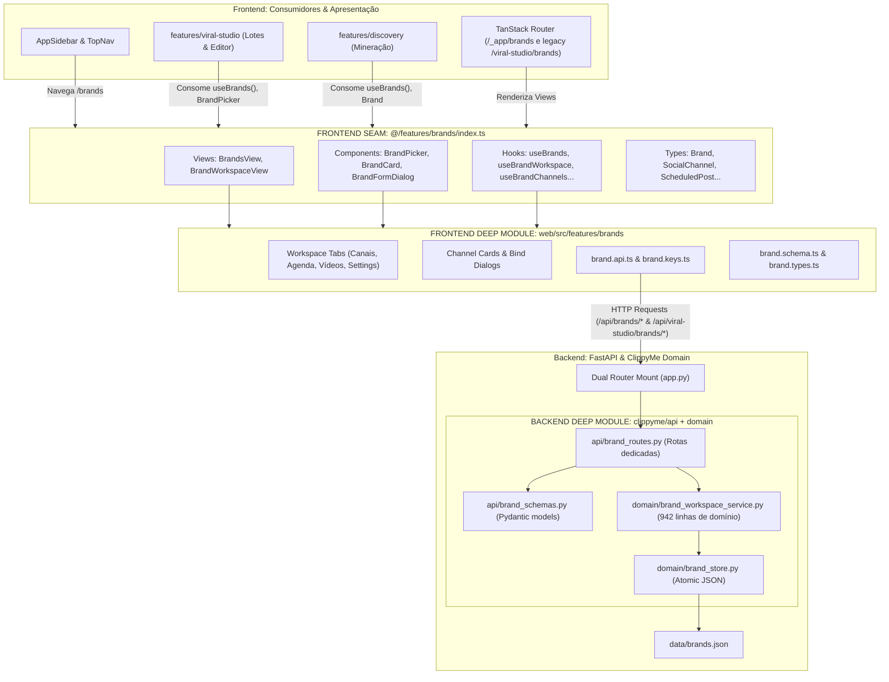
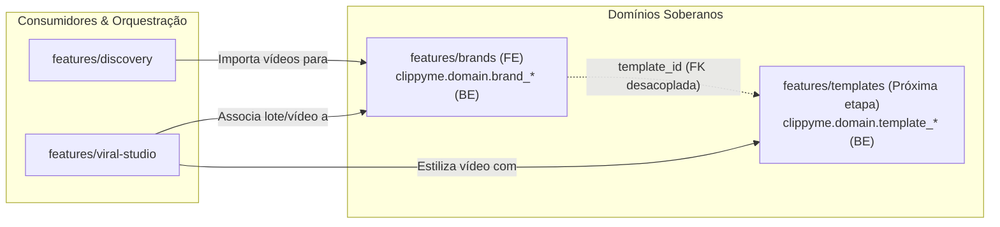

# Plano de Implementação: Desacoplamento do Domínio Brand (Frontend + Backend)

> **Persistent Plan File**: [`docs/plans/decouple-brand-domain.md`](file:///home/luis/repositories/viralforge/docs/plans/decouple-brand-domain.md)  
> **Status**: Pronto para Revisão  
> **Skill**: [`codebase-design`](file:///home/luis/.gemini/config/skills/codebase-design/SKILL.md) & [`plan`](file:///home/luis/.gemini/config/skills/plan/SKILL.md)  
> **Princípios**: Módulo Profundo (*Deep Module*), Inversão de Dependências, Seams Limpos e Zero Quebras (*Zero Breaking Changes*).

---

## 1. Visão Geral e Contexto

O domínio de Gestão de Marcas (*Brand Management & Sovereign Workspaces*) evoluiu para ser o agregador central de identidade, vínculos sociais (Postiz/Zernio), grade editorial de horários e métricas. No entanto, o código ainda encontra-se acoplado estruturalmente a `viral-studio`:

- **No Frontend**: A pasta [`web/src/features/viral-studio/components/`](file:///home/luis/repositories/viralforge/web/src/features/viral-studio/components) acumula **148 arquivos planos**, misturando a gestão de lotes/vídeos (`viral-studio`), workspaces e canais de marcas (`brands`) e o estúdio de templates visuais/Konva (`templates`). Além disso, [`discovery/`](file:///home/luis/repositories/viralforge/web/src/features/discovery) depende indevidamente de `viral-studio` para importar tipos e hooks de marca.
- **No Backend**: Mais de 320 linhas de rotas HTTP de marca estão declaradas dentro de [`src/clippyme/api/viral_studio_routes.py`](file:///home/luis/repositories/viralforge/src/clippyme/api/viral_studio_routes.py), schemas Pydantic estão em `viral_studio_schemas.py`, e operações CRUD atômicas residem em `viral_studio_store.py`.

Este plano estabelece a extração do **Módulo Profundo Soberano `Brand` em ambas as camadas (Frontend e Backend)**, estabelecendo interfaces públicas enxutas e de alto leverage, mantendo 100% de retrocompatibilidade através de fachadas de re-exportação (*barrel proxies*) e roteamento dual, e pavimentando o caminho para o posterior desacoplamento de `Templates`.

---

## 2. Diagramas de Arquitetura

### 2.1 Visão Unificada Frontend + Backend (`flowchart TD`)



### 2.2 Mapa de Dependências Limpo entre Domínios (`flowchart LR`)



---

## 3. Revisão do Usuário Obrigatória (*User Review Required*)

> [!IMPORTANT]
> **Garantia de Não-Regressão e Compatibilidade Total**:
> 1. **Backend Dual-Mounting**: `app.py` montará as rotas de marca em `/api/brands` (prefixo canônico) E manterá `/api/viral-studio/brands` ativo. Qualquer teste de API existente continuará passando sem alterações.
> 2. **Backend Re-exports**: `viral_studio_store.py` e `viral_studio_schemas.py` re-exportarão todas as funções e classes movidas para `brand_store.py` e `brand_schemas.py`.
> 3. **Frontend Re-exports**: `viral-studio/data/batch.types.ts`, `hooks/use-brands.ts` e `services/viral-studio.api.ts` re-exportarão todos os tipos, hooks e métodos para manter compatibilidade com código existente.
> 4. **Rotas Frontend**: As rotas existentes `/viral-studio/brands/*` continuam funcionando, e novas rotas de 1ª classe `/_app/brands/*` são disponibilizadas no `AppSidebar`.

---

## 4. Alterações Propostas

### 4.1 Backend (`src/clippyme/`)

#### [NEW] [`src/clippyme/api/brand_schemas.py`](file:///home/luis/repositories/viralforge/src/clippyme/api/brand_schemas.py)
Extração dos modelos Pydantic de Marca, Agendamento e Canais Sociais a partir de `viral_studio_schemas.py`:
- `PostingSchedule`, `BrandCreateRequest`, `BrandUpdateRequest`, `BrandResponse`, `BrandListResponse`
- `SocialChannelResponse`, `SocialChannelBindRequest`, `SocialAccountLinkRequest`
- `BrandWorkspaceResponse`, `BrandAutoScheduleRequest`, `BrandAutoScheduleResponse`, `BrandPublishRequest`, `BrandPublishResponse`
- `ScheduleSlotsUpdateRequest`, `ScheduledTimelineResponse`, `WorkspaceSummaryResponse`

#### [MODIFY] [`src/clippyme/api/viral_studio_schemas.py`](file:///home/luis/repositories/viralforge/src/clippyme/api/viral_studio_schemas.py)
Re-exportar todos os schemas de `brand_schemas.py` para retrocompatibilidade (`from clippyme.api.brand_schemas import *`).

#### [NEW] [`src/clippyme/domain/brand_store.py`](file:///home/luis/repositories/viralforge/src/clippyme/domain/brand_store.py)
Extração da persistência JSON atômica de marcas a partir de `viral_studio_store.py`:
- `list_brands()`, `get_brand()`, `get_brand_or_raise()`, `create_brand()`, `update_brand()`, `delete_brand()`, `get_brands_path()`

#### [MODIFY] [`src/clippyme/domain/viral_studio_store.py`](file:///home/luis/repositories/viralforge/src/clippyme/domain/viral_studio_store.py)
Re-exportar as funções de `brand_store.py` para retrocompatibilidade.

#### [NEW] [`src/clippyme/api/brand_routes.py`](file:///home/luis/repositories/viralforge/src/clippyme/api/brand_routes.py)
Extração das 320+ linhas de rotas de marcas de `viral_studio_routes.py` em um router modular dedicado.

#### [MODIFY] [`src/clippyme/api/viral_studio_routes.py`](file:///home/luis/repositories/viralforge/src/clippyme/api/viral_studio_routes.py)
Remover rotas de marca duplicadas (ficando restrito a lotes, itens, copies, observability e render).

#### [MODIFY] [`src/clippyme/api/app.py`](file:///home/luis/repositories/viralforge/src/clippyme/api/app.py)
Incluir o router de marcas no prefixo soberano `/api/brands` e no prefixo legado `/api/viral-studio/brands`.

---

### 4.2 Frontend — Novo Módulo Soberano: `web/src/features/brands`

#### [NEW] [`web/src/features/brands/index.ts`](file:///home/luis/repositories/viralforge/web/src/features/brands/index.ts)
Seam público exportando:
- Views: `BrandsView`, `BrandWorkspaceView`
- Components: `BrandCard`, `BrandPicker`, `BrandFormDialog`, `BrandQuickPublishDialog`
- Hooks: `useBrands`, `useBrand`, `useCreateBrand`, `useUpdateBrand`, `useBrandWorkspace`, `useBrandChannels`, `useBrandVideos`, `useBrandScheduled`, `useBrandAvailableChannels`, `useBindBrandChannels`, `useAutoScheduleBrandVideo`, `usePublishBrandVideo`, `useCancelBrandScheduledPost`, `usePublishBrandScheduledNow`, `useUpdateBrandScheduleSlots`
- Types: `Brand`, `BrandCreate`, `BrandUpdate`, `BrandListResponse`, `SocialChannel`, `SocialChannelBinding`, `ScheduledPost`, `PostingSchedule`, `BrandWorkspaceSummary`, `ScheduleSlotsUpdate`, `BrandFormData`
- Services: `brandApi`, `brandKeys`

#### [NEW] [`web/src/features/brands/data/brand.schema.ts`](file:///home/luis/repositories/viralforge/web/src/features/brands/data/brand.schema.ts) & [`web/src/features/brands/data/brand.types.ts`](file:///home/luis/repositories/viralforge/web/src/features/brands/data/brand.types.ts)
Migrado de `viral-studio/data/brand.schema.ts`, eliminando as definições obsoletas e duplicadas de `templateSchema`.

#### [NEW] [`web/src/features/brands/services/brand.api.ts`](file:///home/luis/repositories/viralforge/web/src/features/brands/services/brand.api.ts) & [`web/src/features/brands/services/brand.keys.ts`](file:///home/luis/repositories/viralforge/web/src/features/brands/services/brand.keys.ts)
API client dedicado com os 15 métodos de marca e chaves de cache do TanStack Query.

#### [NEW] [`web/src/features/brands/hooks/use-brands.ts`](file:///home/luis/repositories/viralforge/web/src/features/brands/hooks/use-brands.ts) & [`web/src/features/brands/hooks/use-brand-workspace.ts`](file:///home/luis/repositories/viralforge/web/src/features/brands/hooks/use-brand-workspace.ts)
Hooks com seus respectivos arquivos de teste unitário (`use-brands.test.tsx`, `use-brand-workspace.test.tsx`), limpando `useTemplates` de `use-brands.ts`.

#### [NEW] [`web/src/features/brands/mocks/handlers.ts`](file:///home/luis/repositories/viralforge/web/src/features/brands/mocks/handlers.ts)
Handlers MSW isolados para `/api/viral-studio/brands/*` e `/api/brands/*`.

#### [NEW] [`web/src/features/brands/views/`](file:///home/luis/repositories/viralforge/web/src/features/brands/views/)
- `brands-view.tsx` e `brands-view.test.tsx`
- `brand-workspace-view.tsx` e `brand-workspace-view.test.tsx`

#### [NEW] [`web/src/features/brands/components/`](file:///home/luis/repositories/viralforge/web/src/features/brands/components/)
Migração de todos os 31 componentes dedicados de marca com seus testes unitários:
- `brand-workspace-header.tsx`
- `brand-workspace-tab-channels.tsx` & `.test.tsx`
- `brand-workspace-tab-schedule.tsx` & `.test.tsx`
- `brand-workspace-tab-videos.tsx` & `.test.tsx`
- `brand-workspace-tab-settings.tsx`
- `brand-channel-card.tsx`
- `brand-channel-row.tsx`
- `brand-manage-channels-dialog.tsx` & `.test.tsx`
- `brand-manual-batch-dialog.tsx`
- `brand-quick-publish-dialog.tsx`
- `brand-schedule-post-item.tsx`
- `brand-cancel-schedule-dialog.tsx`
- `brand-video-card.tsx` & `.test.tsx`
- `brand-card.tsx` & `.test.tsx`
- `brands-filter-bar.tsx`
- `brand-form-dialog.tsx` & `.test.tsx`
- `brand-form-fields.tsx`
- `brand-settings-identity-card.tsx`
- `brand-settings-motor-card.tsx`
- `brand-settings-schedule-card.tsx`
- `brand-settings-conversion-fields.tsx` & `.test.tsx`
- `brand-settings-cards.test.tsx`
- `brand-social-profiles-section.tsx`

---

### 4.3 Frontend — Camada de Retrocompatibilidade em `features/viral-studio`

#### [MODIFY] [`web/src/features/viral-studio/data/batch.types.ts`](file:///home/luis/repositories/viralforge/web/src/features/viral-studio/data/batch.types.ts)
Re-exportar todos os tipos de marca de `@/features/brands`.

#### [MODIFY] [`web/src/features/viral-studio/hooks/use-brands.ts`](file:///home/luis/repositories/viralforge/web/src/features/viral-studio/hooks/use-brands.ts) & [`use-brand-workspace.ts`](file:///home/luis/repositories/viralforge/web/src/features/viral-studio/hooks/use-brand-workspace.ts)
Transformar em fachadas de re-exportação apontando para `@/features/brands`.

#### [MODIFY] [`web/src/features/viral-studio/services/viral-studio.api.ts`](file:///home/luis/repositories/viralforge/web/src/features/viral-studio/services/viral-studio.api.ts) & [`viral-studio.keys.ts`](file:///home/luis/repositories/viralforge/web/src/features/viral-studio/services/viral-studio.keys.ts)
Delegar métodos e chaves de marca para `brandApi` e `brandKeys`.

#### [MODIFY] [`web/src/features/viral-studio/mocks/handlers.ts`](file:///home/luis/repositories/viralforge/web/src/features/viral-studio/mocks/handlers.ts)
Importar e incluir `...brandHandlers` a partir de `@/features/brands/mocks/handlers`.

---

### 4.4 Frontend — Ajuste de Consumidores Externos e Navegação

#### [MODIFY] [`web/src/features/discovery/components/discovery-brand-picker.tsx`](file:///home/luis/repositories/viralforge/web/src/features/discovery/components/discovery-brand-picker.tsx) & [discovery-brand-picker.test.tsx](file:///home/luis/repositories/viralforge/web/src/features/discovery/components/discovery-brand-picker.test.tsx)
Atualizar import para `@/features/brands`.

#### [MODIFY] [`web/src/features/discovery/components/discovery-import-drawer.tsx`](file:///home/luis/repositories/viralforge/web/src/features/discovery/components/discovery-import-drawer.tsx)
Atualizar import de `useBrands` para `@/features/brands` e `useTemplates` para `@/features/viral-studio/hooks/use-templates`.

#### [NEW] [`web/src/routes/_app/brands/index.tsx`](file:///home/luis/repositories/viralforge/web/src/routes/_app/brands/index.tsx) & [`web/src/routes/_app/brands/$brandId.tsx`](file:///home/luis/repositories/viralforge/web/src/routes/_app/brands/$brandId.tsx)
Rotas soberanas `/brands` e `/brands/$brandId`.

#### [MODIFY] [`web/src/routes/_app/viral-studio/brands/index.tsx`](file:///home/luis/repositories/viralforge/web/src/routes/_app/viral-studio/brands/index.tsx) & [`$brandId.tsx`](file:///home/luis/repositories/viralforge/web/src/routes/_app/viral-studio/brands/$brandId.tsx)
Importar Views de `@/features/brands`.

#### [MODIFY] [`web/src/components/shared/app-sidebar.tsx`](file:///home/luis/repositories/viralforge/web/src/components/shared/app-sidebar.tsx)
Adicionar item "Marcas" no menu de navegação primário (`/brands`, ícone `Bookmark`).

---

## 5. Plano de Verificação

### 5.1 Backend Python
```bash
# 1. Lint Python e regras de bug-class (Ruff)
uv run --extra host-tests --with ruff ruff check src/clippyme tests --select E9,F63,F7,F82

# 2. Execução da suíte completa de testes host (1636+ testes)
uv run --extra host-tests --with pytest --with pytest-mock python -m pytest -m "not integration" -q
```

### 5.2 Frontend Web
```bash
# 1. Validação de conformidade Shadcn e Typography (0 warnings obrigatório)
python3 ./scripts/check_shadcn_usage.py

# 2. Geração de rotas e verificação de tipagem TypeScript
pnpm --dir web typecheck

# 3. Execução completa dos testes unitários com cobertura (thresholds >= 75%/70%)
pnpm --dir web test:coverage

# 4. Verificação de build de produção do frontend
pnpm --dir web build

# 5. Validação ponta a ponta
./scripts/verify.sh
```

### 5.3 Validação Manual e de Navegação
- Navegar para `/brands` e testar a listagem e filtros de marcas.
- Navegar para `/brands/vale-o-clique` e testar as 4 abas (Vídeos, Agenda, Canais, Configurações).
- Acessar a rota legada `/viral-studio/brands` e conferir que continua renderizando normalmente.
- Abrir a Descoberta (`/discovery`) e conferir o funcionamento do seletor de marcas no Drawer de Ingestão.
