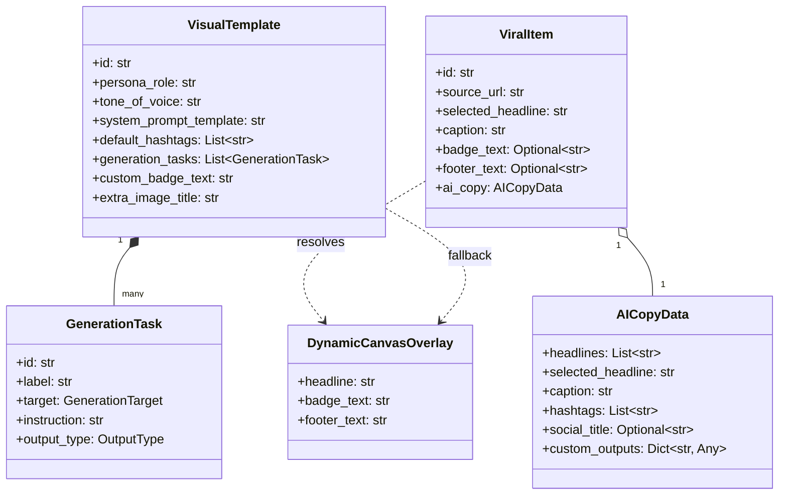

# Plano Detalhado de Implementação: Reformulação do Motor de IA, Templates e Renderização Visual

> **Disciplinas Aplicadas**:
> - [`domain-modeling`](file:///home/luis/.gemini/config/skills/domain-modeling/SKILL.md): Invariantes de domínio, vocabulário canônico e eliminação de termos ambíguos.
> - [`codebase-design`](file:///home/luis/.gemini/config/skills/codebase-design/SKILL.md): Módulos profundos (*small interface, deep implementation*), costuras limpas (*clean seams*), alavancagem para chamadores e localidade de manutenção.

---

## 1. Modelo de Domínio e Invariantes (`domain-modeling`)

O vocabulário canônico do sistema foi sincronizado no [`CONTEXT.md`](file:///home/luis/repositories/viralforge/CONTEXT.md). As regras fundamentais que regem esta reformulação são expressas como **Invariantes de Domínio**:



### Invariante 1: Letreiro Limpo (*Canvas Cleanliness*)
> **Nenhuma hashtag, caractere de marcação de lista (`1.`, `-`, `•`) ou elemento de legenda pode residir em um `selected_headline` ou `headlines` gravados no item ou renderizados no topo do canvas 1080x1920.**
- O letreiro no canvas existe exclusivamente como gancho visual de retenção nos primeiros 3 segundos.
- Títulos brutos importados de fontes externas (TikTok, Instagram) são dados contextuais de proveniência (`source_metadata`), **nunca** headlines manuais pré-definidas.

### Invariante 2: Localidade e Limite de Hashtags (*Hashtag Locality & Bounding*)
> **As hashtags residem exclusivamente no fim do `NormalizedCaption`, padronizadas em minúsculas (`#achadinhos`), limitadas a exatamente no máximo 5 tags essenciais.**
- A composição é estritamente deduplicada: priorizam-se as tags contextuais geradas pela IA (`copy_data.hashtags`) e completa-se com as tags do template (`template.default_hashtags`).
- Não pode haver blocos residuais de hashtags no corpo da legenda gerada.

### Invariante 3: Precedência Visual Dinâmica (*Dynamic Visual Precedence*)
> **Elementos visuais do canvas (`canvas_badge`, `canvas_extra_image`) utilizam a saída da IA associada à tarefa quando disponível; na sua ausência ou falha, recorrem estritamente ao valor estático configurado no `VisualTemplate`.**
- Se `GenerationTask(target="canvas_badge")` produzir `"SUPER OFERTA 🔥"`, o overlay renderizará esse texto. Se não houver tarefa de badge, o renderizador desenha `template.custom_badge_text`.
- O mesmo contrato se aplica para o card de rodapé (`canvas_extra_image` / `footer_comment`).

### Invariante 4: Desambiguação de Título de Publicação (*Social Title Priority*)
> **Em plataformas sociais com limite estrito de título (YouTube Shorts, TikTok), o campo `social_title` (<60 caracteres) tem prioridade sobre o `selected_headline` visual.**
- Garante títulos de alto CTR sem quebra de leiaute nas timelines e feeds sociais.

---

## 2. Design dos Módulos Profundos (`codebase-design`)

Cada subsistema foi modelado como um **Módulo Profundo**: interface estreita com alta alavancagem para os chamadores e forte concentração de complexidade oculta.

```
┌────────────────────────────────────────────────────────┐
│           CopyEngine (viral_studio_copy.py)            │
│  Interface Estreita:                                    │
│    generate_viral_copy(template, brand, item, ...)     │
├────────────────────────────────────────────────────────┤
│  Implementação Profunda (Oculta):                      │
│    - Interpolação de variáveis ({transcript}, {cta})   │
│    - Injeção prioritária de SystemPromptTemplate       │
│    - Schema dinâmico por target e tipo de saída        │
│    - Payload multimodal (JPEGs de keyframes + áudio)   │
│    - Providers: Gemini, Ollama, LM Studio              │
│    - Parser resiliente com 5 níveis de reparo JSON     │
│    - Normalização de hashtags (<= 5, lowercase, union) │
│    - Higienização estrita de headlines                 │
│    - Mapeamento de targets para badge/rodapé dinâmicos │
└────────────────────────────────────────────────────────┘
                           │
                           ▼
┌────────────────────────────────────────────────────────┐
│         VideoRenderer (viral_studio_renderer.py)       │
│  Interface Estreita:                                    │
│    render_viral_video(source, brand, template, item)   │
├────────────────────────────────────────────────────────┤
│  Implementação Profunda (Oculta):                      │
│    - Resolução de badge (item.badge_text -> tpl.badge) │
│    - Resolução de rodapé (item.footer_text -> tpl.sub) │
│    - FFprobe metadata & áudio tracking                 │
│    - Pillow RGBA overlay (header, avatar, 1:1 konva)   │
│    - Micro-ajuste par de macroblocos YUV420p           │
│    - FFmpeg multi-input stream composition             │
└────────────────────────────────────────────────────────┘
```

### Módulo 1: `CopyEngine` (`viral_studio_copy.py`)
- **Papel**: Dono do ciclo de vida da geração textual, estruturação de prompt e pós-processamento de IA.
- **Interface Externa**:
  ```python
  async def generate_viral_copy(
      template: Optional[Union[VisualTemplate, Dict[str, Any]]] = None,
      brand: Optional[Union[Brand, Dict[str, Any]]] = None,
      item: Optional[Union[ViralItem, Dict[str, Any]]] = None,
      video_path: Optional[str] = None,
      model: Optional[str] = None,
      manual_instructions: Optional[str] = None,
      video_context: Optional[Any] = None,
      api_key: Optional[str] = None,
  ) -> AICopyData:
  ```
- **Costuras Internas (Seams)**:
  - `_clean_headline_text(raw: str) -> str`: Remove bullets e todas as hashtags (`#[\w-]+`).
  - `_normalize_hashtags(raw_tags, default_tags, limit=5) -> List[str]`: Extrai, sanitiza, converte para minúsculas e une tags da IA com template até o limite de 5.
  - `_assemble_prompt_directives(template, subs) -> str`: Injeta o `system_prompt_template` interpolado em bloco de alta prioridade.
  - `_distribute_task_targets(data: dict, template: VisualTemplate) -> dict`: Mapeia tarefas que visam `canvas_badge` e `canvas_extra_image` diretamente para os atributos dinâmicos do item.
- **Teste de Exclusão (*Deletion Test*)**: Se o `CopyEngine` for removido, toda a lógica de reparo JSON, schemas dinâmicos, sanitização de texto, fallback de provedores e fusão de tags se espalharia por rotas e orquestradores. A profundidade garante que os chamadores recebam um `AICopyData` perfeito e pronto para uso.

---

### Módulo 2: `VideoRenderer` (`viral_studio_renderer.py`)
- **Papel**: Motor de composição visual 1080x1920 (Pillow + FFmpeg).
- **Interface Refinada**:
  ```python
  def render_viral_video(
      source_path: str,
      brand: Union[Brand, Dict[str, Any]],
      template: Union[VisualTemplate, Dict[str, Any]],
      headline: str,
      output_path: str,
      watermark: bool = True,
      badge_text: Optional[str] = None,
      footer_text: Optional[str] = None,
  ) -> str:
  ```
- **Costura Interna**:
  - `generate_header_overlay(...)`:
    - Resolução de Badge: `effective_badge = badge_text if badge_text is not None else template.custom_badge_text`.
    - Resolução de Rodapé: `effective_footer = footer_text if footer_text is not None else template.extra_image_title`.
    - Mantém paridade 1:1 matemática com o canvas Konva.

---

### Módulo 3: `PublishingRouter` (`publish_dispatch_service.py`)
- **Papel**: Roteamento e despacho de publicações para provedores (Postiz/redes).
- **Interface**: `schedule_item(...)` e `publish_item(...)`.
- **Regra Interna de Resolução de Título**:
  ```python
  title = (
      (item.get("ai_copy") or {}).get("social_title")
      or item.get("social_title")
      or item.get("selected_headline")
      or item.get("headline")
      or brand.get("name")
  )
  ```

---

## 3. Especificação das Mudanças por Componente

### Backend

#### [MODIFY] [viral_studio_schemas.py](file:///home/luis/repositories/viralforge/src/clippyme/api/viral_studio_schemas.py)
- Expandir `ViralItem` com campos opcionais para elementos dinâmicos:
  ```python
  badge_text: Optional[str] = Field(None, max_length=60)
  footer_text: Optional[str] = Field(None, max_length=240)
  social_title: Optional[str] = Field(None, max_length=120)
  ```
- Expandir `ItemUpdateRequest` e `ViralItemUpdatePayload` para suportar esses campos na edição via API.

#### [MODIFY] [viral_studio_copy.py](file:///home/luis/repositories/viralforge/src/clippyme/domain/viral_studio_copy.py)
- **Ativação de `system_prompt_template`**:
  ```python
  sys_prompt_raw = _extract_field(template, "system_prompt_template")
  if sys_prompt_raw and str(sys_prompt_raw).strip():
      sys_interp = str(sys_prompt_raw).strip()
      for k, v in subs.items():
          sys_interp = sys_interp.replace(k, str(v))
      system_section = f"--- DIRETRIZES MESTRAS DO TEMPLATE (SYSTEM PROMPT) ---\n{sys_interp}\n\n"
  ```
- **Sanitização de Headlines**:
  ```python
  def _clean_headline_text(text: str) -> str:
      if not text:
          return ""
      clean = re.sub(r"^(?:[-*•–—]|\d+[\.\-\)])\s*", "", text.strip())
      clean = re.sub(r"#[\w-]+", "", clean)
      clean = re.sub(r"\s+", " ", clean).strip(" -:;,")
      return clean[:300]
  ```
- **Normalização de Hashtags**:
  ```python
  def _normalize_hashtags(raw_hashtags: Any, default_hashtags: Optional[List[str]] = None, limit: int = 5) -> List[str]:
      tags: List[str] = []
      seen = set()
      def _add(cand: str):
          if not cand:
              return
          c = cand.strip().replace(" ", "").lower()
          if not c.startswith("#"):
              c = f"#{c}"
          if len(c) > 1 and c not in seen:
              seen.add(c)
              tags.append(c)
      # Adicionar tags geradas pela IA primeiro
      # Completar com default_hashtags do template
      return tags[:limit]
  ```
- **Montagem da Legenda**:
  - Remove qualquer cauda de hashtags existente no corpo da legenda.
  - Anexa as 5 hashtags normalizadas separadas por espaço após `\n\n`.
- **Mapeamento de Tarefas Visuais**:
  - Se houver tarefa com target `canvas_badge`, salva em `copy_data.custom_outputs["badge_text"]`.
  - Se houver tarefa com target `canvas_extra_image`, salva em `copy_data.custom_outputs["footer_text"]`.

#### [MODIFY] [viral_studio_renderer.py](file:///home/luis/repositories/viralforge/src/clippyme/domain/viral_studio_renderer.py)
- Atualizar assinaturas de `generate_header_overlay` e `render_viral_video` para aceitar `badge_text: Optional[str] = None` e `footer_text: Optional[str] = None`.
- No desenho do badge:
  ```python
  effective_badge = badge_text if (badge_text and badge_text.strip()) else custom_badge_text
  ```
- No desenho do card de comentários:
  ```python
  effective_footer = footer_text if (footer_text and footer_text.strip()) else custom_title
  ```

#### [MODIFY] [viral_studio_orchestrator.py](file:///home/luis/repositories/viralforge/src/clippyme/domain/viral_studio_orchestrator.py)
- Na etapa de renderização e re-renderização:
  - Extrair `badge_text` do item ou de `custom_outputs`.
  - Extrair `footer_text` do item ou de `custom_outputs`.
  - Passar ambos para `render_viral_video`.
  - Persistir `badge_text` e `footer_text` no `viral_studio_store.update_item`.

#### [MODIFY] [publish_dispatch_service.py](file:///home/luis/repositories/viralforge/src/clippyme/domain/publish_dispatch_service.py) e [brand_workspace_service.py](file:///home/luis/repositories/viralforge/src/clippyme/domain/brand_workspace_service.py)
- Priorizar `social_title` da IA na composição do título do job de publicação.

---

### Frontend

#### [MODIFY] [discovery-import-drawer.tsx](file:///home/luis/repositories/viralforge/web/src/features/discovery/components/discovery-import-drawer.tsx)
- Linha 98: Remover `manual_headline: item.title ? item.title.slice(0, 120) : undefined`.
- Preservar `source_metadata` e `provenance` intactos.

#### [NEW] [item-detail-ai-tasks-tab.tsx](file:///home/luis/repositories/viralforge/web/src/features/viral-studio/components/item-detail-ai-tasks-tab.tsx)
- Renderizar cards dedicados para cada saída gerada:
  - **Badge Dinâmico**: Exibe o texto com tag e botão de copiar.
  - **Texto de Rodapé**: Exibe a pergunta/chamada para o rodapé.
  - **Título Social do Post**: Exibe o título otimizado para o feed.
  - **Enquete / Quiz**: Renderiza a pergunta e as opções A/B/C/D.
  - **Outras Tarefas**: Renderização dinâmica de qualquer outra chave em `custom_outputs`.

#### [MODIFY] [item-detail-sheet.tsx](file:///home/luis/repositories/viralforge/web/src/features/viral-studio/components/item-detail-sheet.tsx)
- Adicionar a aba `tasks` ("Tarefas IA") com ícone de tarefas ao lado de `Copy & Ganchos`.

#### [NEW] [viral-editor-ai-tasks-tab.tsx](file:///home/luis/repositories/viralforge/web/src/features/viral-studio/components/viral-editor-ai-tasks-tab.tsx)
- Aba de edição operacional no `ViralEditor`:
  - Inputs para `badge_text`, `footer_text` e `social_title`.
  - Permite que o operador edite o badge ou rodapé e clique em "Re-renderizar vídeo" para aplicar diretamente no novo MP4.

#### [MODIFY] [viral-editor-tabs-section.tsx](file:///home/luis/repositories/viralforge/web/src/features/viral-studio/components/viral-editor-tabs-section.tsx)
- Adicionar o gatilho da 5ª aba "Tarefas IA" na barra de abas principal.

#### [MODIFY] [item-editor.schema.ts](file:///home/luis/repositories/viralforge/web/src/features/viral-studio/data/item-editor.schema.ts)
- Adicionar validações Zod para `badge_text`, `footer_text` e `social_title`.

---

## 4. Plano de Verificação e Testabilidade

Seguindo o princípio de *Codebase Design* (**"A interface é a superfície de teste"**), todos os comportamentos serão testados através de suas interfaces públicas:

### Testes Automatizados (Backend)

```bash
# 1. Testes do CopyEngine (Prompt, System Prompt, Hashtags e Higienização de Headlines)
uv run pytest tests/domain/test_viral_studio_copy.py -v

# 2. Testes do VideoRenderer (Renderização de Badge e Rodapé Dinâmicos vs Fallback)
uv run pytest tests/domain/test_viral_studio_renderer.py -v

# 3. Testes do Orchestrator & Publicação (Encaminhamento de saídas da IA e título social)
uv run pytest tests/domain/test_viral_studio_orchestrator.py -v
uv run pytest tests/domain/test_publish_dispatch.py -v
```

Novos testes de contrato a adicionar:
1. `test_system_prompt_template_injected_with_variables`: Garante que o system prompt seja interpolado e incluído no prompt da IA.
2. `test_headlines_stripped_of_hashtags_and_numbering`: Testa que qualquer headline com `#tag` tenha as tags limpas.
3. `test_caption_normalizes_up_to_5_lowercase_hashtags`: Valida que a legenda termine com exatamente até 5 hashtags em minúsculas e sem duplicatas.
4. `test_renderer_honors_dynamic_badge_and_footer`: Testa que passar `badge_text` e `footer_text` substitui os textos do template no PNG do overlay.
5. `test_publish_prioritizes_social_title`: Garante que `DispatchJob` receba `social_title` se presente.

### Testes Automatizados (Frontend)

```bash
cd web
pnpm test src/features/discovery/components/discovery-import-drawer.test.tsx
pnpm test src/features/viral-studio/components/item-detail-sheet.test.tsx
pnpm test src/features/viral-studio/components/viral-editor-tabs-section.test.tsx
```

### Verificação Manual
1. Abrir o Discovery, importar um vídeo com hashtags no título e verificar que `manual_headline` não é enviado.
2. Executar o pipeline e confirmar:
   - A 1ª headline não contém hashtags.
   - A legenda comercial contém exatamente até 5 hashtags em minúsculas no final.
   - O vídeo renderizado exibe o badge dinâmico da IA (ou fallback do template).
   - O card de comentários exibe o texto dinâmico gerado pela IA.
3. Abrir a nova aba **Tarefas IA** no editor e modal para inspecionar e editar as saídas adicionais.
