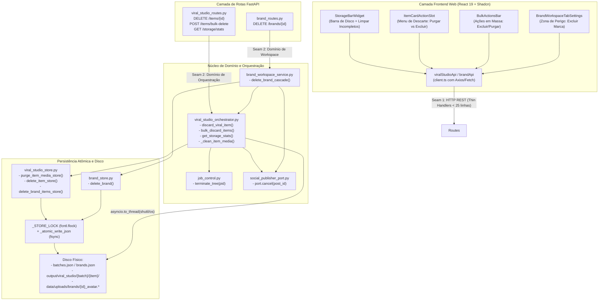
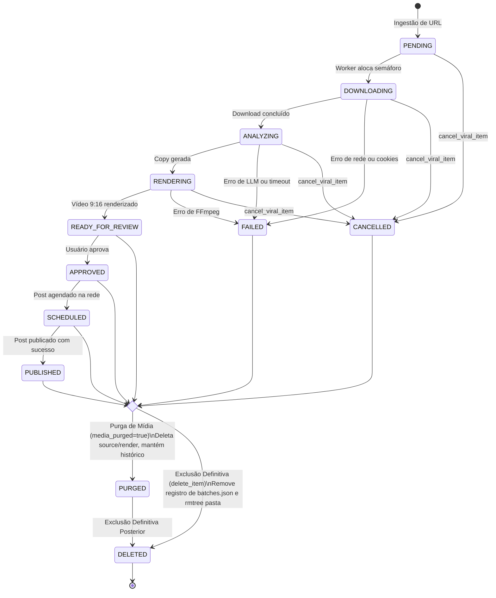
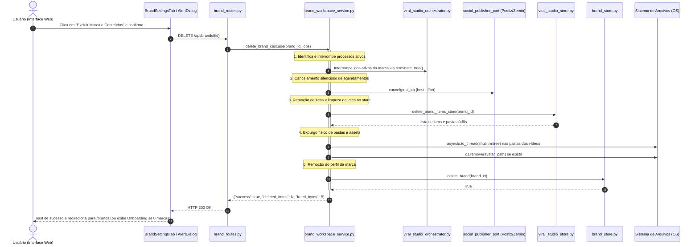

# Plano Oficial de Implementação: Gestão de Armazenamento, Descarte de Vídeos e Exclusão de Marcas

> **Documento Oficial de Arquitetura e Engenharia**  
> **Status**: Aguardando Aprovação do Usuário  
> **Escopo**: Backend FastAPI (`src/clippyme/`), Frontend Web (`web/`), Persistência Atômica (`batches.json`, `brands.json`), Gestão Física de Disco (`output/viral_studio/`).

---

## 1. Contexto e Objetivos

### 1.1. O Problema
No processamento de vídeos curtos para redes sociais (Reels, TikTok, Shorts), o ViralForge armazena múltiplos artefatos pesados por item:
- `source.mp4`: Vídeo original baixado (~10MB a 150MB).
- `rendered.mp4`: Vídeo vertical 9:16 final renderizado com legendas e template (~20MB a 200MB).
- `keyframes/`: Frames intermediários extraídos para análise visual (~5MB a 30MB).
- Áudio temporário e manifestos.

Um lote com 20 vídeos consome entre 1GB e 8GB de armazenamento. Sem um ciclo de vida de dados previsível:
1. O disco do servidor ou do container Docker esgota rapidamente.
2. Vídeos falhos, cancelados ou já publicados continuam monopolizando espaço em disco indefinidamente.
3. Não existe mecanismo para excluir marcas nem para limpar seus vídeos, agendamentos externos e assets em cascata.

### 1.2. A Solução
Implementar um sistema unificado, resiliente e enxuto de governança de dados:
1. **Descarte em 2 Níveis**:
   - **Purga de Mídia (Media Reclaim)**: Apaga os arquivos pesados (`source.mp4`, `rendered.mp4`, `keyframes/`), liberando ~98% do espaço em disco, enquanto preserva o card, copy gerada, metadados, links sociais e uma thumbnail leve (`media_purged: true`).
   - **Exclusão Definitiva (Hard Delete)**: Remove o item integralmente de `batches.json` e apaga todo o diretório físico `output/viral_studio/{batch_id}/{item_id}/`.
2. **Exclusão de Marca em Cascata**:
   - Interrompe processos ativos da marca via `terminate_tree`.
   - Dispara cancelamento *best-effort* de posts agendados no provedor externo (Postiz/Zernio).
   - Exclui todos os itens da marca em `batches.json` e expurga os diretórios em disco. Lotes que ficarem com 0 itens são apagados automaticamente.
   - Remove assets próprios (`data/uploads/brands/{id}_avatar.*`) e apaga o perfil em `brands.json`.
   - Suporta estado de 0 marcas cadastradas (*Zero Brands Onboarding*).
3. **Gestão Visual de Disco (UI/UX)**:
   - Widget compacto de Storage Bar no topo do Viral Studio com espaço livre/usado e botão rápido "Limpar Incompletos" em 1 clique.
   - Diálogos de confirmação com estimativa de vídeos afetados e espaço liberado.
   - Zona de Perigo nas configurações da marca com exclusão em cascata.

---

## 2. Decisões Arquiteturais e Diretrizes Técnicas

| Eixo | Decisão Aprovada | Racional Técnico |
|---|---|---|
| **Modelo de Purga** | Flag booleana `media_purged: true` | Evita inflar a máquina de estados global (`CANCELLED`, `PUBLISHED`, etc.); mantém compatibilidade com filtros existentes e zera os ponteiros de disco. |
| **Agendados (`SCHEDULED`)** | Cancelamento silencioso *best-effort* | Tenta cancelar no Postiz/Zernio com timeout curto; se a rede ou a API externa falhar, registra warning e conclui a remoção local sem travar o usuário. |
| **Jobs Ativos** | `job_control.terminate_tree` gracioso | Envia `SIGTERM` com timeout de 5s seguido de `SIGKILL` antes de remover arquivos, prevenindo race conditions de escrita em diretórios deletados. |
| **Concorrência e Locks** | `store_lock()` + `_atomic_write_json()` | Proteção multi-thread (`RLock`) e multi-processo (`fcntl.flock` em `.store.lock`) com `mkstemp` + `os.replace` + `fsync`. |
| **Abstrações e Filosofia Ponytail** | Stdlib (`shutil`, `os`) dentro dos módulos existentes | Cortado módulo intermediário desnecessário; reduzida a superfície da API de 8 para 4 endpoints REST essenciais. |
| **Frontend Web** | 100% Shadcn-First & Tipografia Canônica | Uso estrito de `@/components/ui/*` (`Typography`, `Button`, `Progress`, `AlertDialog`, `DropdownMenu`). Zero tags HTML cruas e zero `any`. |

---

## 3. Diagramas de Arquitetura

### 3.1. Mapa de Camadas, Módulos e Seams (`flowchart TD`)



---

### 3.2. Ciclo de Vida do Vídeo e Transições de Descarte (`stateDiagram-v2`)



---

### 3.3. Diagrama de Sequência: Exclusão de Marca em Cascata (`sequenceDiagram`)



---

## 4. Mapeamento da API REST (FastAPI)

Todos os endpoints implementam a regra de **Thin Handlers** (< 25 linhas) com conversão de exceções de domínio em status HTTP:

### 4.1. `viral_studio_routes.py`

#### 1. `DELETE /api/viral-studio/items/{item_id}`
- **Parâmetros de Query**: `purge_only: bool = False`
- **Comportamento**:
  - Se `purge_only=True`: Deleta `source.mp4`, `rendered.mp4` e keyframes; atualiza o item com `media_purged: True` e zera caminhos.
  - Se `purge_only=False`: Remove o item de `batches.json` e apaga todo o diretório do item. Se o lote ficar com 0 itens, remove o lote.
- **Retorno**: `200 OK` com payload do item (se purgado) ou `{ "deleted": True, "item_id": item_id, "batch_removed": bool }`.

#### 2. `POST /api/viral-studio/items/bulk-delete`
- **Body (`BulkDeleteRequest`)**:
  ```json
  {
    "item_ids": ["item-1", "item-2"],
    "purge_only": false
  }
  ```
- **Comportamento**: Executa a operação de forma concorrente em disco e atômica no store sob lock único.
- **Retorno**: `200 OK` com `BulkDeleteResponse`:
  ```json
  {
    "success": true,
    "affected_items": 2,
    "purge_only": false,
    "freed_bytes": 104857600
  }
  ```

#### 3. `GET /api/viral-studio/storage/stats`
- **Comportamento**: Mede o uso de disco da partição (`shutil.disk_usage`) e varre de forma não-bloqueante o diretório `output/viral_studio/`.
- **Retorno**: `200 OK` com `StorageStatsResponse`:
  ```json
  {
    "disk_total_bytes": 500000000000,
    "disk_used_bytes": 200000000000,
    "disk_free_bytes": 300000000000,
    "viral_studio_used_bytes": 15420000000,
    "purged_items_count": 14,
    "total_items_count": 85,
    "failed_or_cancelled_count": 6
  }
  ```

### 4.2. `brand_routes.py`

#### 4. `DELETE /api/brands/{id}`
- **Comportamento**: Executa `brand_workspace_service.delete_brand_cascade(id)`.
- **Retorno**: `200 OK`:
  ```json
  {
    "success": true,
    "brand_id": "marca-exemplo",
    "deleted_items_count": 12,
    "deleted_batches_count": 2,
    "freed_bytes": 450000000
  }
  ```

---

## 5. Detalhamento das Alterações por Componente

### 5.1. Backend Python

#### `[MODIFY] src/clippyme/api/viral_studio_schemas.py`
- Adicionar campo `media_purged: Optional[bool] = False` ao modelo `ViralItem`.
- Adicionar schemas:
  - `BulkDeleteRequest(BaseModel)`: `item_ids: list[str]`, `purge_only: bool = False`.
  - `BulkDeleteResponse(BaseModel)`: `success: bool`, `affected_items: int`, `purge_only: bool`, `freed_bytes: int`.
  - `StorageStatsResponse(BaseModel)`: métricas de disco e contagens operacionais.

#### `[MODIFY] src/clippyme/domain/viral_studio_store.py`
- `purge_item_media_store(item_id: str) -> dict`: Seta `media_purged = True`, zera `rendered_path` e `source_path`, grava log de auditoria e salva atomicamente.
- `delete_item_store(item_id: str) -> tuple[dict, str, bool]`: Remove o item do lote. Se o lote ficar vazio (`items == []`), deleta o lote de `batches.json`. Recalcula status do lote via `_derive_batch_status`.
- `bulk_delete_items_store(item_ids: list[str], *, purge_only: bool) -> tuple[list[dict], list[str], list[str]]`: Operação atômica em bloco para múltiplos itens sob um único ciclo de lock/fsync.
- `delete_brand_items_store(brand_id: str) -> list[tuple[str, str]]`: Remove todos os itens vinculados a `brand_id` em todos os lotes; remove lotes esvaziados. Retorna lista de `(batch_id, item_id)` para expurgo físico.

#### `[MODIFY] src/clippyme/domain/viral_studio_orchestrator.py`
- `_clean_item_media(batch_id: str, item_id: str, *, purge_only: bool) -> int`:
  - Utiliza `asyncio.to_thread`.
  - Se `purge_only`: remove `source.mp4`, `rendered.mp4` e frames em `keyframes/` via `os.remove` defensivo.
  - Se `not purge_only`: remove o diretório inteiro `output/viral_studio/{batch_id}/{item_id}/` via `shutil.rmtree`.
  - Retorna o total de bytes liberados.
- `discard_viral_item(item_id: str, *, purge_only: bool = False, jobs: dict | None = None) -> dict`:
  - Se em processamento ativo (`PENDING`..`RENDERING`), invoca interrupção de processos via `job_control.terminate_tree`.
  - Se `SCHEDULED`, dispara cancelamento no publisher externo (`try/except` silencioso / best-effort).
  - Executa a limpeza física via `_clean_item_media`.
  - Atualiza o store via `purge_item_media_store` ou `delete_item_store`.
- `bulk_discard_items(item_ids: list[str], *, purge_only: bool = False, jobs: dict | None = None) -> dict`: Executa concorrência de cancelamento/limpeza física e grava no store em lote.
- `get_storage_stats() -> dict`: Coleta `shutil.disk_usage` e varre pastas via `asyncio.to_thread`.

#### `[MODIFY] src/clippyme/domain/brand_workspace_service.py`
- `delete_brand_cascade(brand_id: str, *, jobs: dict | None = None) -> dict`:
  - Interrompe jobs ativos da marca.
  - Cancela agendamentos externos.
  - Executa `delete_brand_items_store(brand_id)` e apaga diretórios físicos de vídeos.
  - Remove avatar `data/uploads/brands/{brand_id}_avatar.*`.
  - Invoca `brand_store.delete_brand(brand_id)`.

#### `[MODIFY] src/clippyme/api/viral_studio_routes.py`
- Adicionar endpoints `DELETE /items/{item_id}`, `POST /items/bulk-delete` e `GET /storage/stats`.

#### `[MODIFY] src/clippyme/api/brand_routes.py`
- Adicionar endpoint `DELETE /brands/{id}`.

---

### 5.2. Frontend Web (`web/src/`)

#### `[MODIFY] web/src/features/viral-studio/data/batch.types.ts`
- Adicionar `media_purged?: boolean` na interface `ViralItem`.
- Adicionar interface `StorageStats`.

#### `[MODIFY] web/src/features/viral-studio/services/viral-studio.service.ts`
- Adicionar métodos: `deleteItem`, `bulkDeleteItems`, `getStorageStats`.

#### `[MODIFY] web/src/features/brands/services/brand.service.ts`
- Adicionar método: `deleteBrand`.

#### `[NEW] web/src/features/viral-studio/components/storage-bar-widget.tsx`
- Componente minimalista com `<Progress>`, consumo de disco em GB, porcentagem e botão `Limpar Incompletos` (filtra FAILED/CANCELLED e dispara bulk-delete).

#### `[MODIFY] web/src/features/viral-studio/components/item-card-action-slot.tsx`
- Adicionar botão de exclusão com `DropdownMenu` oferecendo "Purgar Mídia" e "Excluir Definitivamente".
- Se `item.media_purged === true`, exibe badge discreto `Mídia Purgada`.

#### `[MODIFY] web/src/features/viral-studio/components/bulk-actions-bar.tsx`
- Adicionar botão `Excluir Selecionados` acionando modal de confirmação `AlertDialog`.

#### `[MODIFY] web/src/features/viral-studio/views/batches-list-view.tsx`
- Renderizar `StorageBarWidget` no topo da listagem de lotes.

#### `[MODIFY] web/src/features/brands/components/brand-workspace-tab-settings.tsx`
- Adicionar seção **Zona de Perigo (Danger Zone)** com card vermelho e botão `Excluir Marca e Conteúdos` com `AlertDialog`.

#### `[MODIFY] web/src/features/brands/views/brands-view.tsx`
- Tratar estado `brands.length === 0` exibindo card de onboarding amigável para criação da primeira marca.

---

## 6. Plano de Verificação e Testes

### 6.1. Testes Automatizados (Backend Python)
Executar via `pytest` isolado:
```bash
uv run --extra host-tests --with pytest --with pytest-mock python -m pytest tests/domain/test_storage_and_discard.py tests/domain/test_brand_cascade_delete.py tests/test_brand_workspace_api.py -q
```
Cenários cobertos:
1. `test_purge_item_media`: Verifica que `source.mp4` e `rendered.mp4` são apagados do disco, `media_purged` é setado para `True` e o registro permanece íntegro.
2. `test_delete_item_hard`: Verifica que a pasta inteira do item é removida e o item sai de `batches.json`.
3. `test_auto_delete_empty_batch`: Verifica que ao apagar o último item de um lote, o lote é removido de `batches.json`.
4. `test_discard_running_item`: Verifica que processos ativos são terminados antes da remoção dos arquivos.
5. `test_discard_scheduled_item_best_effort`: Verifica que erro de rede na API externa não impede a exclusão local.
6. `test_delete_brand_cascade`: Verifica exclusão da marca, expurgo dos itens da marca, desvinculação e remoção do avatar.
7. `test_delete_brand_leaves_other_brands_intact`: Verifica que itens de outras marcas no mesmo lote não são afetados.
8. `test_zero_brands_allowed`: Verifica que `brands.json` pode ficar vazio sem levantar exceção crítica.

### 6.2. Testes e Validação (Web Frontend)
```bash
# 1. Checagem estrita de Shadcn UI (0 avisos)
./scripts/check_shadcn_usage.py

# 2. Tipagem TypeScript
pnpm --dir web typecheck

# 3. Linter ESLint
pnpm --dir web lint

# 4. Testes Vitest com cobertura
pnpm --dir web test:coverage

# 5. Build de produção Vite
pnpm --dir web build
```

---

## 7. Próximos Passos de Execução
Após aprovação do plano pelo usuário:
1. **Passo 1**: Implementar mutações atômicas de persistência em `viral_studio_store.py`.
2. **Passo 2**: Implementar lógica de expurgo físico e orquestração em `viral_studio_orchestrator.py` e `brand_workspace_service.py`.
3. **Passo 3**: Criar endpoints REST e schemas em `viral_studio_routes.py`, `viral_studio_schemas.py` e `brand_routes.py`.
4. **Passo 4**: Desenvolver testes unitários backend e validar execução com `pytest`.
5. **Passo 5**: Implementar componentes frontend Shadcn (`StorageBarWidget`, modais de descarte e exclusão de marca).
6. **Passo 6**: Validar frontend (`check_shadcn_usage.py`, typecheck, lint, test, build).
7. **Passo 7**: Gerar `walkthrough.md` com evidências completas de testes.
