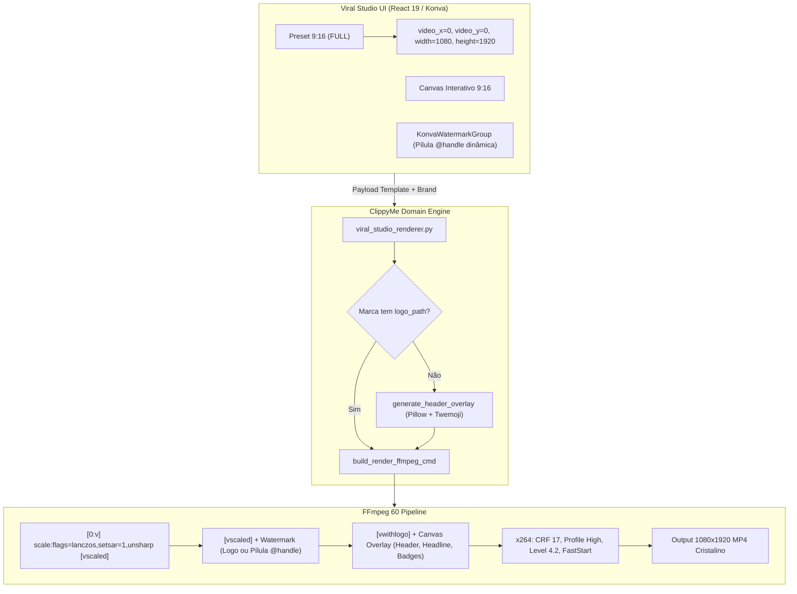
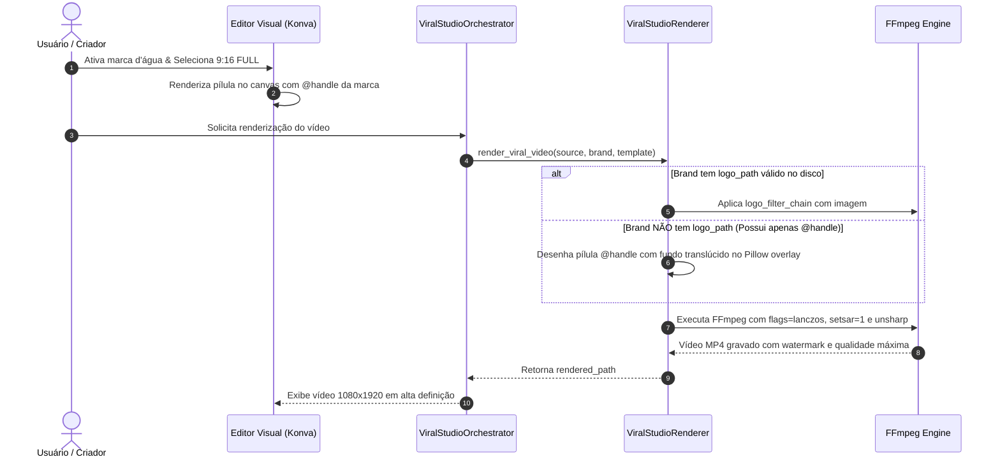

# Plano Técnico: Vídeo Tela Cheia (9:16 Full Screen), Gravação de Marca d'Água e Otimização de Qualidade

> **Data:** 08/10/2026  
> **Status:** Proposto (Aguardando Gate Humano 1 & 2)  
> **Escopo:** Viral Studio — Frontend Konva (`web/`), Backend Renderer (`src/clippyme/domain/viral_studio_renderer.py`, `encode.py`), Schemas e Testes.

---

## 1. Contexto & Problema

1. **Opção de Vídeo em Tela Cheia (9:16 Full Screen)**:
   - Atualmente, as proporções rápidas oferecidas são `1:1`, `4:5`, `16:9` e `free`. Falta a opção de preencher a tela inteira (`9:16` / `FULL`).
   - Os sliders de geometria restringem `video_y` (mínimo de 40px) e `video_height` (máximo de 1600px), impedindo que o vídeo comece em `y = 0` e tenha altura `1920px`.
   - No Konva Canvas, as restrições de arrasto (`dragBoundFunc`) bloqueiam coordenadas `y < 40` e altura total, e as camadas de texto ficavam atrás do vídeo quando este ocupava a tela toda.

2. **Marca d'Água Não Está Sendo Gravada no Vídeo**:
   - No backend (`viral_studio_renderer.py`), a marca d'água só é enviada ao FFmpeg se a marca tiver um arquivo `logo_path` existente no disco. Como marcas cadastradas (incluindo `@valeoclique`) possuem apenas `@handle` ou `avatar_url`, a marca d'água é completamente ignorada na renderização.
   - No frontend (`konva-watermark-group.tsx`), o preview exibe uma pílula com o handle `@valeoclique` (atualmente fixo), criando uma discrepância onde o usuário vê a marca d'água no preview mas ela nunca é gravada no arquivo `.mp4` final.

3. **Baixa Qualidade do Vídeo Renderizado**:
   - Fontes de vídeo baixadas de redes sociais (TikTok, Instagram Reels) frequentemente possuem resolução menor (ex: `576x1024` ou `720x1280`).
   - O FFmpeg realiza o redimensionamento com o filtro padrão (`scale=vw:vh`) sem sinalizadores de interpolação, resultando em perda de nitidez (blur/interpolação bilinear).
   - O Sample Aspect Ratio (SAR) de saída foi registrado com distorção `2559:2560`, em vez de `1:1` estrito.
   - O encoder x264 não força High Profile / Level 4.2 nem recuperação de microdetalhes em fontes comprimidas.

---

## 2. Decisões Arquiteturais (Gate 0 Confirmado)

1. **Preset 9:16 Tela Cheia Híbrido**:
   - Botão `9:16 (FULL)` nas proporções rápidas: configura `video_aspect = '9:16'`, `video_x = 0`, `video_y = 0`, `video_width = 1080`, `video_height = 1920`, `video_fit = 'cover'`, `video_radius = 0`, `video_border_width = 0`.
   - Expansão dos sliders: `video_y` (0 a 950px), `video_height` (300 a 1920px).
   - Ordem no Konva e FFmpeg: o vídeo opera como camada base visual, permitindo que cabeçalho e headline fiquem como overlay flutuante ou sejam ocultados através dos switches.

2. **Marca d'Água Inteligente Híbrida (Logo ou Pílula de Handle)**:
   - Se a marca possuir arquivo de logotipo PNG, renderiza o logo.
   - Se não possuir arquivo de logo, renderiza a pílula de marca d'água com o `@handle` da marca (ex: `@valeoclique`) com fundo escuro arredondado semi-transparente, exatamente com paridade visual 1:1 com o Konva.
   - A gravação ocorre no overlay de alta qualidade do Pillow/Twemoji ou via FFmpeg overlay garantido, gravando permanentemente nos pixels do `.mp4`.
   - No Konva, o texto do `@handle` passa a ser dinâmico com base na marca selecionada.

3. **Pipeline de Alta Fidelidade no FFmpeg**:
   - Escalonamento com algoritmo Lanczos de alta precisão: `scale=vw:vh:flags=lanczos,setsar=1`.
   - Filtro de nitidez inteligente sutil (`unsharp=3:3:0.5:3:3:0.0`) para revitalizar vídeos 576p/720p provenientes de scrapers sem gerar artefatos.
   - Parâmetros x264 otimizados: `-profile:v high -level:v 4.2 -crf 17` para retenção visual cristalina.

---

## 3. Diagramas Arquiteturais

### Topologia de Renderização (Flowchart TD)



### Ciclo de Resolução da Marca d'Água (SequenceDiagram)



---

## 4. Arquivos Impactados

### Backend (`src/clippyme/`)
1. `src/clippyme/domain/viral_studio_renderer.py`:
   - Atualizar `calculate_video_placement` para suportar `9:16` Full Screen (`x=0, y=0, width=1080, height=1920`).
   - Em `generate_header_overlay`: se `watermark_enabled` for True e não houver `logo_path`, renderizar a pílula do `@handle` (com fundo escuro arredondado e tipografia idêntica ao Konva) na posição e opacidade especificadas.
   - Em `build_render_ffmpeg_cmd`: adicionar `:flags=lanczos,setsar=1` ao scale e filtro `unsharp=3:3:0.5:3:3:0.0` para upscaling de qualidade superior.
   - Refinar suporte de watermark para logo caso exista arquivo válido.
2. `src/clippyme/domain/encode.py`:
   - Permitir CRF 17 e `-profile:v high -level:v 4.2` para o renderizador de vídeo viral.
3. `tests/domain/test_viral_studio_renderer.py`:
   - Testes unitários para cálculo de enquadramento 9:16 Full Screen.
   - Teste de renderização de watermark de texto (@handle) quando `logo_path` é None.
   - Teste de inclusão dos filtros de nitidez Lanczos/unsharp no comando FFmpeg.

### Frontend (`web/`)
1. `web/src/features/viral-studio/data/template.types.ts`:
   - Garantir que `video_aspect` aceite `'9:16'` além de `'1:1' | '4:5' | '16:9' | 'free'`.
2. `web/src/features/viral-studio/components/template-visual-tab-video.tsx`:
   - Adicionar o botão `9:16 (FULL)` nas opções de proporção rápida.
   - Ajustar limites dos sliders: `video_y` com mínimo em `0` (permitindo preset Topo 0px) e `video_height` com máximo em `1920`.
   - Adicionar preset de posição "Tela Cheia (0px)".
3. `web/src/features/viral-studio/components/konva-video-group.tsx`:
   - Permitir que `dragBoundFunc` aceite `clampedY` a partir de `0` (em vez de travar em 40).
   - Permitir altura até 1920px.
4. `web/src/features/viral-studio/components/konva-watermark-group.tsx`:
   - Tornar o texto da pílula dinâmico usando o `@handle` da marca ativa (passado via props ou contexto) em vez do valor estático.
5. `web/src/features/viral-studio/components/template-canvas-konva.tsx`:
   - Ajustar hierarquia de camadas para que o vídeo fique na camada de base, permitindo que textos/badges fiquem sobrepostos caso estejam ativos em modo tela cheia.

---

## 5. Plano de Verificação

### Testes Automatizados
```bash
# Validação rápida de backend
uv run --extra host-tests --with pytest --with pytest-mock python -m pytest tests/domain/test_viral_studio_renderer.py -v

# Validação rápida de frontend
pnpm --dir web test -- run src/features/viral-studio/components/template-visual-tab-video.test.tsx
pnpm --dir web typecheck
pnpm --dir web lint
./scripts/check_shadcn_usage.py

# Validação completa do repositório
./scripts/verify.sh
```

### Verificação Manual
1. Abrir o template editor no Viral Studio, clicar em `9:16 (FULL)`.
2. Verificar se o vídeo ocupa exatamente o canvas 1080x1920 no preview.
3. Verificar se a marca d'água exibe o `@handle` da marca ativa.
4. Renderizar um vídeo de teste e verificar com `ffprobe` se o arquivo resultante possui 1080x1920, SAR 1:1, watermark gravada e alta fidelidade visual.
