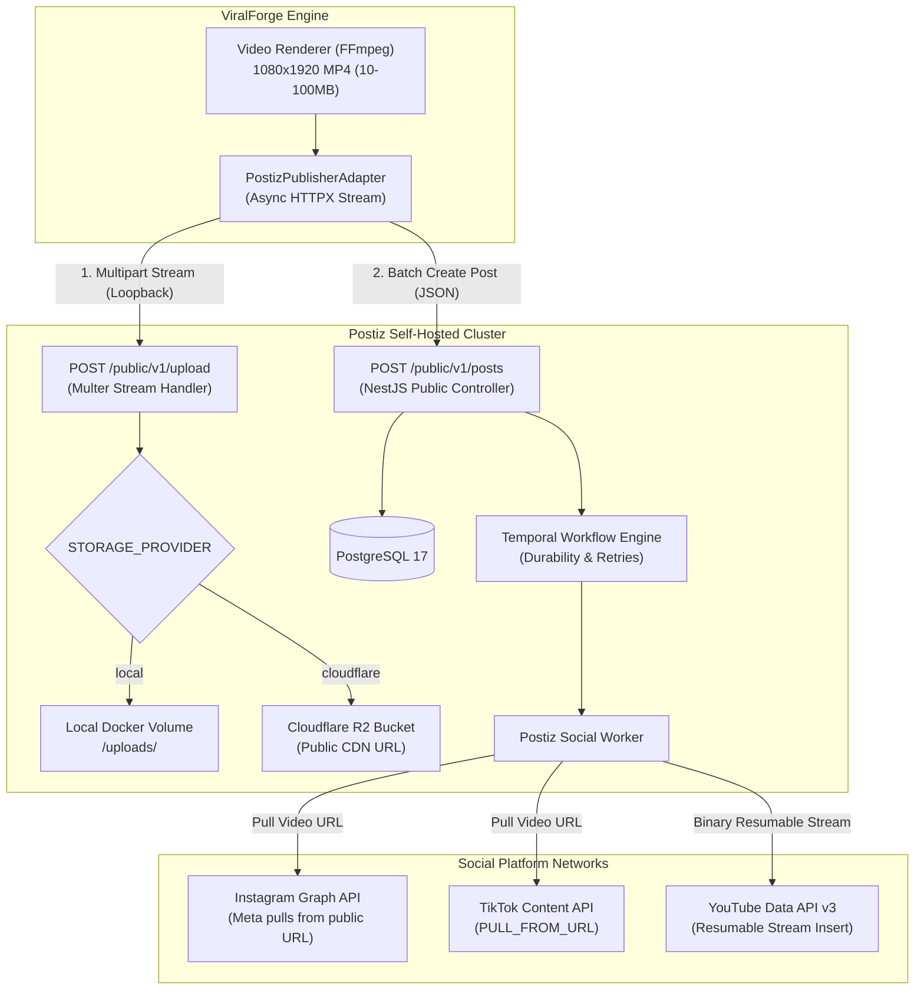

# Postiz API & Publishing Performance Research Report

**Document Target:** `docs/postiz-publishing-performance-research.md`  
**Investigation Scope:** Official Postiz Documentation (`docs.postiz.com`), Upstream GitHub Repository (`gitroomhq/postiz-app`), NestJS Backend/Orchestrator Architecture, Media Upload APIs, Large Video (10MB–100MB) Ingestion Strategies, and ViralForge Optimization Plan.

---

## Executive Summary & Key Findings

1. **API Endpoints & Schemas:**
   - **Media Upload:** Postiz provides two public endpoints:
     - `POST /public/v1/upload` (Multipart `form-data`, file field: `file`) → Returns `{"id": "<uuid>", "path": "<url_or_relative_path>"}`.
     - `POST /public/v1/upload-from-url` (JSON `{"url": "https://..."}`) → Downloads remote media into Postiz storage. *(Note: Upstream Issue #1147 reports missing file extensions on some versions).*
   - **Post Creation (`POST /public/v1/posts`):**
     - Uses `value[].image: [{ id, path }]` as the media container for **both images and videos**.
     - Requires platform-specific `settings` with strict `__type` keys (`"youtube"`, `"tiktok"`, `"instagram"`, `"instagram-standalone"`, `"facebook"`, `"linkedin"`, etc.).
     - YouTube strictly requires `title` (2–100 chars) in `settings`.
     - TikTok requires `privacy_level` and `content_posting_method` (`DIRECT_POST` vs `UPLOAD`).

2. **Backend & Storage Architecture:**
   - **Storage Backends (`STORAGE_PROVIDER`):** `local` (filesystem via `UPLOAD_DIRECTORY`, mapped to Docker volume) or `cloudflare` (Cloudflare R2 / S3-compatible via `@aws-sdk/client-s3`).
   - **The "Public HTTPS URL" Invariant for Social Networks:** Meta (Instagram Reels) and TikTok APIs **do not ingest raw video files from local Postiz servers**. Instead, their servers make a server-to-server HTTP/HTTPS request (`video_url` / `PULL_FROM_URL`) back to Postiz storage. If Postiz is hosted strictly on `localhost` without public ingress or R2, Instagram and TikTok video publishing will fail at the dispatch stage. YouTube, conversely, supports streaming resumable uploads from Postiz backend.

3. **High-Performance Ingestion of 10MB–100MB Video Payloads:**
   - On a colocated Docker host (`ViralForge` + `Postiz`), **local multipart streaming over internal Docker network (`http://postiz:5000`) achieves high-speed loopback throughput**.
   - **Rate Limiting:** Postiz enforces a global rate limit of **90 requests/hour** on `create-post`. ViralForge should batch multi-channel dispatches (Instagram + TikTok + YouTube) into a single `/public/v1/posts` call with multiple items in the `posts: [...]` array.

---



---

## 1. Primary Documentation & Public API Surface

### 1.1 Complete Media Endpoints Comparison

| Endpoint | Method | Payload Type | Response Body | Characteristics & Best Use Case |
|---|---|---|---|---|
| `/public/v1/upload` | `POST` | `multipart/form-data` (`file`) | `{"id": "uuid", "path": "uploads/..."}` | **Primary local method.** Direct binary upload handled by NestJS/Multer. Supports images and videos up to server configured limit. |
| `/public/v1/upload-from-url` | `POST` | `application/json` (`{"url": "https://..."}`) | `{"id": "uuid", "path": "uploads/..."}` | Downloads remote URL into Postiz storage. Useful when files are already hosted on S3/CDN. *(Warning: Issue #1147 extension bug in some versions).* |
| Direct Media Reference | `POST /posts` | `application/json` (`image: [{id, path}]`) | Post creation response | Reuses previously uploaded media IDs/paths across multiple social channels without re-uploading. |

### 1.2 `POST /public/v1/posts` Schema for Video

Postiz represents media inside the `value[].image` array regardless of whether the file is an image (`.png`, `.jpg`) or a video (`.mp4`, `.mov`).

#### Canonical JSON Payload for Multi-Channel Video Post:
```json
{
  "type": "schedule",
  "date": "2026-09-28T14:30:00.000Z",
  "shortLink": false,
  "tags": ["viral", "tech"],
  "posts": [
    {
      "integration": {
        "id": "ig_integration_uuid_123"
      },
      "value": [
        {
          "content": "Confira este corte incrível! 🔥 #shorts #reels",
          "image": [
            {
              "id": "media_uuid_abc456",
              "path": "https://media.viralforge.app/uploads/video_output_916.mp4"
            }
          ]
        }
      ],
      "settings": {
        "__type": "instagram",
        "post_type": "post"
      }
    },
    {
      "integration": {
        "id": "tiktok_integration_uuid_789"
      },
      "value": [
        {
          "content": "Confira este corte incrível! 🔥 #tiktok #viral",
          "image": [
            {
              "id": "media_uuid_abc456",
              "path": "https://media.viralforge.app/uploads/video_output_916.mp4"
            }
          ]
        }
      ],
      "settings": {
        "__type": "tiktok",
        "privacy_level": "PUBLIC_TO_EVERYONE",
        "content_posting_method": "DIRECT_POST",
        "duet": true,
        "stitch": true,
        "comment": true
      }
    },
    {
      "integration": {
        "id": "youtube_integration_uuid_999"
      },
      "value": [
        {
          "content": "Descrição completa do vídeo no YouTube Shorts com detalhes e links.",
          "image": [
            {
              "id": "media_uuid_abc456",
              "path": "https://media.viralforge.app/uploads/video_output_916.mp4"
            }
          ]
        }
      ],
      "settings": {
        "__type": "youtube",
        "title": "Os 5 Segredos do Algoritmo Viral (Shorts)",
        "type": "public",
        "selfDeclaredMadeForKids": false,
        "tags": ["algoritmo", "cortes", "viral"]
      }
    }
  ]
}
```

---

## 2. Architecture & Performance Mechanisms

### 2.1 Storage Backends & Network Ingestion

Postiz configures storage via `STORAGE_PROVIDER`:
1. **`STORAGE_PROVIDER=local`**:
   - Files are stored in `UPLOAD_DIRECTORY` (e.g. `/uploads`).
   - Served via NestJS static asset route or Nginx at `NEXT_PUBLIC_UPLOAD_DIRECTORY`.
   - **Crucial Limitation:** If `NEXT_PUBLIC_UPLOAD_DIRECTORY` is `http://localhost:4007` or a private LAN IP, **Instagram Reels and TikTok publishing will fail** with webhook or timeout errors because Meta/ByteDance servers cannot download from private IPs.
2. **`STORAGE_PROVIDER=cloudflare` (Recommended for Video)**:
   - Uses Cloudflare R2 bucket (`CLOUDFLARE_BUCKETNAME`, `CLOUDFLARE_ACCOUNT_ID`, `CLOUDFLARE_ACCESS_KEY`, `CLOUDFLARE_SECRET_ACCESS_KEY`).
   - Generates publicly accessible CDN URLs (`CLOUDFLARE_BUCKET_URL`).
   - High download bandwidth for Meta/TikTok ingest crawlers with zero egress fees.

---

## 3. Concrete Recommendations for ViralForge Integration

### Recommendation 1: Single-Upload Multi-Channel Batching (Rate Limit Optimization)
Postiz limits `/public/v1/posts` to **90 requests/hour**.
- When publishing a video to multiple channels (Instagram, TikTok, YouTube):
  1. Call `upload_file(video_path)` **once** → obtain `media_id` and `media_path`.
  2. Call `POST /public/v1/posts` with all target channels in the `posts: [...]` array in **one single HTTP request** (1 API credit consumed instead of N).

### Recommendation 2: Automatic Platform Settings Enrichment
Ensure `PostizPublisherAdapter` automatically injects mandatory platform keys:
- If target platform is `youtube`: automatically inject `settings: {"__type": "youtube", "title": item.selected_headline, "type": "public"}`.
- If target platform is `tiktok`: inject `settings: {"__type": "tiktok", "privacy_level": "PUBLIC_TO_EVERYONE", "content_posting_method": "DIRECT_POST"}`.
- If target platform is `instagram`: inject `settings: {"__type": "instagram", "post_type": "post"}`.

### Recommendation 3: Self-Hosted Production Ingress Setup
For self-hosted instances publishing to Instagram/TikTok:
- Either set `STORAGE_PROVIDER=cloudflare` in Postiz `.env`, OR
- Expose Postiz uploads through a public reverse proxy / Cloudflare Tunnel / Ngrok, setting `NEXT_PUBLIC_UPLOAD_DIRECTORY=https://media.myproductiondomain.com/uploads`.
