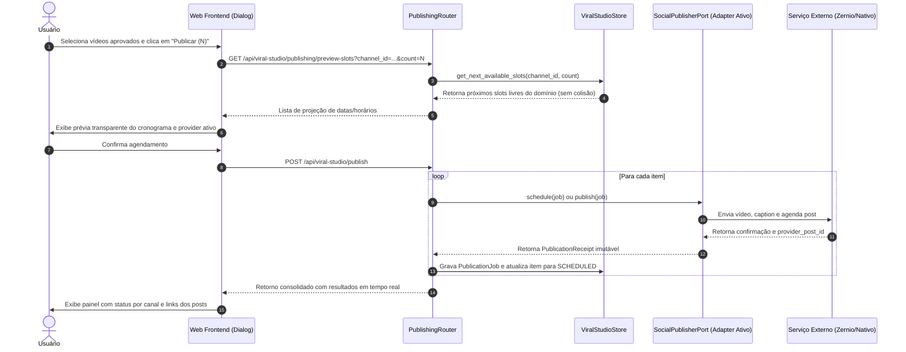

# Especificação Técnica — Publicação Inteligente & Fila Contínua (Zernio)

> **Documento de Engenharia & Arquitetura de Produto**  
> **Módulo:** Viral Studio / Publicação & Redes Sociais  
> **Status:** Aprovado para implementação  
> **Integração Externa:** [Zernio API](https://zernio.com) (TikTok, Instagram Reels, YouTube Shorts)

---

## 1. Contexto, Motivação e Problema

O **ViralForge** gera lotes de vídeos curtos em formato 9:16 (TikTok, Reels, Shorts) com alta cadência. No entanto, o fluxo de publicação legado herdado do ClippyMe apresentava gargalos críticos:

1. **Ausência de Fila Contínua (Colisão entre Lotes):**
   - Se o usuário gerasse um lote de 3 vídeos hoje e agendasse com espaçamento diário (segunda, terça, quarta), e logo em seguida gerasse outro lote de 4 vídeos, o sistema não tinha memória unificada da fila daquela conta social.
   - Resultado: o segundo lote tentava agendar nos mesmos dias e horários do primeiro lote, gerando colisões de publicação, violação de limites de taxa das APIs sociais e risco de *shadowban*.
2. **Falta de Visibilidade e Controle Centralizado:**
   - O usuário não conseguia visualizar no app quais vídeos estavam agendados, para quais contas e em quais datas/horários.
   - Não havia como reagendar um horário ou cancelar um post agendado sem acessar o painel externo do Zernio.
3. **Falta de Suporte a Estratégia de Múltiplas Contas de Nicho (Promoções/Achadinhos):**
   - Usuários que gerenciam fazendas de perfis de achadinhos precisam dividir lotes de vídeos entre várias contas diferentes para não saturar uma única conta.

---

## 2. Objetivos da Funcionalidade

- **Fila Contínua Automática por Conta (*Auto-Chaining*):** Novos agendamentos detectam o último horário já ocupado na conta e continuam automaticamente a partir do próximo slot vago.
- **Transparência Antes do Disparo:** O diálogo de publicação projeta exatamente as datas e horários em que cada vídeo será postado antes da confirmação.
- **Painel Centralizado de Fila de Postagens (`/publishing`):** Uma tela dedicada com histórico cronológico, status e ações de cancelamento/reagendamento.
- **Arquitetura Desacoplada (Ports & Adapters):** O domínio não conhece fornecedores externos. A comunicação com serviços de postagem é isolada atrás da porta `SocialPublisherPort`, permitindo plugar novos provedores ou motores locais sem alterar a lógica de negócios.
- **Transparência de Providers e Multi-Contas:** Cada provedor cadastrado expõe seus canais (`SocialChannel`), permitindo ao usuário ver e escolher qual conta/provedor deseja usar.
- **Resiliência com Fallback Automático:** Caso o provedor primário atinja limites de taxa (HTTP 429) ou instabilidade, o sistema pode acionar canais alternativos ou alertar de forma transparente.
- **Feedback em Tempo Real:** Disparo com acompanhamento item a item por rede, sem fechamento abrupto e com reenvio de falhas.
- **Preparação para V2 (Multi-Account Sharding):** Arquitetura desenhada para permitir rodízio (*Round-Robin*) de vídeos entre múltiplos canais.

---

## 3. Arquitetura da Solução & Ports & Adapters

> **ADR de Referência:** [`docs/adr/0001-ports-and-adapters-publishing.md`](adr/0001-ports-and-adapters-publishing.md)  
> **Glossário do Domínio:** [`CONTEXT.md`](../CONTEXT.md)

```mermaid
flowchart TD
    subgraph UI["Camada de Interface (Web Frontend)"]
        BulkBar["BulkActionsBar ('Publicar')"]
        PublishDialog["ViralPublishDialog (Transparência de Provider/Canal)"]
        QueueView["PublishingQueueView ('/publishing')"]
    end

    subgraph Domain["Domínio do ViralForge"]
        Router["PublishingRouter (Fila Contínua & Fallback)"]
        Store["ViralStudioStore (Persistência de Jobs & Slots)"]
        Port["<<Port>> SocialPublisherPort"]
    end

    subgraph Adapters["Camada de Adaptadores (Infraestrutura)"]
        ZernioAdapter["ZernioPublisherAdapter (API Zernio)"]
        InternalAdapter["InternalPublisherAdapter (Motor Nativo/Local)"]
        MockAdapter["MockPublisherAdapter (Testes & Offline)"]
    end

    UI --> Router
    Router --> Store
    Router --> Port
    Port <|.. ZernioAdapter
    Port <|.. InternalAdapter
    Port <|.. MockAdapter
```

### 3.1. Sequência de Publicação e Agendamento



---

### 3.2. Análise Formal de Módulos Profundos e Alavancagem (`/codebase-design`)

O subsistema de publicação e agendamento contínuo aplica estritamente os preceitos de **Módulos Profundos** (*Deep Modules*): uma interface estreita e estável encapsulando um comportamento rico, posicionada em uma costura limpa do domínio.

```
┌─────────────────────────────────────────────────────────────┐
│  Pequena Interface (SocialPublisherPort)                   │  ← 4 métodos assíncronos, DTOs imutáveis
├─────────────────────────────────────────────────────────────┤
│  Implementação Profunda do Adaptador (ZernioPublisherAdapter)│  ← Upload pré-assinado via streaming,
│                                                             │    transformação de metadados por rede,
│                                                             │    tratamento de erros 429 com backoff
└─────────────────────────────────────────────────────────────┘
```

#### Costura 1: Porta de Publicação Social (`clippyme.domain.social_publisher_port.SocialPublisherPort`)
* **Papel no Sistema:** Costura que desacopla o domínio do ViralForge de APIs externas de redes sociais.
* **Interface Pequena:**
  ```python
  class SocialPublisherPort(ABC):
      @abstractmethod
      async def publish(self, job: PublicationJob) -> PublicationReceipt: ...
      @abstractmethod
      async def schedule(self, job: PublicationJob) -> PublicationReceipt: ...
      @abstractmethod
      async def cancel(self, external_id: str) -> bool: ...
      @abstractmethod
      async def get_status(self, external_id: str) -> PublicationReceipt: ...
  ```
* **Implementação Profunda Oculta:** O `ZernioPublisherAdapter` esconde:
  - Resolução segura de URLs de upload com proteção SSRF (`_reject_internal_upload_url`).
  - Negociação de token Bearer e limpeza de credenciais em logs (`_scrub_secrets`).
  - Upload binário multipart via presigned PUT.
  - Mapeamento das regras específicas de cada rede (consentimento e privacidade no TikTok, visibilidade no YouTube Shorts, tags no Instagram).
  - Tratamento de rate limit (HTTP 429) com extração da mensagem exata de quota diária para o frontend.
* **Regra dos Dois Adaptadores (*Two Adapters Rule*):**
  1. `ZernioPublisherAdapter`: adaptador oficial para o serviço em nuvem Zernio.
  2. `MockPublisherAdapter`: adaptador em memória 100% determinístico que emite recibos válidos sem chamadas de rede.
* **Alavancagem (*Leverage*):** O chamador (ex: rota `/publish` ou orquestrador) chama apenas `await publisher.schedule(job)`. Uma única linha de chamada no domínio aciona mais de 300 linhas de negociação HTTP e serialização.
* **Localidade (*Locality*):** Nenhuma alteração na API do Zernio (ex.: novos cabeçalhos ou campos de privacidade) vaza para fora do adaptador.
* **O Teste de Deleção (*The Deletion Test*):** Se o módulo `SocialPublisherPort` for deletado, toda a complexidade de autenticação, upload e contratos de redes sociais reaparece espalhada no orquestrador e nos endpoints HTTP.
* **A Interface como Superfície de Teste (*Interface as Test Surface*):** O `MockPublisherAdapter` satisfaz exatamente a mesma interface, permitindo que toda a suíte de testes de agendamento execute no host via Pytest em microssegundos.

#### Costura 2: Motor de Fila Contínua (*Auto-Chaining Queue Engine* em `clippyme.domain.viral_studio_store`)
* **Papel no Sistema:** Módulo algorítmico puro responsável por garantir zero sobreposição de datas e horários para publicações de uma mesma conta social.
* **Interface Pequena:**
  ```python
  def get_next_available_slots(
      account_id: str,
      count: int,
      preferred_time: str = "18:00",
      days_of_week: Optional[List[int]] = None
  ) -> List[datetime]: ...
  ```
* **Implementação Profunda Oculta:** O módulo inspeciona as publicações ativas no store, calcula a transição de fuso horário, verifica feriados/fins de semana conforme restrições e projeta slots consecutivos sem que o chamador precise lidar com lógica de calendário.
* **Alavancagem (*Leverage*):** O modal do frontend simplesmente solicita `GET /preview-slots?count=5` e recebe a grade completa pronta para renderização.

---

## 4. Algoritmo de Fila Contínua (*Auto-Chaining Queue*)

O cálculo de próximos horários livres é executado no backend (`viral_studio_store.py`) através do helper `get_next_available_slots`:

```text
Entrada: account_id, count, start_date (opcional), interval_days (padrão: 1), time_slot (padrão: 18:00)

1. Buscar todos os itens no Store onde:
   - status in ("SCHEDULED", "PENDING_PUBLISH")
   - publication_records contém account_id e data no futuro
2. Extrair a lista de datas já ocupadas: occupied_dates = [record.scheduled_for.date()]
3. Determinar a data base inicial (base_date):
   - Se start_date foi informada: base_date = max(start_date, hoje)
   - Senão, se occupied_dates não estiver vazia:
       base_date = max(occupied_dates) + interval_days
     Senão:
       base_date = hoje (se hora atual < 18:00) ou amanhã
4. Iterar gerando os slots:
   candidate_date = base_date
   slots = []
   enquanto len(slots) < count:
       se candidate_date não está em occupied_dates:
           slots.append(candidate_date + time_slot)
       candidate_date += interval_days
5. Retornar slots
```

Dessa forma, dois lotes de 3 vídeos enviados em sequência para a mesma conta recebem cronogramas contínuos:
- **Lote 1:** Segunda 18:00, Terça 18:00, Quarta 18:00.
- **Lote 2:** Quinta 18:00, Sexta 18:00, Sábado 18:00.

---

## 5. Especificação dos Contratos de API (Backend)

### 5.1. `GET /api/viral-studio/publishing/queue`
Retorna todos os itens agendados ou publicados entre todas as contas:
- **Query Params:** `account_id` (opcional), `platform` (opcional), `status` (opcional: `SCHEDULED`, `PUBLISHED`, `FAILED`).
- **Resposta:**
  ```json
  {
    "total": 12,
    "items": [
      {
        "item_id": "item-abc-123",
        "batch_id": "batch-xyz",
        "headline": "Achadinho que mudou minha rotina!",
        "thumbnail_url": "/thumbnails/viral_studio/batch-xyz/item-abc-123/keyframe_0.jpg",
        "video_url": "/videos/viral_studio/batch-xyz/item-abc-123/rendered.mp4",
        "product_code": "PROD-99",
        "platform": "instagram",
        "account_id": "acc_inst_01",
        "account_name": "@achados_promos",
        "scheduled_for": "2026-09-25T18:00:00-03:00",
        "status": "SCHEDULED",
        "post_id": "zernio_post_88291",
        "post_url": null,
        "error": null
      }
    ]
  }
  ```

### 5.2. `GET /api/viral-studio/publishing/preview-slots`
Calcula a projeção de datas para o modal antes do disparo:
- **Query Params:** `account_id` (string), `count` (int), `start_date` (opcional).
- **Resposta:**
  ```json
  {
    "account_id": "acc_inst_01",
    "account_name": "@achados_promos",
    "count": 3,
    "last_scheduled_slot": "2026-09-24T18:00:00-03:00",
    "projected_slots": [
      { "index": 1, "datetime": "2026-09-25T18:00:00-03:00", "formatted": "25/09 às 18:00" },
      { "index": 2, "datetime": "2026-09-26T18:00:00-03:00", "formatted": "26/09 às 18:00" },
      { "index": 3, "datetime": "2026-09-27T18:00:00-03:00", "formatted": "27/09 às 18:00" }
    ]
  }
  ```

### 5.3. `POST /api/viral-studio/publishing/{item_id}/cancel`
Cancela o agendamento de um vídeo no Zernio:
- Remove o registro de agendamento ativo.
- Retorna o status do `ViralItem` para `APPROVED`.
- Registra evento de auditoria no log do item.

### 5.4. `PATCH /api/viral-studio/publishing/{item_id}/reschedule`
Atualiza a data/horário de postagem no Zernio e no `ViralItem`:
- **Payload:** `{ "new_datetime": "2026-09-28T20:00:00-03:00" }`.

---

## 6. Interface do Usuário (Frontend Web)

### 6.1. Diálogo de Publicação (`ViralPublishDialog`) [V1 — Imediato]
- **Pre-flight & Contas Conectadas:** Exibe as contas ativas do Zernio vinculadas ou configuradas globalmente.
- **Configuração de Disparo:**
  - Seletores visuais de plataformas e contas conectadas (TikTok, Instagram, YouTube).
  - Seleção do modo:
    - **Publicar Agora:** Disparo imediato na API do Zernio.
    - **Fila Inteligente Contínua:** 1 post por dia no melhor horário (padrão: 18:00), continuando consecutivamente sem colidir com agendamentos anteriores.
  - Alerta dinâmico: *"Continuando a fila a partir de 24/09 às 18:00"*.
  - Tabela de projeção: lista com as datas calculadas para cada um dos vídeos selecionados antes de confirmar.
- **Painel em Tempo Real:**
  - Durante o envio, cada vídeo exibe miniatura, título e status (`Enviando...`, `Agendado`, `Falha`).
  - Tratamento individual de falhas com relatório amigável (ex.: quota esgotada) e opção de retentativa.
  - Botão "Concluir" explícito para fechar quando o usuário terminar de revisar.

### 6.2. Pontos de Acionamento no Fluxo da V1
A publicação e o agendamento podem ser disparados nos seguintes pontos de interface:
1. **No Lote (`BatchResultsView`):**
   - **`BulkActionsBar`:** Botão primário "Publicar ({approvedCount})" ativado dinamicamente ao selecionar vídeos com status `APPROVED`.
   - **`BatchFilterToolbar`:** Nova aba "Agendados / Publicados ({count})" com badge semântico.
2. **No Card do Vídeo (`ItemCard`):**
   - Se `APPROVED`: Botão rápido para abrir o `ViralPublishDialog` para o item individual.
   - Se `SCHEDULED`: Pill semântico exibindo *"Agendado para DD/MM às HH:MM"* com botão de ação rápida para *"Cancelar Agendamento"* (revertendo o item para `APPROVED`).
   - Se `PUBLISHED`: Pill *"Publicado"* com link externo direto para o post nas redes.
3. **No Editor de Vídeo (`ViralEditorBottomBar`):**
   - Se `APPROVED`: Botão secundário "Publicar Vídeo" ao lado de salvar alterações.
4. **No Painel de Inspeção (`ItemDetailSheet`):**
   - Exibição do histórico de publicação (`publication_records`), ID externo do post e botão de cancelamento.

### 6.3. Tela Dedicada de Fila (`/publishing`) [V2 — Posterior]
- **Menu Lateral (`AppSidebar`):** Item "Fila de Postagens" sob Estúdio & Criação.
- **KPI Cards no Topo:** Total Agendados, Publicados nos últimos 7 dias, Falhas ativas.
- **Filtros Avançados:** Por Rede Social, por Conta, status e busca textual.
- **Tabela/Timeline Cross-Batch:**
  - Visão unificada de todos os vídeos de todos os lotes agendados ou publicados.
  - Calendário interativo mensal/semanal com suporte a drag-and-drop para reagendamento manual.

---

## 7. Roteiro de Evolução: V1 vs V2

| Capacidade | V1 (Escopo Imediato — Fechamento do Fluxo) | V2 (Evolução Multi-Conta & Calendário Global) |
|---|---|---|
| **Arquitetura** | `SocialPublisherPort` com `ZernioPublisherAdapter` + `MockPublisherAdapter` | Adaptadores adicionais (Nativo, Ayrshare, Upload-Post) |
| **Geração & Templates** | Motor estável atual (Pillow + FFmpeg + Gemini Copy) | Konva 9:16 Canvas interativo + Tarefas Modulares (`GenerationTask`) |
| **Acionamento de Post** | `BulkActionsBar` no lote, `ItemCard` e `ViralEditorBottomBar` | Agendamento automatizado em lote via cron ou webhooks |
| **Modos de Agendamento** | "Publicar Agora" e "Fila Contínua" (1 vídeo/dia às 18:00) | Agendamento com janelas múltiplas de pico e rodízio |
| **Cancelamento de Post** | Direto no `ItemCard` e `ItemDetailSheet` do lote | Painel global de cancelamento em lote em `/publishing` |
| **Interface de Fila** | Modal `ViralPublishDialog` + Pills de status no lote | Tela dedicada `/publishing` com calendário multi-canal |
| **Contas por Marca** | 1 conta por rede (TikTok, Instagram, YouTube) | Pool de múltiplas contas por rede (*Round-Robin Sharding*) |

