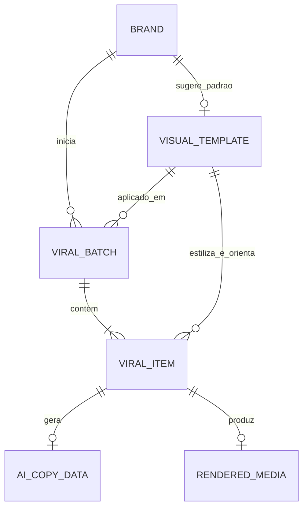

# Arquitetura do Subsistema de Templates e Personas — Viral Studio

**Projeto:** ViralForge  
**Módulo:** Viral Content Studio  
**Status:** Arquitetura Definida (Aprovada)  
**Data:** Setembro de 2026  
**Disciplinas Aplicadas:** `/domain-modeling` e `/codebase-design`  

---

## 1. Visão Geral & Propósito do Sistema

> [!IMPORTANT]
> **Planejamento de Versões (V1 vs V2):**  
> O motor atual de geração de vídeos e aplicação de templates pré-configurados (baseado em Pillow + FFmpeg + Gemini Copy) está **100% estável e funcional** no backend e no frontend atual.  
> Para disponibilizar o fluxo completo do Viral Studio de ponta a ponta imediatamente na **V1**, a prioridade é a **Fase 4: Publicação Inteligente & Fila Contínua (Zernio)**.  
> As especificações avançadas descritas neste documento — abrangendo a reestruturação de schemas com **`GenerationTask`**, compilação dinâmica de JSON Schema e o editor visual com **Canvas Konva 9:16** — compõem a **V2 (Fase 5)** da evolução do sistema.

O subsistema de **Templates e Personas** do Viral Studio é o motor responsável pela identidade visual e editorial dos conteúdos curtos (Instagram Reels, TikTok e YouTube Shorts). 

Historicamente, o sistema continha templates cosméticos rasos e prompts codificados rigidamente para *marketing de afiliados / achadinhos*. Esta arquitetura desacopla completamente o motor, transformando o **VisualTemplate** em um agregador autônomo que une:
1. **Camada Visual:** Layout 1080×1920, posicionamento da mídia, tipografia, cores, selos e marcas-d'água.
2. **Camada Editorial:** Persona da IA, tom de voz, regras de gancho/headline, objetivo de conversão e interpolação de prompts.
3. **Editor Interativo (TemplateStudio):** Workstation de vídeo baseada em `react-konva` com manipulação direta e guias de Safe Zones.

---

## 2. Modelo de Domínio (`/domain-modeling`)

O modelo de domínio estabelece limites claros de responsabilidade e garante uma linguagem ubíqua e precisa em todo o código.

### 2.1. Glossário de Entidades e Agregados

* **VisualTemplate (Agregado Raiz):** Entidade autônoma que encapsula as definições visuais (FFmpeg/Pillow) e as diretrizes de persona/prompt (LLM). Não pertence a uma conta específica; pode ser utilizado por múltiplas marcas.
  - *Evitar:* VideoLayout, PresetTheme, StyleSkin, RenderProfile.
* **Persona:** Identidade editorial e postura adotada pela IA (ex: "Roteirista investigativo focado em mistérios e fatos científicos"). Define o tom, o estilo de argumentação e o vocabulário das headlines.
  - *Evitar:* CharacterProfile, PromptPreset, AgentTone.
* **ConversionGoal:** Estratégia de engajamento ou monetização associada ao template (`engagement`, `affiliate`, `lead_capture`, `keyword_direct`, `infoproduct`). Governa a presença ou ausência de códigos de produto e links.
  - *Evitar:* MonetizationType, CampaignObjective, CTAMode.
* **Brand:** Identidade comercial proprietária de logotipos, avatares, canais de publicação vinculados e um template padrão sugerido.
* **ViralBatch:** Lote operacional de ingestão e processamento que adota um `template_id` padrão para seus itens.
* **ViralItem:** Vídeo individual que registra seu ciclo de vida (Download -> Análise -> Renderização -> Revisão -> Publicação). Permite sobrescrever o template do lote para re-renderização isolada.

### 2.2. Diagrama de Relacionamentos do Domínio



### 2.3. Invariantes de Domínio

1. **Invariante de Não-Poluição Comercial:** Se `conversion_goal == "engagement"` (ex: Curiosidades), a IA é estritamente proibida de inventar códigos de produto, links de afiliado ou chamadas de compra. O CTA deve focar exclusivamente em retenção, debate nos comentários e novos seguidores.
2. **Invariante de Alinhamento YUV420p:** Todas as coordenadas visuais (`x, y, width, height`) calculadas ou editadas no template devem ser números pares para evitar artefatos de compressão e falhas no encoder libx264 do FFmpeg.
3. **Invariante de Preservação da Mídia Original:** A re-renderização de um item com outro template ou com headline editada nunca reexecuta o download do vídeo original nem chama a IA novamente caso a cópia já exista.

---

## 3. Desenho de Código & Módulos Profundos (`/codebase-design`)

O sistema foi desenhado priorizando **módulos profundos** (*deep modules*): interfaces pequenas com implementações robustas que ocultam alta complexidade técnica, gerando **alavancagem (*leverage*)** para os chamadores e **localidade (*locality*)** para a manutenção.

```
┌────────────────────────────────────────────────────────┐
│               Interface Pequena (Callers)              │
│       generate_viral_copy()  /  render_viral_video()   │
├────────────────────────────────────────────────────────┤
│                                                        │
│               Implementação Profunda                   │
│  • Resolução de Provedor (Gemini / Ollama / LM Studio) │
│  • Empacotamento Multimodal de Keyframes JPEG          │
│  • Interpolação Segura de Placeholders Dinâmicos       │
│  • JSON Repair em 5 Níveis e Sanitização               │
│  • Composição Pillow com Quebra de Linha Automática    │
│  • Filter Graph FFmpeg com Fallback de Áudio AAC       │
│                                                        │
└────────────────────────────────────────────────────────┘
```

### 3.1. Análise Formal de Módulos Profundos e Alavancagem (`/codebase-design`)

O sistema adota o princípio de **profundidade de módulo** (*depth as leverage*): a quantidade de comportamento útil que um chamador ou teste consegue exercitar por unidade de interface que precisa aprender.

```
┌─────────────────────────────────────────────────────────────────────────────┐
│                            CALLERS (Alta Alavancagem)                       │
│     Orquestrador de Lotes  •  Rotas de Retry  •  Testador de Templates      │
│                 │                                     │                     │
│                 ▼ [Costura 1: generate_viral_copy]    ▼ [Costura 2: render] │
├─────────────────────────────────────────────────────────────────────────────┤
│ Módulo Profundo: CopyEngine                  │ Módulo Profundo: Renderer    │
│ • Resolução de Provedor (Gemini/Ollama)      │ • Composição Pillow 1080x1920│
│ • Montagem Dinâmica de GenerationTasks       │ • Auto-downscale de Headline │
│ • Interpolação Segura de Tags {transcript}   │ • Máscara Alfa de Bordas     │
│ • Síntese de JSON Schema sob Demanda         │ • ExtraImage / Card Overlay  │
│ • Cadeia de JSON Repair em 5 Níveis          │ • Filter Graph FFmpeg        │
│ • Mapeamento de Saídas (custom_outputs)      │ • Alinhamento Par YUV420p    │
│ • Telemetria Completa de Tokens e Custos     │ • Cópia de Áudio AAC Fallback│
└─────────────────────────────────────────────────────────────────────────────┘
```

#### Costura 1: Motor Editorial de IA (`clippyme.domain.viral_studio_copy`)
- **Interface Enxuta:**
  ```python
  async def generate_viral_copy(
      template: VisualTemplate,
      brand: Brand,
      item: ViralItem,
      video_context: Optional[ViralVideoContext] = None,
      model: Optional[str] = None,
  ) -> AICopyData: ...
  ```
- **Complexidade Ocultada na Implementação:**
  1. *Despacho Dinâmico de Provedor:* Suporte transparente a Google Gemini (cloud), LM Studio (local) e Ollama (local) com timeouts estendidos para modelos de raciocínio.
  2. *Orquestração Dinâmica de `GenerationTask`:* O motor lê `template.generation_tasks` e gera dinamicamente a seção de regras e o JSON Schema contendo exclusivamente as propriedades das tarefas ativas. Se o template não possui headline no canvas, a LLM nem sequer é instruída a criá-la.
  3. *Interpolação Universal:* Interpola `{transcript}`, `{brand_name}`, `{cta}`, `{title}` e `{niche}` em cada instrução de tarefa.
  4. *Tolerância a Falhas:* Cadeia de recuperação de JSON malformado em 5 níveis (`json_repair`), sanitização de cercas de código markdown e fallbacks de segurança.
  5. *Mapeamento para `AICopyData`:* Preenche retrocompativelmente campos canônicos (`headlines`, `caption`, `social_title`) e armazena tarefas extras (quizzes, textos de rodapé, prompts de imagem) em `custom_outputs: Dict[str, Any]`.
  6. *Telemetria:* Coleta de latência (ms), tokens de prompt/resposta e cálculo de custos em USD persistidos no item.
- **Superfície de Testes & Testabilidade:**
  As funções centrais `build_viral_copy_prompt(template, brand, item, ...)` e `parse_viral_copy_response(raw_text, ...)` são funções puras e sem efeitos colaterais. Podem ser testadas com 100% de cobertura no host (`pytest -m "not integration"`) sem mocks de rede e sem dependências de GPU/ML.
- **Teste da Deleção (*Deletion Test*):**
  Se `viral_studio_copy` fosse deletado ou transformado em um módulo raso (*pass-through*), dezenas de linhas de lógica de resolução de provedores, parsing de JSON, interpolação e tratamento de erros reapareceriam espalhadas por todo o orquestrador e rotas de API. O módulo justifica com louvor sua profundidade.

#### Costura 2: Renderização Visual de Mídia (`clippyme.domain.viral_studio_renderer`)
- **Interface Enxuta:**
  ```python
  def render_viral_video(
      source_path: str,
      brand: Brand,
      template: VisualTemplate,
      headline: str,
      output_path: str,
      watermark: bool = True,
  ) -> str: ...
  ```
- **Complexidade Ocultada na Implementação:**
  1. *Cálculo de Geometria Canônica 1080×1920:* Ajuste proporcional da mídia, escala horizontal e altura vertical (`video_height`).
  2. *Invariante YUV420p:* Forçamento de coordenadas e dimensões pares (`coord - (coord % 2)`) para compatibilidade com o encoder libx264.
  3. *Pillow Overlay:* Geração do overlay transparente com recorte circular do avatar, desenho do selo de nicho em `badge_y` e quebra de linhas inteligente com auto-downscaling tipográfico da headline em `headline_y`.
  4. *Moldura e Cantos Arredondados:* Construção de máscara alfa de cantos arredondados (`video_radius`) e bordas estéticas (`video_border_width`, `video_border_color`).
  5. *Camada Extra de Imagem:* Composição do card ou asset de rodapé em `(extra_image_x, extra_image_y)`.
  6. *Orquestração FFmpeg:* Montagem do grafo de filtros `filter_complex`, muxing com cópia direta de áudio (`-c:a copy`) e fallback automático para AAC.

#### Costura 3: Persistência Atômica (`clippyme.domain.viral_studio_store`)
- **Interface Enxuta:**
  ```python
  def get_template(template_id: str) -> Optional[VisualTemplate]: ...
  def list_templates() -> List[VisualTemplate]: ...
  def save_template(template: VisualTemplate) -> VisualTemplate: ...
  def delete_template(template_id: str) -> None: ...
  def ensure_default_templates() -> None: ...
  ```
- **Complexidade Ocultada na Implementação:**
  Gravação atômica em disco (`tmp + os.replace`), trava de concorrência com mutex (`_STORE_LOCK`), permissões estritas (`0o600`), migrações automáticas de esquemas legados e população idempotente dos 4 templates de fábrica universais.

---

## 4. O Sistema de Dados do Template (`VisualTemplate`)

O schema do template unifica as propriedades visuais e editoriais:

```python
class VisualTemplate(BaseModel):
    id: str = Field(..., max_length=64, pattern=r"^[a-zA-Z0-9_-]+$")
    name: str = Field(..., min_length=1, max_length=100)
    
    # ── Camada Visual (1080x1920) ──────────────────────────────────────
    width: int = 1080
    height: int = 1920
    background_color: str = "#0D1117"
    
    # Caixa do Vídeo & Geometria
    video_fit: str = "contain"                     # contain | cover
    video_aspect: str = "1:1"                      # 1:1 | 4:5 | 16:9 | free
    video_x: Optional[int] = None                  # Auto-centralizado se None
    video_y: int = 360                             # Posição Y canônica (50 a 950px)
    video_width: Optional[int] = None              # Calculado via escala se None
    video_height: int = 1000                       # Altura vertical ajustável (400 a 1500px)
    video_scale: int = 92                          # 70% a 100% da largura do canvas
    video_radius: int = 20                         # Arredondamento dos cantos (0 a 48px)
    video_border_width: int = 2                    # Espessura da borda (0 a 10px)
    video_border_color: str = "#3B82F6"            # Cor da moldura
    video_shadow: str = "deep"                     # none | subtle | deep | glow-blue | glow-pink
    
    # Tipografia e Cabeçalho
    avatar_enabled: bool = True
    avatar_x: int = 60
    avatar_y: int = 80
    avatar_size: int = 100
    brand_name_enabled: bool = True
    brand_name_font_size: int = 36
    brand_name_color: str = "#F0F6FC"
    handle_font_size: int = 26
    handle_color: str = "#8B949E"
    
    # Headline Dinâmica (Camada Móvel)
    headline_enabled: bool = True
    headline_font: str = "Montserrat-ExtraBold"
    headline_font_size: int = 48
    headline_color: str = "#FFFFFF"
    headline_y: int = 130                          # Posição Y canônica móvel (40 a 600px)
    headline_max_lines: int = 3
    headline_margin_x: int = 60
    
    # Selo de Nicho / Badge Visual (Camada Móvel)
    badge_enabled: bool = True
    custom_badge_text: Optional[str] = "VOCÊ SABIA?"
    custom_badge_bg_color: str = "#E11D48"
    custom_badge_text_color: str = "#FFFFFF"
    badge_y: int = 45                              # Posição Y canônica móvel (20 a 400px)
    
    # Camada de Imagem / Banner Extra (Preenchimento do Rodapé)
    extra_image_enabled: bool = True
    extra_image_path: Optional[str] = None         # Caminho do asset salvo no backend
    extra_image_url: Optional[str] = None          # URL pública ou DataURI para preview
    extra_image_template_type: str = "comment"     # comment | follow | deal | fact | custom_upload
    extra_image_y: int = 1420                      # Posição Y canônica no rodapé (800 a 1750px)
    extra_image_height: int = 340                  # Altura da camada extra (100 a 700px)
    extra_image_width: int = 92                    # Largura percentual (40 a 100%)
    extra_image_radius: int = 16                   # Arredondamento da imagem extra (0 a 40px)
    
    # Marca-d'água
    watermark_enabled: bool = True
    watermark_opacity: float = 0.7
    watermark_position: str = "bottom-right"       # top-left | top-right | bottom-left | bottom-right
    
    # ── Camada Editorial & IA ──────────────────────────────────────────
    niche_type: str = "curiosities"                # curiosities | affiliate | news | tech | custom
    persona_role: str = "Roteirista mestre em fatos curiosos e mistérios..."
    tone_of_voice: str = "Intrigante, misterioso, dinâmico"
    conversion_goal: str = "engagement"            # engagement | affiliate | lead_capture | keyword_direct
    call_to_action_template: Optional[str] = "Qual desses fatos você já sabia? Comente abaixo e siga!"
    system_prompt_template: Optional[str] = None   # Template mestre com interpolação de {transcript}, etc.
    default_hashtags: List[str] = Field(default_factory=list)
    preferred_model: Optional[str] = None

    # ── Tarefas Modulares de Geração de IA (GenerationTasks) ─────────────
    # Contrato 100% dinâmico: o template declara exatamente o que a IA deve gerar
    generation_tasks: List[GenerationTask] = Field(default_factory=list)
```

### 4.1. O Modelo da Tarefa de Geração (`GenerationTask`)
Cada tarefa de IA é um bloco modular desacoplado que orienta a LLM a gerar um artefato específico:

```python
class GenerationTask(BaseModel):
    id: str = Field(..., max_length=64, pattern=r"^[a-zA-Z0-9_-]+$") # ex: "headline", "caption", "quiz", "image_prompt"
    label: str = Field(..., max_length=100)                          # ex: "Headline do Vídeo", "Prompt de Imagem"
    target: str = Field(..., description="canvas_headline | canvas_badge | canvas_extra_image | post_caption | post_title | post_hashtags | custom_metadata")
    instruction: str = Field(..., description="Instrução para a IA com suporte a tags {transcript}, {brand_name}, {cta}, etc.")
    output_type: str = Field(default="text", description="text | options_list | poll | image_prompt")
    is_required: bool = True
```

### 4.2. Estrutura de Retorno Dinâmica (`AICopyData`)
Garante retrocompatibilidade total com o ecossistema existente e suporte a campos customizados arbitrários:

```python
class AICopyData(BaseModel):
    # Campos canônicos padrão (mantidos para retrocompatibilidade)
    selected_headline: Optional[str] = None
    headlines: List[str] = Field(default_factory=list)
    caption: str = ""
    hashtags: List[str] = Field(default_factory=list)
    social_title: Optional[str] = None
    product: Optional[str] = None
    product_description: Optional[str] = None
    
    # Saídas Dinâmicas de Tarefas Extras (ex: quiz, footer_text, image_prompt)
    custom_outputs: Dict[str, Any] = Field(default_factory=dict)
    
    model: Optional[str] = None
    telemetry: Dict[str, Any] = Field(default_factory=dict)
```

---

## 5. Motor de Geração Dinâmica Modular (`CopyEngine`)

Historicamente, o sistema assumia que todo vídeo precisava obrigatoriamente de um produto identificado, código de afiliado e headline no topo. Com o **Motor Modular Baseado em `GenerationTask`**, a geração torna-se 100% dinâmica e orientada ao template:

### 5.1. Construção Dinâmica de Prompts e Contratos JSON
Quando o `CopyEngine` executa `generate_viral_copy(template, brand, item, ...)`:
1. **Verificação de Necessidades:** O motor inspeciona `template.generation_tasks`. Se o template não possui tarefa com target `canvas_headline` (ex: um vídeo limpo ou foco em legenda), a LLM não é instruída a inventar manchetes e economiza tokens de raciocínio.
2. **Interpolação Universal de Variáveis:** As instruções de cada tarefa passam por interpolação de variáveis contextuais:
   - `{transcript}`: Transcrição integral do áudio falado.
   - `{title}` / `{caption}`: Título e legenda originais da publicação capturada.
   - `{brand_name}` / `{brand_handle}`: Nome e handle da marca configurada.
   - `{cta}`: Chamada para ação definida no template ou na marca.
   - `{niche}`: Nicho do template (`curiosities`, `tech`, etc.).
3. **Construção Dinâmica do JSON Schema:** O contrato de resposta JSON exigido da LLM é gerado em tempo de execução contendo **apenas** as chaves das tarefas ativas. Nenhuma instrução de afiliado polui templates de curiosidades.
4. **Mapeamento de Saída:** Ao receber a resposta da LLM:
   - Campos com target `canvas_headline` preenchem `item.ai_copy.headlines` e `selected_headline`.
   - Campos com target `post_caption` preenchem `item.ai_copy.caption`.
   - Campos extras (como `quiz`, `footer_text`, `image_prompt`) são armazenados em `item.ai_copy.custom_outputs[task.id]`.

### 5.2. Pipeline Futuro de Geração de Imagens de IA (2 Etapas)
O ecossistema dinâmico já nasce preparado para geração multimodal de mídia:
1. **Etapa 1 (Prompt de Imagem via LLM):** A tarefa com target `canvas_extra_image` e tipo `image_prompt` gera uma descrição visual precisa em inglês contextualizada na transcrição (`{transcript}`).
2. **Etapa 2 (Síntese de Imagem via Provedor):** A porta de geração de imagem (`ImageGenerationPort` — ex: Google Imagen, Fal.ai, Flux) renderiza o PNG transparente/ilustrativo e salva em disco como asset do item, injetando automaticamente o caminho em `template.extra_image_path` para ser renderizado no rodapé do vídeo!

### 5.3. Estratégias de Conversão (`conversion_goal`)
O objetivo de conversão governa as diretrizes éticas e de retenção das tarefas de legenda:

| Objetivo (`conversion_goal`) | Exemplo de Nicho | Comportamento Editorial da IA |
| :--- | :--- | :--- |
| **`engagement`** | **Curiosidades**, Fatos, Ciência, Entretenimento | **100% focado em retenção orgânica.** Não gera código de produto nem link de bio. A legenda explica o fato com dados impressionantes e termina com perguntas instigantes para estimular comentários e debates. |
| **`affiliate`** | **Achadinhos**, Ofertas, Promoções | Foco em utilidade e vendas. Identifica o produto, inclui obrigatoriamente `📌 Produto {código}`, chamada de link na bio e hashtags comerciais (`#publi`, `#achadinhos`). |
| **`keyword_direct`** | Infoprodutos, Automação ManyChat | Foco em conversão via DM: *"Comente a palavra FATO que eu te envio o artigo completo no direct!"* |
| **`lead_capture`** | Consultoria, Cursos, Comunidades VIP | CTA direcionando para canal VIP do Telegram ou comunidade do WhatsApp. |


---

## 6. O Editor Visual no Frontend (`TemplateStudio`)

Implementado como um componente modal de tela dividida (*dual-pane workstation*):

### 6.1. Painel Esquerdo: Controles Disciplinados
* **Aba 1: Visual & Layout:**
  - **Identificação & Fundo**: Nome, Categoria e Seletor de Fundo do Canvas com preview HEX.
  - **Tipografia & Headline**: Seleção de fontes reais (`Montserrat`, `Poppins`, `Anton`, `Noto Serif`), tamanhos, cor e slider de Posição Y (40 a 600px).
  - **Selo / Badge Superior**: Toggle de exibição, texto personalizado, cor de fundo, cor de texto e slider de Posição Y (20 a 400px).
  - **Caixa de Vídeo & Altura**: 
    - Botões de Proporção Rápida: `1:1 (Quadrado)`, `4:5 (Feed Retrato)`, `16:9 (Widescreen)` e `Livre`.
    - Sliders de Posição Y (50 a 950px), Altura Vertical (400 a 1500px) e Largura (70 a 100%).
    - Atalhos de alinhamento vertical instantâneo (`Topo 260px`, `Centro 380px`, `Baixo 550px`).
  - **Bordas, Cantos & Sombras**: Arredondamento (0 a 48px), Espessura da Borda (0 a 10px), Cor da moldura e Efeitos de Sombra (`Nenhuma`, `Sombra Suave`, `Sombra Profunda`, `Glow Neon Azul`, `Glow Neon Rosa`).
  - **Imagem / Banner Extra de Rodapé**:
    - Upload de arquivo de imagem do computador (PNG transparente, JPG, logo, selo).
    - Galeria de 4 modelos prontos de rodapé: `💬 Comente`, `🔔 Siga-nos`, `🛒 Oferta Especial`, `💡 Fato Curioso`.
    - Sliders de Posição Y (800 a 1750px), Altura (100 a 700px), Largura e Arredondamento dos cantos.
  - **Toggles da Marca**: Visibilidade de Avatar, Nome, Handle e Marca-d'água.
* **Aba 2: Persona & Tarefas de Geração de IA:**
  - Seletor de Nicho e Objetivo de Conversão (`engagement`, `affiliate`, etc.).
  - **Assistente One-Click**: Campo de texto *"Descreva a proposta do canal em 1 frase"* + Botão *"Aprimorar com IA"*.
  - Campos de Persona Role, Tom de Voz e CTA padrão.
  - **Gerenciador Modular de Tarefas de IA (`generation_tasks`):**
    - Lista visual de tarefas ativas com cards expansíveis e ordenáveis.
    - Botão **"+ Adicionar Tarefa de IA"** com catálogo pronto de 1 clique:
      - `[Headline no Vídeo]` (target: `canvas_headline`, gera 5 ganchos magnéticos).
      - `[Legenda Completa]` (target: `post_caption`, formata gancho, corpo, CTA e hashtags).
      - `[Título do Post]` (target: `post_title`, título curto para YouTube Shorts / Reels).
      - `[Texto do Rodapé]` (target: `canvas_extra_image`, gera texto dinâmico para o card inferior).
      - `[Pergunta / Quiz]` (target: `custom_metadata`, gera pergunta instigante com opções).
      - `[Hashtags de SEO]` (target: `post_hashtags`, gera 5 a 8 tags estratégicas).
      - `[Prompt de Imagem de IA]` (target: `canvas_extra_image`, gera descrição para síntese visual).
    - Editor de instrução individual por tarefa com inserção rápida de tags dinâmicas (`{transcript}`, `{brand_name}`, `{cta}`, `{title}`, `{niche}`).
  - Gerenciador de hashtags padrão do nicho.

### 6.2. Painel Direito: Canvas Konva 9:16 (`react-konva`)
* **Resolução Lógica Canônica:** Fixada em **1080 × 1920**, garantindo equivalência matemática exata com o FFmpeg e Pillow.
* **Sistema de Camadas Livres & Arraste Direto:**
  - **Vídeo Central:** Clicar e arrastar move a posição Y; alças superior e inferior redimensionam a altura verticalmente em tempo real.
  - **Headline & Selo:** Podem ser clicados e arrastados livremente pelo canvas no eixo vertical.
  - **Imagem de Rodapé:** Pode ser arrastada e redimensionada livremente para ocupar com perfeição a área abaixo do vídeo.
* **Guia Magnética Central (Snap Guide):** Linha guia luminosa azul ativada durante o arraste que garante que os elementos fiquem centralizados no eixo X (540px).
* **Overlay de Safe Zones (Instagram & TikTok):** Guias semitransparentes que exibem a área coberta pelos botões da direita (curtir, comentar) e pela barra de legenda inferior, evitando que textos essenciais fiquem ocultos nos aplicativos.
* **Vídeo de Amostra:** Botão para alternar entre uma moldura com medidas técnicas e um vídeo de teste real para verificar a sobreposição.

### 6.3. Validação Prática em Protótipo Interativo (`viral_studio_template_simulation.html`)

Para validar a ergonomia, fluidez e precisão matemática antes da codificação final, foi construído um protótipo de alta fidelidade standalone em HTML5/CSS3/Vanilla JS:
- **Artefato Original:** [`viral_studio_template_simulation.html`](file:///home/luis/.gemini/antigravity/brain/cd76f1f0-21a9-4ded-9da7-12cecce6a6a3/viral_studio_template_simulation.html) (armazenado no diretório de artefatos do assistente).
- **Cópia no Repositório:** [`docs/prototypes/viral-studio-template-simulation.html`](file:///home/luis/repositories/viralforge/docs/prototypes/viral-studio-template-simulation.html) (versão estática commitada no repositório).

> [!IMPORTANT]
> **Diretriz de Design & Cores — Preservação do Tema Atual do Projeto:**  
> O protótipo interativo atua estritamente como **referência funcional, mecânica e geométrica** (comportamento de arraste das camadas, alças de redimensionamento vertical, guia magnética central de snap, proporções rápidas e mapeamento canônico 1080×1920).  
> **Quanto à estilização visual, paleta de cores e componentes de UI** (janela modal, abas, inputs, sliders, botões de ação, tipografia e superfícies), a implementação oficial no frontend React **NÃO** deve adotar as cores ou estilos isolados do protótipo. Ela deve seguir com rigor absoluto o **tema atual do projeto ViralForge** (Dark Editorial Flat, Shadcn / TweakCN, `tokens.css` + `app.css`, utilizando classes semânticas como `bg-card`, `bg-background`, `border-border`, `text-foreground`, `ring-ring`).

- **Mecânicas Validadas com Sucesso:**
  1. *Multi-layer Dragging:* Arraste independente de Headline, Selo, Vídeo e Imagem Extra com bloqueio de limites e guia magnética visual central (linha azul neon pulsante em 50% / X=540).
  2. *Redimensionamento Vertical com Handles:* Alças superior e inferior ancoradas na caixa do vídeo que recalculam `video_y` e `video_height` em tempo real conforme o movimento do mouse/toque, sincronizando bidirecionalmente com o slider de altura.
  3. *Presets de Proporção & Alinhamento Instantâneo:* Botões de 1 clique para `1:1 (Quadrado)`, `4:5 (Feed Retrato)`, `16:9 (Widescreen)` e alinhamentos `Topo (260px)`, `Centro (380px)`, `Baixo (550px)`.
  4. *Upload Local com FileReader:* Carregamento instantâneo de imagem de rodapé sem rede, permitindo ao usuário testar PNGs transparentes e JPGs diretamente do seu computador.
  5. *Estilização de Bordas e Glow:* Renderização em tempo real de raios de curvatura (0 a 48px), borda colorida e sombras (`subtle`, `deep`, `glow-blue`, `glow-pink`).
- **Invariante de Robustez Descoberta na Prototipagem:**
  - *Falha identificada:* Durante a reorganização do formulário, a ausência acidental de um ID no DOM lançava uma exceção não tratada (`TypeError: Cannot read properties of null`), paralisando a rotina de renderização e colapsando todas as camadas em `(0, 0)`.
  - *Regra mandatória para o Frontend React:* Todas as leituras de estado e referências de nós devem possuir fallbacks seguros (`element?.value ?? default_value` ou seletores de store reativa Zustand/Formik com valores padrão garantidos pelo schema Zod). Nenhuma falha em campo individual pode quebrar o renderizador do canvas.

### 6.4. Validação Prática do Motor de Tarefas Dinâmicas (`dynamic-generation-tasks-simulation.html`)

Para validar a experiência de uso do **Catálogo de Tarefas de IA** e a sincronização em tempo real entre as tarefas ativas e o canvas 9:16, foi desenvolvido e validado um segundo protótipo interativo:
- **Cópia no Repositório:** [`docs/prototypes/dynamic-generation-tasks-simulation.html`](file:///home/luis/repositories/viralforge/docs/prototypes/dynamic-generation-tasks-simulation.html)
- **Artefato Original:** [`dynamic_generation_tasks_simulation.html`](file:///home/luis/.gemini/antigravity/brain/cd76f1f0-21a9-4ded-9da7-12cecce6a6a3/dynamic_generation_tasks_simulation.html)

**Mecânicas Validadas no Protótipo:**
1. *Catálogo de Tarefas com 1 Clique:* Modal com blocos pré-configurados prontos para adicionar (`Headline no Vídeo`, `Legenda Completa`, `Título do Post`, `Texto de Rodapé`, `Enquete/Quiz`, `Prompt de Imagem`).
2. *Sincronização Reativa com o Canvas:* Ao desativar a tarefa `canvas_headline` (ex: no template de notícias), a camada de texto superior do canvas é imediatamente oculta e o vídeo entra no modo limpo, sem desperdício de tokens na geração da IA.
3. *Contrato JSON Sob Demanda:* O painel exibe em tempo real o JSON Schema dinâmico montado pelo `CopyEngine`, comprovando que apenas as propriedades das tarefas ativas são solicitadas ao modelo de linguagem.
4. *Pipeline de Imagem em 2 Etapas:* Exibição do prompt detalhado em inglês sintetizado a partir da transcrição e a injeção do asset resultante na camada `ExtraImageOverlay` de rodapé.
5. *Fidelidade ao Tema Oficial:* Implementado estritamente dentro da paleta do projeto (Dark Editorial Flat / Shadcn / `tokens.css` com variáveis semânticas).

---

## 7. Mapeamento Matemático Canônico 1080×1920 & Invariantes de Renderização

Para eliminar qualquer divergência visual (*what you see is what you get*) entre o editor do frontend e o vídeo exportado pelo backend, adota-se um **Espaço Canônico de Coordenadas 1080×1920**:

```
┌─────────────────────────────────┐ (0, 0)
│                                 │
│  [Badge: Y = 45px]              │
│  [Brand Header: Y = 90px]       │
│  [Headline: Y = 130px]          │
│                                 │
│  ┌───────────────────────────┐  │
│  │                           │  │
│  │   Video Container         │  │
│  │   Y = 360px, H = 1000px   │  │
│  │   Width = 92% (993px)     │  │
│  │   Radius = 20px, Stroke   │  │
│  │                           │  │
│  └───────────────────────────┘  │
│                                 │
│  ┌───────────────────────────┐  │
│  │   Extra Image / Card      │  │
│  │   Y = 1420px, H = 340px   │  │
│  │   Width = 92% (993px)     │  │
│  └───────────────────────────┘  │
│                                 │
│                     [Watermark] │
└─────────────────────────────────┘ (1080, 1920)
```

### 7.1. Fórmulas de Conversão e Mapeamento
* **Percentual para Pixels Canônicos:**
  $$\text{pixel\_y} = \text{round}\left(\frac{\text{percentual\_y}}{100} \times 1920\right)$$
  $$\text{pixel\_x} = \text{round}\left(\frac{\text{percentual\_x}}{100} \times 1080\right)$$
* **Largura do Vídeo Canônica:**
  $$\text{video\_w} = \text{round}\left(\frac{\text{video\_scale}}{100} \times 1080\right)$$
* **Centralização Horizontal (X Canônico):**
  $$\text{video\_x} = \frac{1080 - \text{video\_w}}{2}$$
* **Invariante YUV420p (Macroblocks Par):**
  Todos os valores finais de dimensões e coordenadas aplicados no FFmpeg passam pela correção par mandatória:
  $$\text{coord\_even} = \text{coord} - (\text{coord} \pmod 2)$$

### 7.2. Pipeline de Renderização de Camadas (Pillow + FFmpeg)
1. **Fundo Base:** Criação do canvas 1080×1920 com a cor de fundo sólida `template.background_color` (via filtro `color=c=HEX:s=1080x1920` do FFmpeg).
2. **Caixa do Vídeo & Moldura:**
   - O vídeo original é redimensionado para preencher a caixa alvo `(video_w, video_height)` preservando o modo `video_fit` (`contain` ou `cover`).
   - Se `video_radius > 0`, é gerada uma máscara alfa com cantos arredondados (via Pillow ou filtro `format=yuva420p,geq`).
   - A moldura (`video_border_width` e `video_border_color`) é desenhada via `drawbox` do FFmpeg ou composta com Pillow.
   - O vídeo é sobreposto na posição `(video_x, video_y)` sobre o fundo base.
3. **Camada de Imagem Extra / Card de Rodapé:**
   - Se `extra_image_enabled = True`, a imagem personalizada ou o card gerado dinamicamente é redimensionado para `(extra_image_width, extra_image_height)` e sobreposto em `(extra_image_x, extra_image_y)`.
4. **Camada de Cabeçalho e Headline (Pillow Overlay):**
   - Um PNG transparente 1080×1920 é gerado pelo Pillow contendo:
     - Avatar recortado circularmente na posição configurada.
     - Nome da marca e handle tipograficamente ajustados.
     - Selo / Badge de nicho desenhado no retângulo arredondado em `badge_y`.
     - Headline com auto-downscaling inteligente e quebra de linha em `headline_y`.
   - O PNG resultante é sobreposto via `overlay=0:0` no stream de vídeo.
5. **Marca-d'água:**
   - Se ativa, o logotipo da marca com opacidade `watermark_opacity` é sobreposto no canto escolhido (`watermark_position`).
6. **Encodamento Final:**
   - Execução do FFmpeg com argumentos padrão de alta performance: `-c:v libx264 -preset fast -crf 18 -pix_fmt yuv420p` e cópia direta do áudio `-c:a copy` (com fallback automático para `-c:a aac -b:a 192k`).

---

## 8. Templates Iniciais Pré-configurados de Fábrica

O sistema é inicializado com 4 templates universais prontos para uso:

1. 🌟 **`curiosities-viral` (Curiosidades & Fatos Incríveis):**
   - *Visual:* Fundo escuro profundo (`#0D1117`), headline branca em `Montserrat-ExtraBold`, selo vermelho `"VOCÊ SABIA?"`, card de rodapé de engajamento (*"Comente seu palpite"*).
   - *Editorial:* Persona de roteirista investigativo, tom misterioso, `conversion_goal = "engagement"`, sem códigos nem links.
2. 🛍️ **`classic-affiliate` (Achadinhos & Ofertas):**
   - *Visual:* Fundo branco limpo (`#FFFFFF`), headline contrastante `#111111`, cabeçalho da marca em destaque, card de rodapé de oferta (*"Link na Bio"*).
   - *Editorial:* Persona comercial de afiliados, foco em benefícios práticos, `conversion_goal = "affiliate"`, código do produto obrigatório.
3. 📰 **`quick-facts-news` (Notícias & Fatos Rápidos):**
   - *Visual:* Fundo grafite editorial (`#18181B`), selo vermelho `"URGENTE / FATO"`, tipografia sóbria, card de rodapé de seguidores (*"Siga para mais"*).
   - *Editorial:* Persona de jornalista digital, tom objetivo e confiável, foco em atualidades e autoridade.
4. ⚡ **`tech-review` (Tech & Gadgets):**
   - *Visual:* Fundo azul escuro futurista (`#0F172A`), headline ciano (`#38BDF8`), selo azul `"TECH REVIEW"`, card de rodapé técnico (*"Fato do Gadget"*).
   - *Editorial:* Persona especialista em tecnologia e gadgets, tom moderno e analítico, foco em especificações e inovação.

---

## 9. Estratégia de Testes e Validação

* **Testes de Host Rápidos (Unitários):**
  - Validação de serialização atômica do store (`test_viral_studio_store.py`).
  - Validação da montagem de prompts puros e interpolação de variáveis (`test_viral_studio_copy.py`).
  - Verificação de que templates de curiosidades não contêm menções a códigos de produtos (`test_viral_studio_copy.py`).
  - Validação do cálculo de geometria par para FFmpeg (`test_viral_studio_renderer.py`).
* **Testes de Integração de UI:**
  - Build do frontend com Vite (`npm run build`).
  - Teste de renderização do componente `TemplateEditorModal` com Vitest.
* **Atualização da Base de Conhecimento:**
  - Execução de `graphify update .` para sincronizar o grafo de conhecimento do repositório.

